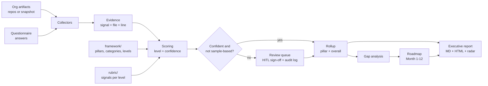

# AI maturity assessment

[](https://github.com/jagadishmazure-jpg/Jagadish-ai-maturity-assessment/actions/workflows/ci.yml)

An offline, evidence-first agent that positions an organisation on a six-pillar AI maturity model.
It reads what a team has actually built (Terraform, pipelines, decision records, model and risk
cards, eval gates, cost reports, data contracts, security policies, training material, plans),
asks a short questionnaire only for the things code cannot show, scores all 29 categories with a
confidence value and cited evidence, routes weak calls to a human reviewer, and turns the result
into a gap list, a twelve-month roadmap and an executive report with a radar chart.

## At a glance (for recruiters)

- **What it shows:** turning a published public-sector maturity framework into a machine-readable
  model, an agent that scores against it from real artifacts, and the governance around that agent
  (confidence, human sign-off, audit trail, eval gates).
- **Scale:** 6 pillars, 29 categories, 5 levels, 76 evidence signals, 44 questionnaire items,
  **683 automated tests**, 3 eval gates, 9 read-only MCP tools, an A2A agent card.
- **Honest sample:** my own eight public repositories are assessed as the sample organisation
  (overall level 3, provisional, with 12 categories waiting for a reviewer). People and culture
  items for the portfolio come from **sample answers**, labelled as such, never inferred.
- **Two fictional organisations** ([Kestrel Bay Bank](docs/samples/kestrel-bay-bank.md) and
  [Valemont Revenue Agency](docs/samples/valemont-revenue-agency.md)) show the same engine on a
  regulated bank and a public agency.
- **Engineering standards:** Python, pytest, ruff, JSON Schemas, Terraform and Bicep with the
  smallest SKUs, checkov and tflint, GitHub Actions with OIDC and a dev-to-prod approval, every
  doc's command output re-rendered and checked in CI.
- **Nothing is deployed.** Deploy and teardown stay off until a repository variable
  `DEPLOY_ENABLED` is set to `true`, and it is not set.

## Results

Every number below is printed by the CLI and re-checked in CI, so it cannot drift from the code.

<!-- output: summary -->
```text
organisation               overall    P1  P2  P3  P4  P5  P6  review queue  status
-------------------------  ---------  --  --  --  --  --  --  ------------  -----------
Kestrel Bay Bank           3 Dynamic  3   2   3   3   3   3   1             provisional
Jagadish Meduri portfolio  3 Dynamic  3   2   4   3   3   3   12            provisional
Valemont Revenue Agency    2 Ready    2   3   2   2   3   2   1             provisional
```
<!-- /output -->

Portfolio by pillar (from `samples/portfolio`):

<!-- output: assess --org portfolio -->
```text
Jagadish Meduri portfolio: overall Level 3 (Dynamic), mean 2.59
pillar  name                          level            mean  capped by
------  ----------------------------  -----  --------  ----  ---------
P1      Strategy & Value              3      Dynamic   2.4   -
P2      People & Culture              2      Ready     1.8   -
P3      Technology & Infrastructure   4      Advanced  3.75  -
P4      AI Operations & Ecosystem     3      Dynamic   2.6   -
P5      AI Governance, Ethics & Risk  3      Dynamic   2.8   -
P6      Data (AI-Specific Focus)      3      Dynamic   2.2   -

cat  level  computed  conf  status          target
---  -----  --------  ----  --------------  ------
1.1  3      3         0.53  pending-review  3
1.2  2      2         0.44  pending-review  3
1.3  1      1         0.64  auto            3
1.4  3      3         0.62  auto            3
1.5  3      3         0.75  auto            3
2.1  1      1         0.31  pending-review  3
2.2  2      2         0.7   pending-review  3
2.3  2      2         0.31  pending-review  3
2.4  2      2         0.5   pending-review  3
2.5  2      2         0.74  pending-review  3
3.1  4      4         1.0   auto            4
3.2  4      4         0.75  pending-review  4
3.3  4      4         1.0   auto            4
3.4  3      3         0.9   auto            4
4.1  3      3         0.64  auto            3
4.2  3      3         0.62  auto            3
4.3  4      4         1.0   auto            3
4.4  1      1         0.31  pending-review  3
4.5  2      2         0.66  auto            3
5.1  4      4         0.95  auto            4
5.2  1      1         0.31  pending-review  4
5.3  3      3         0.62  auto            4
5.4  3      3         0.9   auto            4
5.5  3      3         0.87  auto            4
6.1  3      3         0.87  auto            3
6.2  3      3         0.87  auto            3
6.3  1      1         0.31  pending-review  3
6.4  3      3         0.57  pending-review  3
6.5  1      1         0.61  auto            3

review queue: 1.1, 1.2, 2.1, 2.2, 2.3, 2.4, 2.5, 3.2, 4.4, 5.2, 6.3, 6.4; final: False
```
<!-- /output -->

Full reports: [portfolio](samples/portfolio/report/report.md),
[Kestrel Bay Bank](samples/kestrel-bay-bank/report/report.md),
[Valemont Revenue Agency](samples/valemont-revenue-agency/report/report.md)
(each also as HTML with an embedded radar chart).

## How it works



1. **Collectors** search a target's files for the 76 signals in `rubric/signals.yaml` (for example a
   Terraform backend, an OIDC login step, an ADR folder, a model card with intended use, a residual
   risk score, a cost anomaly report, a data contract). Each hit keeps the file and line.
2. **Questionnaire answers** cover leadership, skills, culture and procurement items; answers marked
   `sample: true` lower confidence and always send the category to a reviewer.
3. **Scoring** climbs the five levels stepwise: a level counts only when most of its signals are
   present and the level below holds. Confidence combines evidence weight and margin.
4. **Rollup** takes the median per pillar, capped by critical categories, and the median of pillars
   capped one above the weakest pillar.
5. **HITL**: reviewers confirm or override queued categories; each sign-off is bound to a digest of
   the evidence, and the audit log is hash-chained.
6. **Gaps and roadmap** rank the next level per category into quick wins and strategic items with
   dependencies, laid out as Month 1 to Month 12 (no calendar dates).
7. **Report**: Markdown and HTML with a matplotlib radar chart.

The assessor agent is a small graph (collect, score, verify citations, route) driven by a mock LLM,
so runs are deterministic and need no network or key.

## Quick start

```bash
python -m venv .venv && . .venv/bin/activate
pip install -e ".[dev]"
aimaturity summary                                    # all three sample orgs
aimaturity explain --org portfolio --category 5.3     # evidence behind one score
aimaturity roadmap --org kestrel-bay-bank             # Month 1-12 plan
aimaturity report --all                               # regenerate MD + HTML + radar
aimaturity evals                                      # stability, citations, calibration
pytest -q
```

Assess your own organisation: copy `samples/valemont-revenue-agency/` as a template, point
`org.yaml` at your repositories, fill in `questionnaire.yaml`, then run
`aimaturity assess --org <your-org>`. See [docs/adopt-this.md](docs/adopt-this.md).

## Cross-links to my other repositories

The portfolio assessment draws on specific repositories for specific pillars:

| Pillar area | Evidence source |
| --- | --- |
| Governance, ethics and risk (5.1, 5.3, 5.5) | [Jagadish-agentic-ai-model-risk](https://github.com/jagadishmazure-jpg/Jagadish-agentic-ai-model-risk): model and risk cards, tiering, residual risk, HITL sign-off |
| Cost and value (1.4, 3.2) | [Jagadish-azure-finops](https://github.com/jagadishmazure-jpg/Jagadish-azure-finops): budgets, anomaly reports, showback |
| Data for AI (6.1, 6.2) | [Jagadish-fabric-enterprise-bi](https://github.com/jagadishmazure-jpg/Jagadish-fabric-enterprise-bi): data contracts, quality checks, lineage |

The other scanned repositories are
[Jagadish-agentic-ai](https://github.com/jagadishmazure-jpg/Jagadish-agentic-ai),
[Jagadish-azure-agent-platform](https://github.com/jagadishmazure-jpg/Jagadish-azure-agent-platform),
[Jagadish-azure-ai-integration-platform](https://github.com/jagadishmazure-jpg/Jagadish-azure-ai-integration-platform),
[Jagadish-azure-agent-labs](https://github.com/jagadishmazure-jpg/Jagadish-azure-agent-labs) and
[Jagadish-ai-learning-lab](https://github.com/jagadishmazure-jpg/Jagadish-ai-learning-lab).
They were scanned read-only; the evidence is frozen in `samples/portfolio/evidence.json` so CI
works without them.

## Repository map

| Folder | What it holds |
| --- | --- |
| `framework/` | The pillar, category and level model (CC BY-SA, see below) |
| `rubric/` | Evidence signals, level mapping and questionnaire |
| `src/aimaturity/` | Collectors, scoring, rollup, HITL, gaps, roadmap, report, evals, CLI, MCP server, agent |
| `samples/` | The portfolio, Kestrel Bay Bank and Valemont Revenue Agency |
| `evals/` | Eval gate thresholds |
| `schemas/` | JSON Schemas for org files, answers and evidence snapshots |
| `a2a/` | The A2A agent card |
| `infra/` | Terraform and Bicep for the evidence store and scheduled job |
| `.github/` | CI, infra, deploy and teardown workflows |
| `docs/` | Pillar, component, sample and infra docs, ADRs and guides |
| `scripts/` | Doc rendering and the wording overlap check |
| `tests/` | The pytest suite |

## Documentation

- [Architecture](docs/architecture.md), [implementation guide](docs/implementation-guide.md),
  [interview guide](docs/interview-guide.md), [best practices](docs/best-practices.md),
  [deployment](docs/deployment.md), [adopt this](docs/adopt-this.md)
- [Pillars](docs/pillars/README.md) (6), [components](docs/components/README.md) (13),
  [samples](docs/samples/README.md) (3), [infra](docs/infra/README.md) (4); each has the same 17
  sections, from purpose to interview talking points and an "Adopt this" section
- [Decision records](docs/adr/README.md) (6)

## Honesty notes

- All organisations except my own portfolio are fictional. Kestrel Bay Bank and Valemont Revenue
  Agency do not exist; their artifacts are synthetic.
- Portfolio people and culture answers are sample answers I wrote to exercise the questionnaire.
  They are marked `sample: true`, keep the result provisional and wait for a reviewer.
- The LLM is a mock. Scores come from the rubric; the mock only phrases rationales, and a verifier
  rejects any rationale citing evidence that was not collected.
- Nothing is deployed and no cloud account is referenced.

## Attribution and licensing

The framework structure (six pillars, 29 categories and five maturity levels) is adapted under CC BY-SA 3.0 IGO
from UNESCO, *AI Maturity Framework*, the UNESCO self-positioning guide for public
administrations, prepared by Stratejai for UNESCO. License:
[CC BY-SA 3.0 IGO](https://creativecommons.org/licenses/by-sa/3.0/igo/). All descriptors are written
in my own words; this project is not endorsed by UNESCO or Stratejai. The source PDF is not
included in the repository.

- The framework-derived content in `framework/` is shared under the same license (CC BY-SA 3.0 IGO);
  see [framework/LICENSE.md](framework/LICENSE.md).
- Everything else (code, rubric, samples, infrastructure and docs) is under the repository's
  [MIT license](LICENSE).
