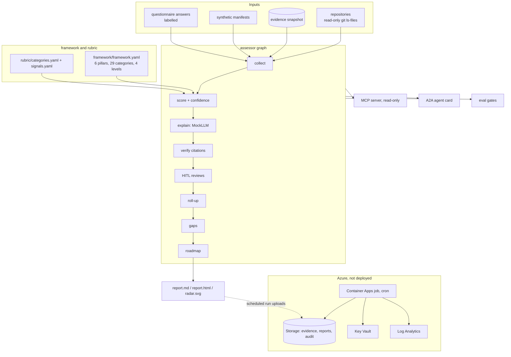

# Architecture

Framework structure adapted from UNESCO, *AI Maturity Framework* (Stratejai for UNESCO), [CC BY-SA 3.0 IGO](https://creativecommons.org/licenses/by-sa/3.0/igo/). Wording is this project's own; UNESCO does not endorse it.

## Components

## Data flow

1. **Collect.** Sources list files; signals match by glob and pattern; questionnaire answers become evidence with an origin label. Evidence gets stable ids.
2. **Score.** Each category reaches the highest level whose signals are at least two-thirds present, in order. Confidence blends source trust and decision margin.
3. **Explain and verify.** A mock LLM writes a rationale that cites evidence ids; the verifier rejects unknown or foreign citations and level mismatches.
4. **Review.** Low-confidence and sample-answer categories wait for a human; reviews are digest-bound and audit-logged.
5. **Roll up, gap, plan.** Median per pillar with critical caps; overall median capped at weakest + 1; gaps against targets; Month 1-12 schedule.
6. **Report.** Markdown, HTML and a radar SVG, checked in and drift-checked.

## Licensing boundary

| Path | License |
|---|---|
| `framework/` | CC BY-SA 3.0 IGO (https://creativecommons.org/licenses/by-sa/3.0/igo/), adapted structure, own wording |
| framework-derived tables in `docs/pillars/` | CC BY-SA 3.0 IGO |
| everything else (code, rubric, tests, IaC, other docs) | MIT |

## Azure mapping

| Concern | Azure service |
|---|---|
| Scheduled assessments | Container Apps job (consumption, schedule trigger) |
| Evidence, reports, audit log | Storage account (LRS, keyless, versioned; immutability optional) |
| Optional hosted-LLM key | Key Vault (RBAC) |
| Logs and trends | Log Analytics / Azure Monitor |
| Hosted rationales | Microsoft Foundry model + evaluations |
| Catalogue and lineage | Microsoft Purview |
| Guardrails on the plane | Azure Policy |
