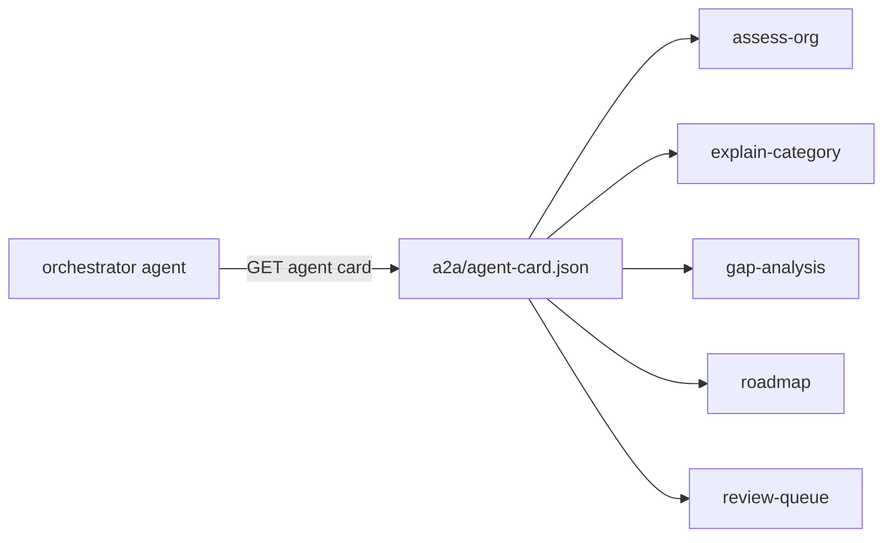

# Component: A2A agent card

`a2a/agent-card.json` describes the assessor for agent-to-agent discovery: five skills, input and output
modes, Entra ID client-credentials security and a placeholder endpoint (`.invalid`), because nothing is
deployed.

Sections: [1. Purpose](#1-purpose) · [2. Architecture](#2-architecture) · [3. How it works](#3-how-it-works) · [4. Key files](#4-key-files) · [5. Code excerpts](#5-code-excerpts) · [6. Configuration](#6-configuration) · [7. Commands](#7-commands) · [8. Real output](#8-real-output) · [9. Tests and gates](#9-tests-and-gates) · [10. Guardrails](#10-guardrails) · [11. Security and governance](#11-security-and-governance) · [12. Observability](#12-observability) · [13. Failure modes](#13-failure-modes) · [14. Mapping to Azure services](#14-mapping-to-azure-services) · [15. Limitations](#15-limitations) · [16. Interview talking points](#16-interview-talking-points) · [17. Adopt this](#17-adopt-this)

## 1. Purpose

* Let other agents discover what the assessor can do and how to authenticate, without guessing.

## 2. Architecture



## 3. How it works

1. The card follows the A2A shape: protocol version, name, description, url, version, capabilities, security schemes, default modes and skills.
2. Skills map to MCP tools: assess-org (assess), explain-category (category_result), gap-analysis (gaps), roadmap (roadmap), review-queue (review_queue).
3. The description carries the CC BY-SA 3.0 IGO attribution for the framework structure.

## 4. Key files

| File | Role |
|---|---|
| `a2a/agent-card.json` | The card |

## 5. Code excerpts

<!-- code: a2a/agent-card.json -->
```json
{
  "protocolVersion": "0.3.0",
  "name": "AI Maturity Assessor",
  "description": "Evidence-based AI maturity assessment over six pillars and 29 categories (framework structure adapted from UNESCO under CC BY-SA 3.0 IGO). Scores categories from repository artifacts and questionnaire answers, with confidence, cited evidence and human review for low-confidence items; produces gaps, a Month 1-12 roadmap and an executive report. Read-only: it never records a review.",
  "url": "https://ai-maturity.example.invalid/a2a/v1",
  "preferredTransport": "JSONRPC",
  "version": "0.1.0",
  "provider": {"organization": "Jagadish Meduri (portfolio project)", "url": "https://github.com/jagadishmazure-jpg/Jagadish-ai-maturity-assessment"},
  "documentationUrl": "https://github.com/jagadishmazure-jpg/Jagadish-ai-maturity-assessment/blob/main/docs/components/a2a-agent-card.md",
  "capabilities": {"streaming": false, "pushNotifications": false, "stateTransitionHistory": false},
  "securitySchemes": {"entra": {"type": "oauth2", "description": "Microsoft Entra ID client credentials; the caller needs the Assessment.Read app role.", "flows": {"clientCredentials": {"tokenUrl": "https://login.microsoftonline.com/organizations/oauth2/v2.0/token", "scopes": {"api://ai-maturity/.default": "Read assessments"}}}}},
  "security": [{"entra": ["api://ai-maturity/.default"]}],
  "defaultInputModes": ["application/json", "text/plain"],
  "defaultOutputModes": ["application/json", "text/markdown"],
  "skills": [
    {"id": "assess-org", "name": "Assess an organisation", "description": "Overall, pillar and category maturity with confidence and review status.", "tags": ["maturity", "assessment", "governance"], "examples": ["Assess valemont-revenue-agency", "What is the overall maturity of kestrel-bay-bank?"], "outputModes": ["application/json"]},
    {"id": "explain-category", "name": "Explain a category result", "description": "Rationale for one category, with the evidence ids it cites and what the next level needs.", "tags": ["evidence", "explainability"], "examples": ["Why is 5.3 at level 3 for the portfolio?"]},
    {"id": "gap-analysis", "name": "Gap analysis", "description": "Categories below target and the missing evidence per step.", "tags": ["gaps", "planning"], "examples": ["Which critical categories are below target?"]},
    {"id": "roadmap", "name": "Month 1-12 roadmap", "description": "Prioritised steps with quick wins, dependencies, start and end months, and a backlog.", "tags": ["roadmap", "planning"], "examples": ["Give me the quick wins for the first three months"], "outputModes": ["application/json", "text/markdown"]},
    {"id": "review-queue", "name": "Human review queue", "description": "Low-confidence or sample-answer categories that wait for a named reviewer.", "tags": ["hitl", "governance"], "examples": ["What still needs human sign-off?"]}
  ]
}
```
<!-- /code -->

## 6. Configuration

| Field | Value |
|---|---|
| url | placeholder `https://ai-maturity.example.invalid/a2a/v1` |
| security | Entra ID client credentials, scope `api://ai-maturity/.default` |
| streaming | false |

## 7. Commands

```bash
aimaturity agent-card
```

## 8. Real output

<!-- output: agent-card -->
```text
{
  "protocolVersion": "0.3.0",
  "name": "AI Maturity Assessor",
  "description": "Evidence-based AI maturity assessment over six pillars and 29 categories (framework structure adapted from UNESCO under CC BY-SA 3.0 IGO). Scores categories from repository artifacts and questionnaire answers, with confidence, cited evidence and human review for low-confidence items; produces gaps, a Month 1-12 roadmap and an executive report. Read-only: it never records a review.",
  "url": "https://ai-maturity.example.invalid/a2a/v1",
  "preferredTransport": "JSONRPC",
  "version": "0.1.0",
  "provider": {"organization": "Jagadish Meduri (portfolio project)", "url": "https://github.com/jagadishmazure-jpg/Jagadish-ai-maturity-assessment"},
  "documentationUrl": "https://github.com/jagadishmazure-jpg/Jagadish-ai-maturity-assessment/blob/main/docs/components/a2a-agent-card.md",
  "capabilities": {"streaming": false, "pushNotifications": false, "stateTransitionHistory": false},
  "securitySchemes": {"entra": {"type": "oauth2", "description": "Microsoft Entra ID client credentials; the caller needs the Assessment.Read app role.", "flows": {"clientCredentials": {"tokenUrl": "https://login.microsoftonline.com/organizations/oauth2/v2.0/token", "scopes": {"api://ai-maturity/.default": "Read assessments"}}}}},
  "security": [{"entra": ["api://ai-maturity/.default"]}],
  "defaultInputModes": ["application/json", "text/plain"],
  "defaultOutputModes": ["application/json", "text/markdown"],
  "skills": [
    {"id": "assess-org", "name": "Assess an organisation", "description": "Overall, pillar and category maturity with confidence and review status.", "tags": ["maturity", "assessment", "governance"], "examples": ["Assess valemont-revenue-agency", "What is the overall maturity of kestrel-bay-bank?"], "outputModes": ["application/json"]},
    {"id": "explain-category", "name": "Explain a category result", "description": "Rationale for one category, with the evidence ids it cites and what the next level needs.", "tags": ["evidence", "explainability"], "examples": ["Why is 5.3 at level 3 for the portfolio?"]},
    {"id": "gap-analysis", "name": "Gap analysis", "description": "Categories below target and the missing evidence per step.", "tags": ["gaps", "planning"], "examples": ["Which critical categories are below target?"]},
    {"id": "roadmap", "name": "Month 1-12 roadmap", "description": "Prioritised steps with quick wins, dependencies, start and end months, and a backlog.", "tags": ["roadmap", "planning"], "examples": ["Give me the quick wins for the first three months"], "outputModes": ["application/json", "text/markdown"]},
    {"id": "review-queue", "name": "Human review queue", "description": "Low-confidence or sample-answer categories that wait for a named reviewer.", "tags": ["hitl", "governance"], "examples": ["What still needs human sign-off?"]}
  ]
}
```
<!-- /output -->

## 9. Tests and gates

* `tests/test_mcp_a2a.py`: required fields, unique skills with examples, `.invalid` url, security and attribution present.

## 10. Guardrails

* The endpoint is deliberately non-routable until a deployment exists.

## 11. Security and governance

Client credentials with an app role; no secret is stored in the repository.

## 12. Observability

An A2A host would log task ids per skill call.

## 13. Failure modes

| Failure | Behaviour |
|---|---|
| Card drifts from tools | skills test lists the five ids |

## 14. Mapping to Azure services

* **Azure Container Apps** hosts the A2A endpoint; **Azure API Management** enforces Entra ID tokens; **Microsoft Foundry Agent Service** can register it as a connected agent.
* **Microsoft Purview**: register the evidence store and reports as data assets with lineage back to the scanned repositories, and keep questionnaire answers under a sensitivity label.
* **Azure Policy**: audit that the evidence store stays keyless and versioned and that the Key Vault keeps RBAC, so the controls the assessment relies on cannot drift silently.
* **Azure Monitor / Log Analytics**: job logs, blob access logs and Key Vault audit events land in one workspace, where a query can trend maturity runs over time.

## 15. Limitations

* Card only; no A2A server implementation in this repository.

## 16. Interview talking points

* "The card is a contract: skills, modes and auth, tested like code."

## 17. Adopt this

1. Replace `url` and `provider` when you deploy.
2. Add a skill entry for any new MCP tool you expose.
3. Change `securitySchemes` to match your identity provider.
