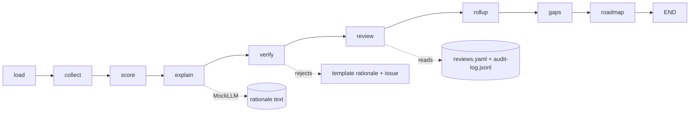

# Component: assessor agent (state graph, mock LLM, verifier)

The assessor is a small LangGraph-style state graph. Nine deterministic nodes load an organisation,
collect evidence, score each category, ask a mock LLM for a rationale, verify the rationale against the
evidence, apply human reviews, roll up, analyse gaps and plan the roadmap. It runs offline in under a
second per organisation.

Sections: [1. Purpose](#1-purpose) · [2. Architecture](#2-architecture) · [3. How it works](#3-how-it-works) · [4. Key files](#4-key-files) · [5. Code excerpts](#5-code-excerpts) · [6. Configuration](#6-configuration) · [7. Commands](#7-commands) · [8. Real output](#8-real-output) · [9. Tests and gates](#9-tests-and-gates) · [10. Guardrails](#10-guardrails) · [11. Security and governance](#11-security-and-governance) · [12. Observability](#12-observability) · [13. Failure modes](#13-failure-modes) · [14. Mapping to Azure services](#14-mapping-to-azure-services) · [15. Limitations](#15-limitations) · [16. Interview talking points](#16-interview-talking-points) · [17. Adopt this](#17-adopt-this)

## 1. Purpose

* One entry point (`assess`) that every interface uses: CLI, MCP server, report, scheduled job and evals.
* Keep judgement (scores) separate from language (rationales), so a language model can never change a level.

## 2. Architecture



## 3. How it works

1. **load** reads `samples/<org>/org.yaml`.
2. **collect** gathers evidence from a live scan, the checked-in snapshot or a manifest, plus questionnaire answers, and numbers it (`E001`...).
3. **score** computes level, confidence and cited evidence for all 29 categories.
4. **explain** asks `MockLLM` for a one-paragraph rationale per category that cites evidence ids.
5. **verify** rejects any rationale that cites an unknown id, cites evidence from another category, or claims a level other than the computed one, and replaces it with a template, recording a verification issue.
6. **review** applies valid human reviews (see the HITL component) and builds the queue.
7. **rollup**, **gaps** and **roadmap** produce pillar and overall levels, gaps against targets and the Month 1-12 plan.
8. The run is `final` only when the review queue is empty and the audit log chain is intact.

## 4. Key files

| File | Role |
|---|---|
| `src/aimaturity/agents/assessor.py` | Nodes, graph, `assess`, `summary` |
| `src/aimaturity/agents/graph.py` | StateGraph runtime with step limit and interrupts |
| `src/aimaturity/agents/llm.py` | MockLLM with `hallucinate` and `overclaim` knobs, citation parsing |

## 5. Code excerpts

<!-- code: src/aimaturity/agents/assessor.py::_verify -->
```python
def _verify(s):
    """Reject rationales that cite unknown evidence, cite evidence outside the category, or claim another level."""
    issues, fixed = [], {}
    for cid, text in s["rationales"].items():
        res = s["results"][cid]
        cites = cited_ids(text)
        bad = [c for c in cites if c not in s["evidence_by_id"]]
        foreign = [c for c in cites if c in s["evidence_by_id"] and c not in res.evidence]
        lvl = claimed_level(text)
        problems = []
        if bad:
            problems.append(f"unknown evidence {bad}")
        if foreign:
            problems.append(f"evidence not used by this category {foreign}")
        if lvl != res.level:
            problems.append(f"claims level {lvl}, scored {res.level}")
        if problems:
            issues.append({"category": cid, "problems": problems})
            text = template_rationale(_facts(res))
        fixed[cid] = text
    return {**s, "rationales": fixed, "verification_issues": issues}
```
<!-- /code -->

<!-- code: src/aimaturity/agents/llm.py::MockLLM -->
```python
@dataclass
class MockLLM:
    hallucinate: bool = False
    overclaim: bool = False
    calls: int = 0

    def rationale(self, facts: dict) -> str:
        self.calls += 1
        level = min(4, facts["level"] + 1) if self.overclaim else facts["level"]
        cites = list(facts["evidence"][:4])
        if self.hallucinate:
            cites.append("E999")
        parts = [f"Level {level} ({LEVEL_NAMES[level]})."]
        if cites:
            parts.append("Supported by " + ", ".join(f"[{c}]" for c in cites) + ".")
        else:
            parts.append("No artifact or answer supports a level above Basic.")
        if facts["missing"]:
            parts.append(f"Next level needs: {', '.join(facts['missing'])}.")
        parts.append(f"Confidence {facts['confidence']:.2f}.")
        return " ".join(parts)
```
<!-- /code -->

## 6. Configuration

| Setting | Where | Default |
|---|---|---|
| Step limit | `build_graph` | nodes + 2 |
| Mock LLM knobs | `MockLLM(hallucinate=, overclaim=)` | off |
| Evidence mode | `assess(org, live=)` | snapshot or manifest |
| Checkout root for live scans | `assess(root=)` | parent of the repository |

## 7. Commands

```bash
aimaturity assess --org valemont-revenue-agency
aimaturity explain --org kestrel-bay-bank --category 5.1
aimaturity assess --org portfolio --live      # scan the sibling checkouts read-only
```

## 8. Real output

<!-- output: assess --org valemont-revenue-agency -->
```text
Valemont Revenue Agency: overall Level 2 (Ready), mean 2.2
pillar  name                          level           mean  capped by
------  ----------------------------  -----  -------  ----  ---------
P1      Strategy & Value              2      Ready    2     -
P2      People & Culture              3      Dynamic  2.6   -
P3      Technology & Infrastructure   2      Ready    2     -
P4      AI Operations & Ecosystem     2      Ready    1.8   -
P5      AI Governance, Ethics & Risk  3      Dynamic  2.8   -
P6      Data (AI-Specific Focus)      2      Ready    2     -

cat  level  computed  conf  status          target
---  -----  --------  ----  --------------  ------
1.1  2      2         0.88  auto            3
1.2  2      2         0.54  confirmed       3
1.3  2      2         0.93  auto            3
1.4  2      2         0.66  auto            3
1.5  2      2         0.92  auto            3
2.1  2      2         0.54  pending-review  3
2.2  2      2         0.8   auto            3
2.3  3      3         0.76  auto            3
2.4  3      3         0.86  auto            3
2.5  3      3         0.82  auto            3
3.1  2      2         0.94  auto            3
3.2  2      2         0.9   auto            3
3.3  2      2         0.91  auto            3
3.4  2      2         0.92  auto            3
4.1  2      2         0.9   auto            3
4.2  1      1         0.88  auto            3
4.3  2      2         0.92  auto            3
4.4  3      2         0.46  overridden      3
4.5  1      1         0.88  auto            3
5.1  3      3         0.74  auto            3
5.2  3      3         0.88  auto            4
5.3  2      2         0.92  auto            3
5.4  3      3         0.94  auto            3
5.5  3      3         0.92  auto            4
6.1  2      2         0.94  auto            3
6.2  2      2         0.94  auto            3
6.3  2      2         0.84  auto            3
6.4  1      1         0.88  auto            2
6.5  3      3         0.88  auto            3

review queue: 2.1; final: False
```
<!-- /output -->

<!-- output: explain --org kestrel-bay-bank --category 5.1 -->
```text
5.1 AI Governance Framework: level 4 (Advanced), confidence 0.97, status auto
rationale: Level 4 (Advanced). Supported by [E002], [E098], [E037], [E040]. Confidence 0.97.
  [x] ai_policy_doc                artifact         E002
  [x] security_policy              artifact         E098
  [x] inventory                    artifact         E037
  [x] lifecycle_gates              artifact         E040
  [x] q_review_board               self-reported    E079
  [x] compliance_in_pipeline       artifact         E014, E015
  [x] audit_log                    artifact         E006
  [x] secret_hygiene               artifact         E097
  E002 kb-model-governance:docs/best-practices.md (file present)
  E098 kb-model-governance:SECURITY.md (file present)
  E037 kb-model-governance:registry/inventory.yaml (file present)
  E040 kb-model-governance:src/gov/lifecycle.py (matched 'lifecycle')
  E079 questionnaire:q_review_board (answer yes)
  E014 kb-ai-platform:.github/workflows/ci.yml (matched 'gate')
  E015 kb-model-governance:.github/workflows/ci.yml (matched 'checkov')
  E006 kb-model-governance:src/review/audit.py (matched 'AUDIT_LOG')
```
<!-- /output -->

## 9. Tests and gates

* `tests/test_agent.py`: node order, clean runs, verifier catches both injected faults, determinism, step limit, interrupts.
* Eval gate `citations`: every injected bad rationale across all orgs is caught (`verifier_catch = 1.0`).

## 10. Guardrails

* The language model only writes text; levels come from the rubric.
* The verifier is not optional and its fallback is deterministic.
* A step limit stops a mis-wired graph.

## 11. Security and governance

Runs offline with no credentials. Reads repositories through `git ls-files` and never executes their code; evidence holds paths and short match details, never file contents or secrets.

## 12. Observability

Each run carries `trace` (nodes visited), `verification_issues`, `review_queue` and `audit_problems`; the scheduled job writes them into `summary.json`.

## 13. Failure modes

| Failure | Behaviour |
|---|---|
| Model cites a non-existent evidence id | rationale replaced, issue recorded |
| Model overclaims a level | rationale replaced, issue recorded |
| Evidence snapshot missing | `FileNotFoundError` names the file |
| Graph loops | `StepLimitExceeded` |

## 14. Mapping to Azure services

* **Microsoft Agent Framework** or **Foundry Agent Service** can host the same nodes, with **Microsoft Foundry** models replacing `MockLLM` for rationales.
* **Azure Container Apps jobs** run the graph on a schedule (see the scheduled-job doc).
* **Microsoft Purview**: register the evidence store and reports as data assets with lineage back to the scanned repositories, and keep questionnaire answers under a sensitivity label.
* **Azure Policy**: audit that the evidence store stays keyless and versioned and that the Key Vault keeps RBAC, so the controls the assessment relies on cannot drift silently.
* **Azure Monitor / Log Analytics**: job logs, blob access logs and Key Vault audit events land in one workspace, where a query can trend maturity runs over time.

## 15. Limitations

* Rationales are templated; a real model would write richer text but must pass the same verifier.
* No persistence between nodes beyond the state dict.

## 16. Interview talking points

* "The model cannot change a score. It explains one, and a verifier checks every citation."
* "One `assess` function powers the CLI, MCP, reports, evals and the scheduled job, so they cannot disagree."

## 17. Adopt this

1. Call `assess("<org>")` from your own code, or run `aimaturity assess --org <org> --json`.
2. To use a hosted model, implement a class with `rationale(facts) -> str` and pass it as `llm=`; keep `_verify` unchanged.
3. Add a node (for example, a notification step) with `g.add_node` and an edge after `roadmap`.
