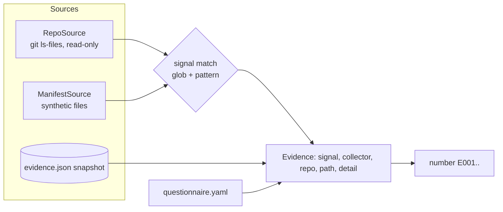

# Component: evidence collectors and sources

Collectors turn an organisation's artifacts into evidence. Each of the 76 file-based signals in
`rubric/signals.yaml` names a collector, path globs and an optional content pattern; a source supplies
files (a git checkout, read-only, or a synthetic manifest).

Sections: [1. Purpose](#1-purpose) · [2. Architecture](#2-architecture) · [3. How it works](#3-how-it-works) · [4. Key files](#4-key-files) · [5. Code excerpts](#5-code-excerpts) · [6. Configuration](#6-configuration) · [7. Commands](#7-commands) · [8. Real output](#8-real-output) · [9. Tests and gates](#9-tests-and-gates) · [10. Guardrails](#10-guardrails) · [11. Security and governance](#11-security-and-governance) · [12. Observability](#12-observability) · [13. Failure modes](#13-failure-modes) · [14. Mapping to Azure services](#14-mapping-to-azure-services) · [15. Limitations](#15-limitations) · [16. Interview talking points](#16-interview-talking-points) · [17. Adopt this](#17-adopt-this)

## 1. Purpose

* Gather evidence that a reviewer can open and check: every item points at a repository and a path.
* Keep scans cheap and safe enough to run on every pull request.

## 2. Architecture



## 3. How it works

1. `RepoSource.files()` lists tracked text files (falls back to a filtered walk outside git); files over 400 KB are skipped.
2. For each file, signals whose globs match (`PurePosixPath.full_match`, `**` aware) are tested; the content pattern is case-insensitive and multi-line.
3. Each signal is cited at most three times per repository.
4. `number()` sorts by signal, source and path and assigns `E001`, `E002`... so ids are stable across runs.
5. `write_snapshot` stores the scan (without ids) so CI can assess the portfolio without the checkouts.

## 4. Key files

| File | Role |
|---|---|
| `src/aimaturity/collectors/__init__.py` | Evidence type, matching, questionnaire collector, numbering |
| `src/aimaturity/sources.py` | RepoSource and ManifestSource |
| `src/aimaturity/orgs.py` | Org config, live/snapshot/manifest modes |
| `rubric/signals.yaml` | Signal catalogue with an example per signal |
| `schemas/snapshot.schema.json` | Snapshot format |

## 5. Code excerpts

<!-- code: src/aimaturity/collectors/__init__.py::collect_source -->
```python
def collect_source(source, max_per_signal: int = 3) -> list[Evidence]:
    """All file-based evidence in one source; at most ``max_per_signal`` citations per signal."""
    out: list[Evidence] = []
    counts: dict[str, int] = {}
    file_signals = [sid for sid in signals()]
    for rel in source.files():
        text = None
        for sid in file_signals:
            if counts.get(sid, 0) >= max_per_signal:
                continue
            s = signals()[sid]
            if not any(PurePosixPath(rel).full_match(g) for g in s["paths"]):
                continue
            if text is None:
                text = source.read(rel)
            if matches(sid, rel, text):
                counts[sid] = counts.get(sid, 0) + 1
                out.append(Evidence(sid, s["collector"], source.name, rel, _detail(sid, text)))
    return out
```
<!-- /code -->

<!-- code: src/aimaturity/sources.py::RepoSource -->
```python
@dataclass
class RepoSource:
    name: str
    path: Path

    def files(self) -> list[str]:
        try:
            out = subprocess.run(["git", "-C", str(self.path), "ls-files"], capture_output=True, text=True, check=True).stdout.split("\n")
            files = [f for f in out if f]
        except (subprocess.CalledProcessError, FileNotFoundError):
            files = [str(p.relative_to(self.path)) for p in self.path.rglob("*") if p.is_file() and not SKIP & set(p.parts)]
        return sorted(f for f in files if Path(f).suffix in TEXT or Path(f).name in {"Dockerfile", "Makefile", "CODEOWNERS"})

    def read(self, rel: str) -> str:
        p = self.path / rel
        if not p.is_file() or p.stat().st_size > MAX_BYTES:
            return ""
        return p.read_text(errors="ignore")
```
<!-- /code -->

## 6. Configuration

| Collector | Looks at |
|---|---|
| docs | Vision, roadmap, value, experiments, ADRs, scouting |
| people | CONTRIBUTING, CODEOWNERS, onboarding, learning material |
| iac | Terraform and Bicep: services, cost guards, identities, Key Vault, scans |
| ci | Tests, linting, deployment, OIDC, approvals, eval gates, pinning |
| ops | Telemetry, alerts, drift, APIs, events, MCP, A2A, reuse |
| governance | Policies, cards, risk scoring, HITL, audit logs, regulation, fairness |
| data | Data needs, catalogues, contracts, quality tests, synthetic data, domain docs |
| questionnaire | Answers for items code cannot show |

## 7. Commands

```bash
aimaturity collect --org portfolio
aimaturity collect --org portfolio --live           # scan the eight checkouts, print counts
aimaturity collect --org portfolio --live --write   # refresh samples/portfolio/evidence.json
```

## 8. Real output

<!-- output: collect --org portfolio -->
```text
source                         collector      items
-----------------------------  -------------  -----
agentic-ai-model-risk          ci             12
agentic-ai-model-risk          data           17
agentic-ai-model-risk          docs           6
agentic-ai-model-risk          governance     38
agentic-ai-model-risk          iac            12
agentic-ai-model-risk          ops            9
agentic-ai-model-risk          people         2
agentic-ai-portfolio           ci             17
agentic-ai-portfolio           data           12
agentic-ai-portfolio           docs           11
agentic-ai-portfolio           governance     21
agentic-ai-portfolio           iac            23
agentic-ai-portfolio           ops            22
agentic-ai-portfolio           people         1
ai-learning-lab                ci             4
ai-learning-lab                data           4
ai-learning-lab                docs           9
ai-learning-lab                governance     4
ai-learning-lab                people         4
azure-agent-labs               ci             16
azure-agent-labs               data           8
azure-agent-labs               docs           11
azure-agent-labs               governance     16
azure-agent-labs               iac            23
azure-agent-labs               ops            13
azure-agent-labs               people         1
azure-agent-platform           ci             20
azure-agent-platform           data           6
azure-agent-platform           docs           5
azure-agent-platform           governance     19
azure-agent-platform           iac            24
azure-agent-platform           ops            13
azure-agent-platform           people         1
azure-ai-integration-platform  ci             19
azure-ai-integration-platform  data           5
azure-ai-integration-platform  docs           5
azure-ai-integration-platform  governance     22
azure-ai-integration-platform  iac            21
azure-ai-integration-platform  ops            17
azure-ai-integration-platform  people         1
azure-finops                   ci             13
azure-finops                   data           11
azure-finops                   docs           15
azure-finops                   governance     18
azure-finops                   iac            15
azure-finops                   ops            8
azure-finops                   people         2
fabric-enterprise-bi           ci             19
fabric-enterprise-bi           data           19
fabric-enterprise-bi           docs           7
fabric-enterprise-bi           governance     12
fabric-enterprise-bi           iac            18
fabric-enterprise-bi           ops            13
fabric-enterprise-bi           people         2
questionnaire                  questionnaire  44

710 evidence items, 114 distinct signals
```
<!-- /output -->

<!-- output: collect --org kestrel-bay-bank -->
```text
source               collector      items
-------------------  -------------  -----
kb-ai-platform       ci             10
kb-ai-platform       governance     1
kb-ai-platform       iac            10
kb-ai-platform       ops            7
kb-ai-strategy       docs           13
kb-ai-strategy       people         3
kb-data-products     data           6
kb-model-governance  governance     15
questionnaire        questionnaire  44

109 evidence items, 103 distinct signals
```
<!-- /output -->

## 9. Tests and gates

* `tests/test_signals.py`: every signal's example satisfies its own rule (76 cases), patterns compile, every collector has signals.
* `tests/test_orgs_sources.py`: tracked files only, read-only scan (mtimes unchanged), large files skipped, citation cap, stable numbering.
* With `AIMATURITY_LIVE=1` and the checkouts present, a test compares a live scan with the snapshot.

## 10. Guardrails

* Read-only: no writes, no subprocess other than `git ls-files`, no code execution.
* Patterns were tightened when they matched unrelated code (risk scoring now needs `residual risk` or likelihood near impact).

## 11. Security and governance

Runs offline with no credentials. Reads repositories through `git ls-files` and never executes their code; evidence holds paths and short match details, never file contents or secrets.

## 12. Observability

`aimaturity collect` prints counts per source and collector; the report has an evidence section with the same counts.

## 13. Failure modes

| Failure | Behaviour |
|---|---|
| Checkout missing in live mode | `FileNotFoundError` with the path |
| Binary or huge file | skipped |
| Signal pattern too loose | caught in review; tests pin examples |

## 14. Mapping to Azure services

* **Azure DevOps** or **GitHub** APIs could replace local checkouts; the source interface (`files`, `read`) stays the same.
* **Azure Storage** keeps the snapshot in the `evidence` container.
* **Microsoft Foundry**: a hosted model replaces `MockLLM` for rationales, and Foundry evaluations score rationale groundedness against the cited evidence.
* **Microsoft Purview**: register the evidence store and reports as data assets with lineage back to the scanned repositories, and keep questionnaire answers under a sensitivity label.
* **Azure Policy**: audit that the evidence store stays keyless and versioned and that the Key Vault keeps RBAC, so the controls the assessment relies on cannot drift silently.
* **Azure Monitor / Log Analytics**: job logs, blob access logs and Key Vault audit events land in one workspace, where a query can trend maturity runs over time.

## 15. Limitations

* Pattern matching finds artifacts, not quality.
* Private repositories need a checkout with read access; the tool does not authenticate on its own.

## 16. Interview talking points

* "Every number in the report traces to a file path a reviewer can open."
* "The snapshot makes CI independent of eight other repositories while staying refreshable with one command."

## 17. Adopt this

1. Add a signal: id, collector, description, `paths` globs, optional `contains`, and an `example` that satisfies it; then reference it from a level in `rubric/categories.yaml`.
2. Add a source type by implementing `files()` and `read(path)` (for example, a SharePoint export).
3. Use a manifest (`samples/<org>/manifest.yaml`) to assess an organisation whose files you cannot check out.
