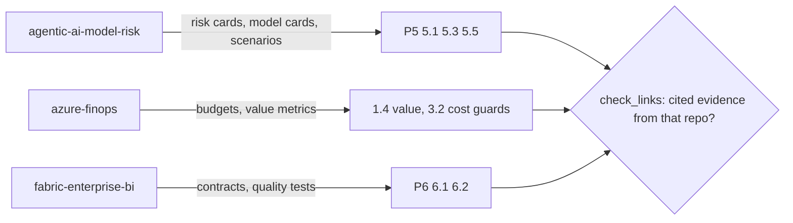

# Component: cross-repository evidence links

For the portfolio, three pillars draw on specific sibling repositories: governance on the model risk
repository, cost and value on the FinOps repository, data on the Fabric BI repository. `links` in
`org.yaml` declares these expectations and a check proves the cited evidence really comes from them.

Sections: [1. Purpose](#1-purpose) · [2. Architecture](#2-architecture) · [3. How it works](#3-how-it-works) · [4. Key files](#4-key-files) · [5. Code excerpts](#5-code-excerpts) · [6. Configuration](#6-configuration) · [7. Commands](#7-commands) · [8. Real output](#8-real-output) · [9. Tests and gates](#9-tests-and-gates) · [10. Guardrails](#10-guardrails) · [11. Security and governance](#11-security-and-governance) · [12. Observability](#12-observability) · [13. Failure modes](#13-failure-modes) · [14. Mapping to Azure services](#14-mapping-to-azure-services) · [15. Limitations](#15-limitations) · [16. Interview talking points](#16-interview-talking-points) · [17. Adopt this](#17-adopt-this)

## 1. Purpose

* Show that the portfolio repositories reinforce each other, and fail CI if that stops being true.

## 2. Architecture



## 3. How it works

1. `links: {repo: [categories]}` in `org.yaml`.
2. `check_links` counts cited evidence items from that repository in each linked category and lists example paths.
3. `aimaturity links --org portfolio` exits 1 if any link is unsatisfied; CI runs it.

## 4. Key files

| File | Role |
|---|---|
| `src/aimaturity/crosslinks.py` | check_links |
| `samples/portfolio/org.yaml` | The links |

## 5. Code excerpts

<!-- code: src/aimaturity/crosslinks.py::check_links -->
```python
def check_links(state: dict[str, Any]) -> list[dict[str, Any]]:
    links = state["org"].config.get("links", {})
    ev = state["evidence_by_id"]
    rows = []
    for repo, cats in links.items():
        for cid in cats:
            cited = [i for i in state["results"][cid].evidence if ev[i].source == repo]
            rows.append({"repo": repo, "category": cid, "cited": len(cited), "examples": sorted({ev[i].path for i in cited})[:3], "ok": bool(cited)})
    return rows
```
<!-- /code -->

## 6. Configuration

```yaml
links:
  agentic-ai-model-risk: ["5.1", "5.3", "5.5"]
  azure-finops: ["1.4", "3.2"]
  fabric-enterprise-bi: ["6.1", "6.2"]
```

## 7. Commands

```bash
aimaturity links --org portfolio
```

## 8. Real output

<!-- output: links --org portfolio -->
```text
repo                   category  cited  ok
---------------------  --------  -----  ----
agentic-ai-model-risk  5.1       14     True
agentic-ai-model-risk  5.3       9      True
agentic-ai-model-risk  5.5       6      True
azure-finops           1.4       9      True
azure-finops           3.2       12     True
fabric-enterprise-bi   6.1       3      True
fabric-enterprise-bi   6.2       6      True
```
<!-- /output -->

## 9. Tests and gates

* `tests/test_samples.py`: links satisfied; governance, cost/value and data evidence come from the expected repositories.
* `tests/test_cli.py`: an unsatisfied link makes the command fail.

## 10. Guardrails

* Links check citations, not just presence, so a repository must contribute to the level.

## 11. Security and governance

Runs offline with no credentials. Reads repositories through `git ls-files` and never executes their code; evidence holds paths and short match details, never file contents or secrets.

## 12. Observability

The report has a cross-repository evidence table with counts and example paths.

## 13. Failure modes

| Failure | Behaviour |
|---|---|
| Sibling repo stops producing the evidence | next snapshot refresh breaks the link; CI fails |

## 14. Mapping to Azure services

* **Microsoft Purview** lineage can show the same relationships between data assets across repositories.
* **Microsoft Foundry**: a hosted model replaces `MockLLM` for rationales, and Foundry evaluations score rationale groundedness against the cited evidence.
* **Azure Policy**: audit that the evidence store stays keyless and versioned and that the Key Vault keeps RBAC, so the controls the assessment relies on cannot drift silently.
* **Azure Monitor / Log Analytics**: job logs, blob access logs and Key Vault audit events land in one workspace, where a query can trend maturity runs over time.

## 15. Limitations

* Links are only configured for the portfolio sample.

## 16. Interview talking points

* "My repositories are designed to be assessed together, and the assessment proves it."

## 17. Adopt this

1. Add `links` to your org config for repositories that own a pillar.
2. Run `aimaturity links --org <org>` in CI.
