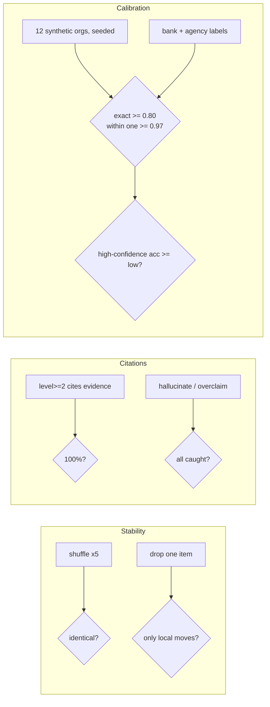

# Component: eval gates (stability, citations, calibration)

Three gates test the assessor itself. Stability: shuffled evidence gives identical results and removing
one item only moves categories that use it. Citations: every level above Basic cites evidence, every
cited id exists, and every injected bad rationale is caught. Calibration: agreement with labelled levels.

Sections: [1. Purpose](#1-purpose) · [2. Architecture](#2-architecture) · [3. How it works](#3-how-it-works) · [4. Key files](#4-key-files) · [5. Code excerpts](#5-code-excerpts) · [6. Configuration](#6-configuration) · [7. Commands](#7-commands) · [8. Real output](#8-real-output) · [9. Tests and gates](#9-tests-and-gates) · [10. Guardrails](#10-guardrails) · [11. Security and governance](#11-security-and-governance) · [12. Observability](#12-observability) · [13. Failure modes](#13-failure-modes) · [14. Mapping to Azure services](#14-mapping-to-azure-services) · [15. Limitations](#15-limitations) · [16. Interview talking points](#16-interview-talking-points) · [17. Adopt this](#17-adopt-this)

## 1. Purpose

* Prove the scorer is deterministic, grounded and reasonably calibrated, and fail CI if it is not.

## 2. Architecture



## 3. How it works

1. **Stability**: for each org, evidence order is shuffled five times; levels and confidence must be identical. Then up to about 60 single-item dropouts per org: no category that does not use the removed signal may move; at most two categories may move per dropout and the mean must stay at or below 0.5. The size of a move is reported (stepwise levels mean a missing foundation can drop a category to Basic).
2. **Citations**: completeness and validity must be 1.0; the mock LLM is run with `hallucinate` and `overclaim` and the verifier must catch every injected fault.
3. **Calibration**: 12 synthetic organisations with known levels and noise (missed artifacts, stray evidence) plus the 58 expert labels of the bank and agency. Gates: exact >= 0.80, within one >= 0.97, and accuracy where confidence >= 0.6 must be at least the accuracy below it.

## 4. Key files

| File | Role |
|---|---|
| `src/aimaturity/evals.py` | The three gates |
| `evals/thresholds.yaml` | Thresholds |
| `samples/*/labels.yaml` | Expert labels |

## 5. Code excerpts

<!-- code: src/aimaturity/evals.py::calibration -->
```python
def calibration(t: dict[str, Any]) -> dict[str, Any]:
    rows = []  # (computed, label, confidence)
    rng = random.Random(t["seed"])
    for n in range(t["synthetic_orgs"]):
        ev, truth = synthetic_org(rng, n)
        res = score_all(ev)
        rows += [(res[c].level, truth[c], res[c].confidence, "synthetic") for c in truth]
    for org_id in list_orgs():
        org = load_org(org_id)
        if not org.config.get("labels"):
            continue
        labels = yaml.safe_load((org.dir / org.config["labels"]).read_text())["labels"]
        state = assess(org_id)
        rows += [(state["results"][c].level, labels[c], state["results"][c].confidence, org_id) for c in labels]
    exact = sum(a == b for a, b, _, _ in rows) / len(rows)
    within = sum(abs(a - b) <= 1 for a, b, _, _ in rows) / len(rows)
    hi = [a == b for a, b, c, _ in rows if c >= REVIEW_BELOW]
    lo = [a == b for a, b, c, _ in rows if c < REVIEW_BELOW]
    hi_acc = sum(hi) / len(hi) if hi else 1.0
    lo_acc = sum(lo) / len(lo) if lo else 0.0
    ok = exact >= t["exact_min"] and within >= t["within_one_min"] and (hi_acc >= lo_acc or not t["high_conf_not_worse"])
    by_source = {}
    for _, _, _, src in rows:
        by_source[src] = by_source.get(src, 0) + 1
    return {
        "gate": "calibration",
        "ok": ok,
        "items": len(rows),
        "exact": round(exact, 3),
        "within_one": round(within, 3),
        "high_conf_accuracy": round(hi_acc, 3),
        "low_conf_accuracy": round(lo_acc, 3),
        "high_conf_items": len(hi),
        "by_source": by_source,
    }
```
<!-- /code -->

<!-- code: src/aimaturity/evals.py::synthetic_org -->
```python
def synthetic_org(rng: random.Random, n: int) -> tuple[list[Evidence], dict[str, int]]:
    """A synthetic org with known levels: signal examples for every level reached, plus noise."""
    R = rubric()["categories"]
    truth = {cid: rng.choice([1, 2, 2, 3, 3, 4]) for cid in categories()}
    files: dict[str, dict[str, str]] = {}
    answers: dict[str, str] = {}
    present: set[str] = set()
    for cid, lvl in truth.items():
        for lv in range(2, lvl + 1):
            present.update(R[cid]["levels"][lv])
    noisy = set(present)
    for cid, lvl in truth.items():
        if lvl >= 2 and rng.random() < 0.12:  # an artifact the collectors miss
            noisy.discard(rng.choice(R[cid]["levels"][lvl]))
        if lvl < 4 and rng.random() < 0.08:  # stray evidence of the next level
            noisy.add(rng.choice(R[cid]["levels"][lvl + 1]))
    for sid in sorted(noisy):
        if is_question(sid):
            answers[sid] = "yes"
            continue
        s = signals()[sid]
        repo = files.setdefault(f"synthetic-{n}-{s['collector']}", {})
        repo[s["example"]["path"]] = repo.get(s["example"]["path"], "") + s["example"]["content"]
    items = scan([ManifestSource(name, c) for name, c in sorted(files.items())])
    items += collect_questionnaire({"label": "self-reported", "answers": answers})
    return number(items), truth
```
<!-- /code -->

## 6. Configuration

See `evals/thresholds.yaml`; every threshold has a comment.

## 7. Commands

```bash
aimaturity evals
aimaturity evals --json
```

## 8. Real output

<!-- output: evals -->
```text
PASS  stability    shuffle_identical=True, dropout_runs=250, nonlocal_moves=0, max_categories_moved=2, mean_categories_moved=0.396, max_level_change_info=3
PASS  citations    completeness=1.0, valid_ids=1.0, verifier_catch=1.0, categories_checked=78, injected=166
PASS  calibration  items=406, exact=0.84, within_one=0.995, high_conf_accuracy=0.861, low_conf_accuracy=0.674, high_conf_items=360
```
<!-- /output -->

## 9. Tests and gates

* `tests/test_evals.py`: gates pass, shuffle invariance, locality, citation totals, labelled samples used, synthetic orgs deterministic, impossible thresholds fail.
* CI runs `aimaturity evals` and uploads the JSON as an artifact.

## 10. Guardrails

* Thresholds live in a file reviewed like code.

## 11. Security and governance

Runs offline with no credentials. Reads repositories through `git ls-files` and never executes their code; evidence holds paths and short match details, never file contents or secrets.

## 12. Observability

The JSON result is uploaded per CI run; trend `exact` and `within_one` over time.

## 13. Failure modes

| Failure | Behaviour |
|---|---|
| Rubric change hurts agreement | calibration gate fails |
| Non-deterministic code (set order, time) | stability gate fails |
| Verifier weakened | citations gate fails |

## 14. Mapping to Azure services

* **Microsoft Foundry evaluations** can run the citation checks against a hosted model's rationales.
* **Microsoft Purview**: register the evidence store and reports as data assets with lineage back to the scanned repositories, and keep questionnaire answers under a sensitivity label.
* **Azure Policy**: audit that the evidence store stays keyless and versioned and that the Key Vault keeps RBAC, so the controls the assessment relies on cannot drift silently.
* **Azure Monitor / Log Analytics**: job logs, blob access logs and Key Vault audit events land in one workspace, where a query can trend maturity runs over time.

## 15. Limitations

* Synthetic labels come from the rubric itself, so they test consistency more than truth; the expert labels are the real check, and there are only 58.

## 16. Interview talking points

* "I gate the assessor like a model: stability, grounding and calibration, with thresholds in a file."

## 17. Adopt this

1. Add your own labelled organisation (`labels.yaml` with 29 levels) and reference it from `org.yaml`; calibration picks it up.
2. Tighten thresholds in `evals/thresholds.yaml` as your labels grow.
3. Add a gate as a function returning `{gate, ok, ...}` and append it in `run_all`.
