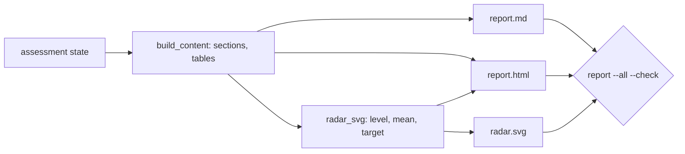

# Component: executive report (Markdown, HTML, radar)

The report turns an assessment into something a leadership team can read in five minutes: overall and
pillar levels, a radar chart, the review queue, gaps, the Month 1-12 plan, evidence counts and the
method with attribution. Markdown and HTML come from the same content; the radar is a matplotlib SVG.

Sections: [1. Purpose](#1-purpose) · [2. Architecture](#2-architecture) · [3. How it works](#3-how-it-works) · [4. Key files](#4-key-files) · [5. Code excerpts](#5-code-excerpts) · [6. Configuration](#6-configuration) · [7. Commands](#7-commands) · [8. Real output](#8-real-output) · [9. Tests and gates](#9-tests-and-gates) · [10. Guardrails](#10-guardrails) · [11. Security and governance](#11-security-and-governance) · [12. Observability](#12-observability) · [13. Failure modes](#13-failure-modes) · [14. Mapping to Azure services](#14-mapping-to-azure-services) · [15. Limitations](#15-limitations) · [16. Interview talking points](#16-interview-talking-points) · [17. Adopt this](#17-adopt-this)

## 1. Purpose

* Give non-technical readers the result and the plan; give reviewers the evidence trail.

## 2. Architecture



## 3. How it works

1. `build_content` assembles sections: executive summary, pillars, categories, human review, gaps, roadmap, cross-links, evidence, method and attribution.
2. Labels matter: sample answers and fictional organisations are stated in the summary.
3. `radar_svg` draws three series (target, category mean, pillar level) with a fixed SVG hash salt and no date metadata, so output is byte-stable.
4. `write(check=True)` compares fresh output with the checked-in files; CI fails on drift.

## 4. Key files

| File | Role |
|---|---|
| `src/aimaturity/report.py` | Content, Markdown, HTML, radar |
| `samples/*/report/` | Checked-in reports for the three samples |

## 5. Code excerpts

<!-- code: src/aimaturity/report.py::radar_svg -->
```python
def radar_svg(pillars: list[dict[str, Any]], targets: list[float], title: str) -> str:
    import matplotlib

    matplotlib.use("Agg")
    import matplotlib.pyplot as plt

    matplotlib.rcParams.update({"svg.hashsalt": "aimaturity", "svg.fonttype": "none", "font.family": "DejaVu Sans", "font.size": 9})
    labels = [f"{p['id']} {p['name']}" for p in pillars]
    n = len(labels)
    angles = [i * 2 * math.pi / n for i in range(n)] + [0.0]
    fig = plt.figure(figsize=(6.4, 5.6))
    ax = fig.add_subplot(111, polar=True)
    ax.set_theta_offset(math.pi / 2)
    ax.set_theta_direction(-1)
    for vals, style, name in [
        ([float(t) for t in targets], dict(color="#9aa5b1", linestyle="--", linewidth=1.2), "Target"),
        ([p["mean"] for p in pillars], dict(color="#1f6feb", linewidth=2), "Category mean"),
        ([float(p["level"]) for p in pillars], dict(color="#d97706", linewidth=1.5, marker="o"), "Pillar level"),
    ]:
        ax.plot(angles, vals + vals[:1], label=name, **style)
    ax.fill(angles, [p["mean"] for p in pillars] + [pillars[0]["mean"]], color="#1f6feb", alpha=0.12)
    ax.set_xticks(angles[:-1], ["\n".join(_wrap(lbl)) for lbl in labels])
    ax.set_ylim(0, 4)
    ax.set_yticks([1, 2, 3, 4], [f"{i} {LEVEL_NAMES[i]}" for i in (1, 2, 3, 4)], fontsize=7)
    ax.set_title(title, pad=24)
    ax.legend(loc="lower right", bbox_to_anchor=(1.32, -0.08), fontsize=8, frameon=False)
    buf = io.StringIO()
    fig.savefig(buf, format="svg", bbox_inches="tight", metadata={"Date": None, "Creator": None})
    plt.close(fig)
    return buf.getvalue()
```
<!-- /code -->

<!-- code: src/aimaturity/report.py::ATTRIBUTION -->
```python
ATTRIBUTION = (
    "Framework structure (six pillars, 29 categories, four levels) adapted from UNESCO, *AI Maturity Framework* "
    '(subtitle: "A self-positioning guide for public administrations"), developed by Stratejai for UNESCO, '
    "under CC BY-SA 3.0 IGO (https://creativecommons.org/licenses/by-sa/3.0/igo/). Descriptors, rubric, scoring "
    "and wording are this project's own; UNESCO does not endorse this tool or its results."
)
```
<!-- /code -->

## 6. Configuration

| Setting | Value |
|---|---|
| SVG hash salt | `aimaturity` |
| Font | DejaVu Sans (bundled with matplotlib), text kept as text |
| matplotlib | pinned 3.11.2 |

## 7. Commands

```bash
aimaturity report --org portfolio
aimaturity report --all --check
```

## 8. Real output

<!-- output: report --all --check -->
```text
kestrel-bay-bank: up to date
portfolio: up to date
valemont-revenue-agency: up to date
```
<!-- /output -->

## 9. Tests and gates

* `tests/test_report.py`: drift check per org, determinism, required sections, embedded SVG, no timestamps or dates, sample and fictional labels, attribution.

## 10. Guardrails

* No dates in reports; month numbers only.
* Attribution with license name and link in every report.

## 11. Security and governance

Runs offline with no credentials. Reads repositories through `git ls-files` and never executes their code; evidence holds paths and short match details, never file contents or secrets.

## 12. Observability

Reports are uploaded by the scheduled job to the `reports` container under the job execution name.

## 13. Failure modes

| Failure | Behaviour |
|---|---|
| Code changes alter numbers | CI drift check fails until reports are regenerated |
| matplotlib upgrade changes SVG | pinned version; drift check catches it |

## 14. Mapping to Azure services

* **Azure Storage static website** or **Power BI** can publish the HTML; **Microsoft Entra ID** protects access.
* **Microsoft Foundry**: a hosted model replaces `MockLLM` for rationales, and Foundry evaluations score rationale groundedness against the cited evidence.
* **Microsoft Purview**: register the evidence store and reports as data assets with lineage back to the scanned repositories, and keep questionnaire answers under a sensitivity label.
* **Azure Policy**: audit that the evidence store stays keyless and versioned and that the Key Vault keeps RBAC, so the controls the assessment relies on cannot drift silently.
* **Azure Monitor / Log Analytics**: job logs, blob access logs and Key Vault audit events land in one workspace, where a query can trend maturity runs over time.

## 15. Limitations

* The HTML is intentionally plain; there is no interactive drill-down.

## 16. Interview talking points

* "The reports are checked in and drift-checked, so the numbers in my README always match the code."

## 17. Adopt this

1. Run `aimaturity report --org <org>`; files land in `samples/<org>/report/`.
2. Add a section in `build_content` (for example, a cost estimate per roadmap item); both formats pick it up.
3. Brand it by editing the CSS string in `to_html`.
