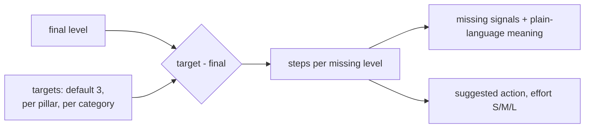

# Component: gap analysis

For each category, the gap is the target level minus the final level. Every missing level becomes a
step with the evidence still absent and the framework's suggested action for that level.

Sections: [1. Purpose](#1-purpose) · [2. Architecture](#2-architecture) · [3. How it works](#3-how-it-works) · [4. Key files](#4-key-files) · [5. Code excerpts](#5-code-excerpts) · [6. Configuration](#6-configuration) · [7. Commands](#7-commands) · [8. Real output](#8-real-output) · [9. Tests and gates](#9-tests-and-gates) · [10. Guardrails](#10-guardrails) · [11. Security and governance](#11-security-and-governance) · [12. Observability](#12-observability) · [13. Failure modes](#13-failure-modes) · [14. Mapping to Azure services](#14-mapping-to-azure-services) · [15. Limitations](#15-limitations) · [16. Interview talking points](#16-interview-talking-points) · [17. Adopt this](#17-adopt-this)

## 1. Purpose

* Turn a score into a to-do list that names concrete evidence, not abstract advice.

## 2. Architecture



## 3. How it works

1. `Org.target(category)` reads category, then pillar, then default targets from `org.yaml`.
2. For each level from final + 1 to target, the step lists missing signals (with their descriptions) and the action from `framework/framework.yaml`.
3. Effort comes from `rubric/categories.yaml` per step.

## 4. Key files

| File | Role |
|---|---|
| `src/aimaturity/gaps.py` | gap_analysis, describe |
| `framework/framework.yaml` | Suggested actions per level |
| `samples/*/org.yaml` | Targets |

## 5. Code excerpts

<!-- code: src/aimaturity/gaps.py::gap_analysis -->
```python
def gap_analysis(results, statuses, target_of) -> list[dict[str, Any]]:
    cats = categories()
    rows = []
    for cid, res in results.items():
        current = statuses[cid]["final_level"]
        target = target_of(cid)
        steps = []
        for lvl in range(current + 1, target + 1):
            need = cats[cid]["rubric"]["levels"][lvl]
            missing = [s for s in need if res.signals[s].present < 1]
            steps.append(
                {
                    "to_level": lvl,
                    "level_name": LEVEL_NAMES[lvl],
                    "missing": missing,
                    "missing_text": [describe(s) for s in missing],
                    "action": cats[cid]["actions"].get(lvl, ""),
                    "effort": cats[cid]["rubric"]["effort"][lvl],
                }
            )
        rows.append(
            {
                "category": cid,
                "name": res.name,
                "pillar": res.pillar,
                "critical": res.critical,
                "current": current,
                "target": target,
                "gap": max(0, target - current),
                "confidence": res.confidence,
                "status": statuses[cid]["status"],
                "steps": steps,
            }
        )
    return rows
```
<!-- /code -->

## 6. Configuration

| Target setting | Example |
|---|---|
| default | 3 (Dynamic) |
| pillars | `{"5": 4}` raises all of P5 |
| categories | `{"6.4": 2}` lowers one |

## 7. Commands

```bash
aimaturity gaps --org portfolio
aimaturity gaps --org valemont-revenue-agency
```

## 8. Real output

<!-- output: gaps --org valemont-revenue-agency -->
```text
cat  now  target  gap  first action
---  ---  ------  ---  ----------------------------------------------------------------------
4.2  1    3       2    Add uptime and error monitoring to every AI service.
4.5  1    3       2    Collect reusable components in a shared repository.
1.1  2    3       1    Attach measurable targets to each outcome and publish them with an own
1.2  2    3       1    Make a business case with goal linkage mandatory before funding any AI
1.3  2    3       1    Add owners, budget and dependencies to each milestone and review it mo
1.4  2    3       1    Track realised value and run cost per use case and report it every mon
1.5  2    3       1    Provide a sandbox, a small pilot fund and a standard write-up template
2.1  2    3       1    Fund a training path per role and add AI roles to workforce planning.
2.2  2    3       1    Charter a centre of excellence with mandate, budget and reporting line
3.1  2    3       1    Standardise on a supported platform with templates for new projects.
3.2  2    3       1    Provision AI infrastructure as code with tagging and budgets.
3.3  2    3       1    Adopt standard integration patterns and record them in architecture de
3.4  2    3       1    Provide a reproducible workbench with pinned dependencies and experime
4.1  2    3       1    Build CI/CD with tests, evaluation gates, approvals and rollback.
4.3  2    3       1    Standardise integration through an API gateway and documented contract
5.2  3    4       1    Track ethics outcomes and involve affected people in design.
5.3  2    3       1    Standardise risk cards with scoring, controls, owners and scenario tes
5.5  3    4       1    Tailor explanations per audience and publish transparency notes.
6.1  2    3       1    Catalogue data assets and link them to use cases.
6.2  2    3       1    Introduce data contracts and automated quality tests in pipelines.
6.3  2    3       1    Serve data through a governed platform with role-based access and mana
6.4  1    2       1    Try a synthetic dataset for one test or privacy problem.
```
<!-- /output -->

## 9. Tests and gates

* `tests/test_gaps_roadmap.py`: gap arithmetic, one step per missing level, actions and effort present, targets follow overrides.

## 10. Guardrails

* Gaps use final levels, so a reviewer's override changes the plan.

## 11. Security and governance

Runs offline with no credentials. Reads repositories through `git ls-files` and never executes their code; evidence holds paths and short match details, never file contents or secrets.

## 12. Observability

The report's gap table lists every category below target with its first action.

## 13. Failure modes

| Failure | Behaviour |
|---|---|
| Target below current level | gap 0, no steps |
| Unknown category in targets | schema rejects it |

## 14. Mapping to Azure services

* **Azure DevOps Boards** or **GitHub Issues** can receive one work item per step (not automated here, by design).
* **Microsoft Foundry**: a hosted model replaces `MockLLM` for rationales, and Foundry evaluations score rationale groundedness against the cited evidence.
* **Microsoft Purview**: register the evidence store and reports as data assets with lineage back to the scanned repositories, and keep questionnaire answers under a sensitivity label.
* **Azure Policy**: audit that the evidence store stays keyless and versioned and that the Key Vault keeps RBAC, so the controls the assessment relies on cannot drift silently.
* **Azure Monitor / Log Analytics**: job logs, blob access logs and Key Vault audit events land in one workspace, where a query can trend maturity runs over time.

## 15. Limitations

* Actions are generic per level; tailoring them is the reviewer's job.

## 16. Interview talking points

* "Every gap names the missing evidence, so 'done' means the next scan can see it."

## 17. Adopt this

1. Set `targets` in `org.yaml`.
2. Rewrite actions for your context in `framework/framework.yaml` (keep the CC BY-SA notice).
3. Export gaps with `aimaturity assess --json` or the MCP `gaps` tool.
