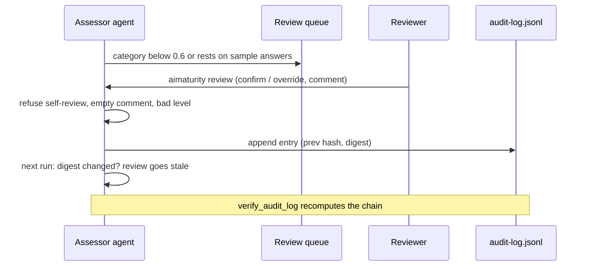

# Component: human review (HITL) and audit log

Low-confidence categories, and any level that rests on sample answers, wait for a named reviewer. A
review confirms or overrides the level with a comment, is bound to a digest of the evidence and is
appended to a hash-chained audit log.

Sections: [1. Purpose](#1-purpose) · [2. Architecture](#2-architecture) · [3. How it works](#3-how-it-works) · [4. Key files](#4-key-files) · [5. Code excerpts](#5-code-excerpts) · [6. Configuration](#6-configuration) · [7. Commands](#7-commands) · [8. Real output](#8-real-output) · [9. Tests and gates](#9-tests-and-gates) · [10. Guardrails](#10-guardrails) · [11. Security and governance](#11-security-and-governance) · [12. Observability](#12-observability) · [13. Failure modes](#13-failure-modes) · [14. Mapping to Azure services](#14-mapping-to-azure-services) · [15. Limitations](#15-limitations) · [16. Interview talking points](#16-interview-talking-points) · [17. Adopt this](#17-adopt-this)

## 1. Purpose

* Put humans where the evidence is weakest, and make their decisions accountable and tamper-evident.

## 2. Architecture



## 3. How it works

1. `apply_reviews` ignores reviews that break a rule or have no matching audit entry.
2. A valid review whose digest matches the current evidence sets the final level (status `confirmed` or `overridden`).
3. If the evidence changed since the review, the status is `stale-review` and the category returns to the queue.
4. `record_review` validates, appends the audit entry (sequence, previous hash, own hash) and stores the review with its audit hash.
5. `verify_audit_log` reports reordered, edited or deleted entries.
6. The MCP server has no review tool: only a person at the CLI can sign off.

## 4. Key files

| File | Role |
|---|---|
| `src/aimaturity/hitl.py` | Digest, validation, record, apply, verify |
| `samples/*/reviews.yaml` | Current reviews |
| `samples/*/audit-log.jsonl` | Hash-chained log |

## 5. Code excerpts

<!-- code: src/aimaturity/hitl.py::record_review -->
```python
def record_review(
    reviews_path: Path, log_path: Path, assessor: str, results: dict[str, CategoryResult], evidence: dict[str, Evidence], **review: Any
) -> dict[str, Any]:
    """Validate, append to the reviews file and the audit log, return the stored review."""
    validate_review(review, assessor, results)
    res = results[review["category"]]
    stored = {
        "category": review["category"],
        "reviewer": review["reviewer"],
        "decision": review["decision"],
        "level": review["level"] if review["decision"] == "override" else res.level,
        "computed_level": res.level,
        "comment": review["comment"].strip(),
        "evidence_digest": category_digest(res, evidence),
    }
    log = read_log(log_path)
    entry = {"seq": len(log) + 1, "action": "review", **stored, "prev": log[-1]["hash"] if log else GENESIS}
    entry["hash"] = _entry_hash(entry)
    stored["audit_hash"] = entry["hash"]
    with log_path.open("a") as f:
        f.write(json.dumps(entry, sort_keys=True) + "\n")
    reviews = [*read_reviews(reviews_path), stored]
    reviews_path.write_text(yaml.safe_dump({"reviews": reviews}, sort_keys=False, width=120))
    return stored
```
<!-- /code -->

<!-- code: src/aimaturity/hitl.py::category_digest -->
```python
def category_digest(result: CategoryResult, evidence: dict[str, Evidence]) -> str:
    """Stable fingerprint of what the category was scored on (paths and answers, not evidence ids)."""
    rows = []
    for sid, st in sorted(result.signals.items()):
        refs = sorted(f"{evidence[i].source}:{evidence[i].path}" for i in st.evidence)
        rows.append([sid, st.present, st.basis, refs])
    return hashlib.sha256(json.dumps(rows, sort_keys=True).encode()).hexdigest()[:16]
```
<!-- /code -->

## 6. Configuration

| Rule | Value |
|---|---|
| Minimum comment | 10 characters |
| Decisions | confirm, override (level 1-4) |
| Reviewer | must differ from `assessor` in org.yaml |

## 7. Commands

```bash
aimaturity queue --org portfolio
aimaturity review --org kestrel-bay-bank --category 3.1 --reviewer "Platform Lead" --decision confirm --comment "Eval gates run in every pipeline"
aimaturity audit --org valemont-revenue-agency
```

## 8. Real output

<!-- output: queue --org kestrel-bay-bank -->
```text
category  name                              why
--------  --------------------------------  -------------------------
3.1       AI Development Platforms & Tools  confidence 0.59 below 0.6
```
<!-- /output -->

<!-- output: audit --org valemont-revenue-agency -->
```text
2 entries; chain intact
```
<!-- /output -->

## 9. Tests and gates

* `tests/test_hitl.py`: self-review, short comment, override without level, confirm, override, stale on evidence change, chain intact, tamper and deletion detected, forged review ignored, latest wins.
* CI: `aimaturity audit` style checks through `tests/test_hitl.py::test_checked_in_logs_are_intact`.

## 10. Guardrails

* Separation of duties in code; digest binding; append-only log with chain verification.

## 11. Security and governance

Reviewer names are strings in this demo; in production they come from Entra ID. Audit entries hold ids, levels and digests, not evidence content.

## 12. Observability

The report's human review section lists pending items with reasons and signed-off items with reviewer and comment, and states whether the chain is intact.

## 13. Failure modes

| Failure | Behaviour |
|---|---|
| Log edited | chain broken, assessment not final |
| Review reused after evidence changes | stale, back in queue |
| Assessor approves itself | rejected |

## 14. Mapping to Azure services

* **Azure Storage immutability policies** on the `audit` container make the log write-once.
* **Microsoft Entra ID** authenticates reviewers; **Azure Monitor** alerts on chain failures.
* **Microsoft Foundry**: a hosted model replaces `MockLLM` for rationales, and Foundry evaluations score rationale groundedness against the cited evidence.
* **Microsoft Purview**: register the evidence store and reports as data assets with lineage back to the scanned repositories, and keep questionnaire answers under a sensitivity label.
* **Azure Policy**: audit that the evidence store stays keyless and versioned and that the Key Vault keeps RBAC, so the controls the assessment relies on cannot drift silently.

## 15. Limitations

* Names are not authenticated identities; the chain proves order and integrity, not who typed the command.

## 16. Interview talking points

* "Reviews are bound to an evidence digest, so a sign-off cannot outlive the evidence it was about."

## 17. Adopt this

1. Set `assessor:` in `org.yaml` to the account that runs the tool.
2. Record reviews with `aimaturity review`; commit `reviews.yaml` and `audit-log.jsonl` together.
3. Upload the log to an immutable container in production (the Terraform creates the `audit` container).
