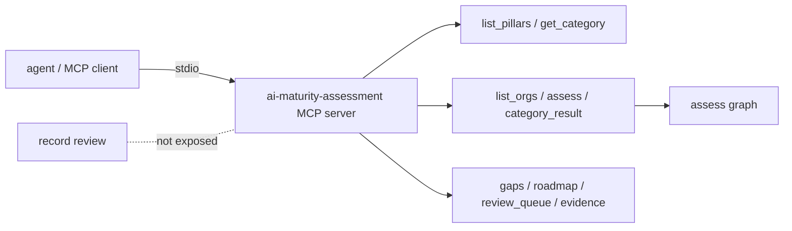

# Component: MCP server (read-only assessment tools)

Nine read-only MCP tools let an agent ask about the framework, the sample organisations, their
results, gaps, roadmap, review queue and evidence. No tool can record a review.

Sections: [1. Purpose](#1-purpose) · [2. Architecture](#2-architecture) · [3. How it works](#3-how-it-works) · [4. Key files](#4-key-files) · [5. Code excerpts](#5-code-excerpts) · [6. Configuration](#6-configuration) · [7. Commands](#7-commands) · [8. Real output](#8-real-output) · [9. Tests and gates](#9-tests-and-gates) · [10. Guardrails](#10-guardrails) · [11. Security and governance](#11-security-and-governance) · [12. Observability](#12-observability) · [13. Failure modes](#13-failure-modes) · [14. Mapping to Azure services](#14-mapping-to-azure-services) · [15. Limitations](#15-limitations) · [16. Interview talking points](#16-interview-talking-points) · [17. Adopt this](#17-adopt-this)

## 1. Purpose

* Make the assessment usable from agent workflows without giving agents decision rights.

## 2. Architecture



## 3. How it works

1. `build_server` registers each tool with `readOnlyHint`, `idempotentHint` and no destructive or open-world hint.
2. Assessments are cached per organisation for the server's lifetime.
3. `aimaturity mcp` serves over stdio; `aimaturity mcp-demo` runs a scripted in-memory session.

## 4. Key files

| File | Role |
|---|---|
| `src/aimaturity/mcp_server.py` | Server, tools, demo |

## 5. Code excerpts

<!-- code: src/aimaturity/mcp_server.py::TOOL_NAMES -->
```python
TOOL_NAMES = ["list_pillars", "get_category", "list_orgs", "assess", "category_result", "gaps", "roadmap", "review_queue", "evidence"]
```
<!-- /code -->

<!-- code: src/aimaturity/mcp_server.py::demo -->
```python
async def demo() -> list[str]:
    """Scripted session used by ``aimaturity mcp-demo``: what a planning agent would ask."""
    from mcp import Client

    lines = []
    async with Client(build_server()) as client:
        tools = await client.list_tools()
        lines.append("tools: " + ", ".join(sorted(t.name for t in tools.tools)))
        lines.append(f"all read-only: {all(t.annotations and t.annotations.read_only_hint for t in tools.tools)}")
        res = (await client.call_tool("assess", {"org_id": "valemont-revenue-agency"})).structured_content
        lines.append(f"{res['name']}: overall {res['overall']['level']} ({res['overall']['level_name']}); queue {res['review_queue']}")
        for p in res["pillars"]:
            lines.append(f"  {p['id']} {p['name']:<30} level {p['level']} mean {p['mean']}")
        cat = (await client.call_tool("category_result", {"org_id": "valemont-revenue-agency", "category_id": "4.4"})).structured_content
        lines.append(f"4.4: computed {cat['computed_level']}, final {cat['level']} ({cat['status']})")
        first = cat["evidence"][0]
        ev = (await client.call_tool("evidence", {"org_id": "valemont-revenue-agency", "evidence_id": first})).structured_content
        lines.append(f"  {first}: {ev['source']} {ev['path']} ({ev['origin']})")
        rm = (await client.call_tool("roadmap", {"org_id": "valemont-revenue-agency"})).structured_content
        lines.append("quick wins: " + ", ".join(p["id"] for p in rm["plan"] if p["kind"] == "quick-win"))
    return lines
```
<!-- /code -->

## 6. Configuration

| Tool | Returns |
|---|---|
| list_pillars | pillars and categories |
| get_category | descriptors, evidence needed, critical flag |
| list_orgs | sample orgs |
| assess | overall, pillars, queue |
| category_result | level, confidence, rationale, evidence ids |
| gaps | categories below target |
| roadmap | plan, backlog, milestones |
| review_queue | pending categories and reasons |
| evidence | one evidence item |

## 7. Commands

```bash
aimaturity mcp-demo
aimaturity mcp        # for an MCP client config
```

## 8. Real output

<!-- output: mcp-demo -->
```text
tools: assess, category_result, evidence, gaps, get_category, list_orgs, list_pillars, review_queue, roadmap
all read-only: True
Valemont Revenue Agency: overall 2 (Ready); queue ['2.1']
  P1 Strategy & Value               level 2 mean 2
  P2 People & Culture               level 3 mean 2.6
  P3 Technology & Infrastructure    level 2 mean 2
  P4 AI Operations & Ecosystem      level 2 mean 1.8
  P5 AI Governance, Ethics & Risk   level 3 mean 2.8
  P6 Data (AI-Specific Focus)       level 2 mean 2
4.4: computed 2, final 3 (overridden)
  E055: questionnaire q_partnership_informal (self-reported)
quick wins: 4.2->2, 4.5->2, 6.4->2, 1.5->3
```
<!-- /output -->

## 9. Tests and gates

* `tests/test_mcp_a2a.py`: tool list, read-only annotations, no write verbs, each tool's output, demo.

## 10. Guardrails

* Read-only by design; review stays a human CLI action.

## 11. Security and governance

Runs offline with no credentials. Reads repositories through `git ls-files` and never executes their code; evidence holds paths and short match details, never file contents or secrets.

## 12. Observability

Tool calls can be logged by the host; the server itself keeps no state beyond the cache.

## 13. Failure modes

| Failure | Behaviour |
|---|---|
| Unknown evidence id | error object, not an exception |
| Unknown org | KeyError listing known orgs |

## 14. Mapping to Azure services

* **Azure API Management** can front an HTTP transport with Entra ID auth; **Azure Container Apps** can host it.
* **Microsoft Foundry**: a hosted model replaces `MockLLM` for rationales, and Foundry evaluations score rationale groundedness against the cited evidence.
* **Microsoft Purview**: register the evidence store and reports as data assets with lineage back to the scanned repositories, and keep questionnaire answers under a sensitivity label.
* **Azure Policy**: audit that the evidence store stays keyless and versioned and that the Key Vault keeps RBAC, so the controls the assessment relies on cannot drift silently.
* **Azure Monitor / Log Analytics**: job logs, blob access logs and Key Vault audit events land in one workspace, where a query can trend maturity runs over time.

## 15. Limitations

* stdio only in this repository.

## 16. Interview talking points

* "Agents can ask, people decide: there is deliberately no review tool."

## 17. Adopt this

1. Add the server to your MCP client: command `aimaturity`, args `["mcp"]`.
2. Add a tool in `build_server` with `annotations=RO` and a test in `tests/test_mcp_a2a.py`.
3. Point it at your own org by adding `samples/<org>/org.yaml`.
