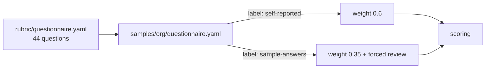

# Component: questionnaire for people and culture items

Some capabilities leave no artifact: sponsorship, change methods, partnerships, review boards. The
questionnaire asks 44 yes/partial/no questions, and every answer file carries a label that says how
far to trust it.

Sections: [1. Purpose](#1-purpose) · [2. Architecture](#2-architecture) · [3. How it works](#3-how-it-works) · [4. Key files](#4-key-files) · [5. Code excerpts](#5-code-excerpts) · [6. Configuration](#6-configuration) · [7. Commands](#7-commands) · [8. Real output](#8-real-output) · [9. Tests and gates](#9-tests-and-gates) · [10. Guardrails](#10-guardrails) · [11. Security and governance](#11-security-and-governance) · [12. Observability](#12-observability) · [13. Failure modes](#13-failure-modes) · [14. Mapping to Azure services](#14-mapping-to-azure-services) · [15. Limitations](#15-limitations) · [16. Interview talking points](#16-interview-talking-points) · [17. Adopt this](#17-adopt-this)

## 1. Purpose

* Collect what code cannot show without pretending it is as strong as an artifact.
* Make demo inputs impossible to mistake for facts.

## 2. Architecture



## 3. How it works

1. Each question names the category it serves; the rubric uses its id (`q_...`) as a signal.
2. Answers are `yes` (1.0), `partial` (0.5) or `no` (0.0), optionally with a note. YAML booleans are accepted.
3. The file's `label` sets the origin: `self-reported` weighs 0.6 in confidence, `sample-answers` 0.35.
4. Any level that rests on a sample answer is queued for human review, whatever the confidence.
5. Unanswered questions weigh 0.2, which lowers confidence and usually triggers review.

## 4. Key files

| File | Role |
|---|---|
| `rubric/questionnaire.yaml` | The questions |
| `samples/portfolio/questionnaire.yaml` | Sample answers for the portfolio (labelled) |
| `samples/kestrel-bay-bank/questionnaire.yaml` | Self-reported answers (fictional) |
| `schemas/answers.schema.json` | Answer file schema |

## 5. Code excerpts

<!-- code: src/aimaturity/collectors/__init__.py::collect_questionnaire -->
```python
def collect_questionnaire(answers: dict[str, Any]) -> list[Evidence]:
    origin = answers.get("label", "self-reported")
    out = []
    for qid, a in sorted(answers.get("answers", {}).items()):
        if qid not in questions():
            raise ValueError(f"unknown question {qid}")
        value = a["answer"] if isinstance(a, dict) else a
        note = a.get("note", "") if isinstance(a, dict) else ""
        if isinstance(value, bool):  # YAML 1.1 reads bare yes/no as booleans
            value = "yes" if value else "no"
        strength = ANSWER_STRENGTH[value]
        out.append(Evidence(qid, "questionnaire", "questionnaire", qid, f"answer {value}" + (f": {note}" if note else ""), strength, origin))
    return out
```
<!-- /code -->

<!-- code: src/aimaturity/scoring.py::WEIGHTS -->
```python
WEIGHTS = {"artifact": 1.0, "absent-scanned": 0.8, "absent-unscanned": 0.5, "self-reported": 0.6, "sample-answers": 0.35, "unanswered": 0.2}
```
<!-- /code -->

## 6. Configuration

| Label | Weight | Effect |
|---|---|---|
| self-reported | 0.6 | normal scoring |
| sample-answers | 0.35 | levels resting on it go to review |
| (unanswered) | 0.2 | counts as absent, lowers confidence |

## 7. Commands

```bash
aimaturity category 2.3
aimaturity queue --org portfolio
```

## 8. Real output

<!-- output: queue --org portfolio -->
```text
category  name                                   why
--------  -------------------------------------  ----------------------------------------------------------------------------
1.1       AI Vision & Ambition                   confidence 0.53 below 0.6; level rests on sample answers: q_vision_published
1.2       Strategic Alignment                    confidence 0.44 below 0.6; level rests on sample answers: q_goal_field
1.5       Innovation & Experimentation           level rests on sample answers: q_pilot_scaling
2.1       Talent & Skills                        confidence 0.31 below 0.6
2.2       Organizational Structure               confidence 0.44 below 0.6; level rests on sample answers: q_coordinator
2.3       Leadership & Sponsorship               confidence 0.31 below 0.6; level rests on sample answers: q_project_sponsors
2.4       Change Management & Adoption           confidence 0.50 below 0.6; level rests on sample answers: q_rollout_comms
2.5       AI Literacy & Awareness                level rests on sample answers: q_awareness_material
3.2       Cloud & Compute Infrastructure         level rests on sample answers: q_cost_optimisation_cadence
4.4       External Collaboration & Partnerships  confidence 0.31 below 0.6
5.2       Ethical Principles & Guidelines        level rests on sample answers: q_ethics_principles
6.3       Data Access for AI Teams               confidence 0.31 below 0.6
6.4       Synthetic Data Generation & Use        confidence 0.57 below 0.6
```
<!-- /output -->

## 9. Tests and gates

* `tests/test_questionnaire.py`: strengths, labels, notes, unknown questions, booleans.
* `tests/test_samples.py`: portfolio answers are labelled sample and their categories wait for review.

## 10. Guardrails

* Unknown question ids fail loudly.
* The report prints SAMPLE ANSWERS when the label says so.

## 11. Security and governance

Answers can contain internal judgements; store them in the private `evidence` container and keep notes short.

## 12. Observability

The review queue shows the reason (`level rests on sample answers: q_...`).

## 13. Failure modes

| Failure | Behaviour |
|---|---|
| Optimistic self-assessment | lower weight than artifacts; reviewer can override with a comment |
| Demo answers treated as real | forced review and report banner |

## 14. Mapping to Azure services

* **Microsoft Forms** collects the answers; a small Logic App writes the YAML into the evidence store.
* **Microsoft Entra ID** identifies respondents if answers must be attributable.
* **Microsoft Foundry**: a hosted model replaces `MockLLM` for rationales, and Foundry evaluations score rationale groundedness against the cited evidence.
* **Microsoft Purview**: register the evidence store and reports as data assets with lineage back to the scanned repositories, and keep questionnaire answers under a sensitivity label.
* **Azure Policy**: audit that the evidence store stays keyless and versioned and that the Key Vault keeps RBAC, so the controls the assessment relies on cannot drift silently.
* **Azure Monitor / Log Analytics**: job logs, blob access logs and Key Vault audit events land in one workspace, where a query can trend maturity runs over time.

## 15. Limitations

* Three answer values are coarse; a richer scale would need calibration data.
* The questions are the project's own and may not suit every sector.

## 16. Interview talking points

* "I weight evidence by source: an artifact beats an answer, and a demo answer can never pass on its own."

## 17. Adopt this

1. Copy the questions into your survey tool; keep the ids.
2. Save answers as `samples/<org>/questionnaire.yaml` with `label: self-reported`.
3. Add or reword questions in `rubric/questionnaire.yaml` and reference them from `rubric/categories.yaml`; `aimaturity validate` checks every id.
