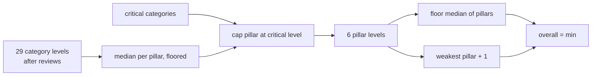

# Component: pillar and overall roll-up

Category levels roll up to six pillar levels and one overall level. Critical categories cap their
pillar, and the overall level cannot sit more than one level above the weakest pillar.

Sections: [1. Purpose](#1-purpose) · [2. Architecture](#2-architecture) · [3. How it works](#3-how-it-works) · [4. Key files](#4-key-files) · [5. Code excerpts](#5-code-excerpts) · [6. Configuration](#6-configuration) · [7. Commands](#7-commands) · [8. Real output](#8-real-output) · [9. Tests and gates](#9-tests-and-gates) · [10. Guardrails](#10-guardrails) · [11. Security and governance](#11-security-and-governance) · [12. Observability](#12-observability) · [13. Failure modes](#13-failure-modes) · [14. Mapping to Azure services](#14-mapping-to-azure-services) · [15. Limitations](#15-limitations) · [16. Interview talking points](#16-interview-talking-points) · [17. Adopt this](#17-adopt-this)

## 1. Purpose

* Summarise without hiding weak spots: medians resist one outlier, caps make foundations count.
* Keep the averages for charts so trends stay visible between whole levels.

## 2. Architecture



## 3. How it works

1. Final category levels include human overrides.
2. Pillar level = floor(median of its categories), capped by the lowest critical category in that pillar.
3. Overall = floor(median of pillar levels), capped at weakest pillar + 1.
4. Pillar means and the overall mean are kept for the radar chart.
5. UNESCO's guide lets each organisation choose its own critical categories; this tool defaults to one per pillar (1.1, 2.3, 3.2, 4.1, 5.1, 6.2) and `org.yaml` can override them.

## 4. Key files

| File | Role |
|---|---|
| `src/aimaturity/rollup.py` | pillar_rollup, overall |
| `rubric/categories.yaml` | Default critical list |
| `samples/valemont-revenue-agency/org.yaml` | Example of a custom critical list |

## 5. Code excerpts

<!-- code: src/aimaturity/rollup.py::pillar_rollup -->
```python
def pillar_rollup(levels: dict[str, int], critical: list[str]) -> list[dict[str, Any]]:
    out = []
    for p in pillars():
        ids = [c["id"] for c in p["categories"]]
        vals = [levels[i] for i in ids]
        median_level = math.floor(statistics.median(vals))
        crit = [levels[i] for i in ids if i in critical]
        cap = min(crit) if crit else 4
        lvl = min(median_level, cap)
        out.append(
            {
                "id": p["id"],
                "name": p["name"],
                "level": lvl,
                "level_name": LEVEL_NAMES[lvl],
                "mean": round(statistics.mean(vals), 2),
                "median": statistics.median(vals),
                "capped_by": [i for i in ids if i in critical and levels[i] < median_level],
            }
        )
    return out
```
<!-- /code -->

<!-- code: src/aimaturity/rollup.py::overall -->
```python
def overall(pillar_rows: list[dict[str, Any]]) -> dict[str, Any]:
    lv = [p["level"] for p in pillar_rows]
    raw = math.floor(statistics.median(lv))
    lvl = min(raw, min(lv) + 1)
    return {"level": lvl, "level_name": LEVEL_NAMES[lvl], "mean": round(statistics.mean(p["mean"] for p in pillar_rows), 2), "capped": lvl < raw}
```
<!-- /code -->

## 6. Configuration

| Setting | Where |
|---|---|
| Default critical categories | `rubric/categories.yaml` `critical` |
| Per-org critical list | `org.yaml` `critical` |

## 7. Commands

```bash
aimaturity assess --org portfolio
aimaturity assess --org kestrel-bay-bank --json
```

## 8. Real output

<!-- output: assess --org portfolio -->
```text
Jagadish Meduri portfolio: overall Level 3 (Dynamic), mean 2.79
pillar  name                          level            mean  capped by
------  ----------------------------  -----  --------  ----  ---------
P1      Strategy & Value              3      Dynamic   3     -
P2      People & Culture              2      Ready     1.8   -
P3      Technology & Infrastructure   4      Advanced  3.75  -
P4      AI Operations & Ecosystem     3      Dynamic   2.8   -
P5      AI Governance, Ethics & Risk  3      Dynamic   3.2   -
P6      Data (AI-Specific Focus)      3      Dynamic   2.2   -

cat  level  computed  conf  status          target
---  -----  --------  ----  --------------  ------
1.1  3      3         0.53  pending-review  3
1.2  2      2         0.44  pending-review  3
1.3  3      3         0.93  auto            3
1.4  3      3         0.62  auto            3
1.5  4      4         0.63  pending-review  3
2.1  1      1         0.31  pending-review  3
2.2  2      2         0.44  pending-review  3
2.3  2      2         0.31  pending-review  3
2.4  2      2         0.5   pending-review  3
2.5  2      2         0.74  pending-review  3
3.1  4      4         1.0   auto            4
3.2  4      4         0.75  pending-review  4
3.3  4      4         1.0   auto            4
3.4  3      3         0.9   auto            4
4.1  3      3         0.64  auto            3
4.2  3      3         0.62  auto            3
4.3  4      4         1.0   auto            3
4.4  1      1         0.31  pending-review  3
4.5  3      3         0.9   auto            3
5.1  4      4         0.95  auto            4
5.2  3      3         0.81  pending-review  4
5.3  3      3         0.62  auto            4
5.4  3      3         0.9   auto            4
5.5  3      3         0.87  auto            4
6.1  3      3         0.87  auto            3
6.2  3      3         0.87  auto            3
6.3  1      1         0.31  pending-review  3
6.4  3      3         0.57  pending-review  3
6.5  1      1         0.61  auto            3

review queue: 1.1, 1.2, 1.5, 2.1, 2.2, 2.3, 2.4, 2.5, 3.2, 4.4, 5.2, 6.3, 6.4; final: False
```
<!-- /output -->

## 9. Tests and gates

* `tests/test_rollup.py`: uniform levels, median floors (odd and even counts), critical cap, non-critical does not cap, overall cap.

## 10. Guardrails

* Overrides change final levels, never computed ones; the report shows both.

## 11. Security and governance

Runs offline with no credentials. Reads repositories through `git ls-files` and never executes their code; evidence holds paths and short match details, never file contents or secrets.

## 12. Observability

Pillar rows include `capped_by`, so a report reader sees which critical category held a pillar down.

## 13. Failure modes

| Failure | Behaviour |
|---|---|
| Strong pillar hides a weak one | overall capped at weakest + 1 |
| A weak foundation in a strong pillar | critical cap |

## 14. Mapping to Azure services

* **Power BI** or an **Azure Monitor workbook** can chart pillar means across runs from `summary.json`.
* **Microsoft Foundry**: a hosted model replaces `MockLLM` for rationales, and Foundry evaluations score rationale groundedness against the cited evidence.
* **Microsoft Purview**: register the evidence store and reports as data assets with lineage back to the scanned repositories, and keep questionnaire answers under a sensitivity label.
* **Azure Policy**: audit that the evidence store stays keyless and versioned and that the Key Vault keeps RBAC, so the controls the assessment relies on cannot drift silently.

## 15. Limitations

* Medians of four or five values are coarse; the means are shown for nuance.

## 16. Interview talking points

* "Critical categories are UNESCO's idea; I made them configurable per organisation and tested the cap."

## 17. Adopt this

1. Set `critical:` in your `org.yaml` to the categories you cannot compromise on.
2. Replace the median with a weighted mean in `pillar_rollup` if your board prefers it; the tests document the current behaviour.
