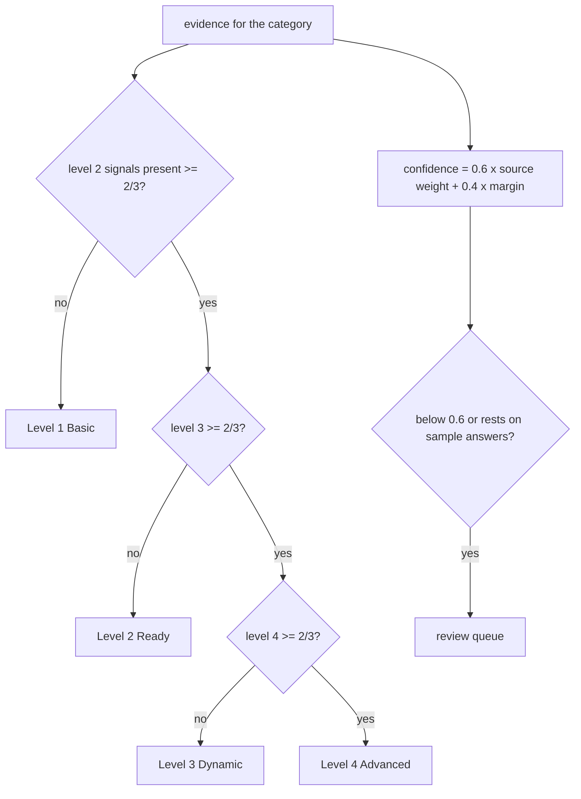

# Component: scoring and confidence

Each category gets a level from 1 to 4, a confidence between 0 and 1 and the evidence ids that justify
the level. The rules are short enough to explain in an interview and strict enough to test.

Sections: [1. Purpose](#1-purpose) · [2. Architecture](#2-architecture) · [3. How it works](#3-how-it-works) · [4. Key files](#4-key-files) · [5. Code excerpts](#5-code-excerpts) · [6. Configuration](#6-configuration) · [7. Commands](#7-commands) · [8. Real output](#8-real-output) · [9. Tests and gates](#9-tests-and-gates) · [10. Guardrails](#10-guardrails) · [11. Security and governance](#11-security-and-governance) · [12. Observability](#12-observability) · [13. Failure modes](#13-failure-modes) · [14. Mapping to Azure services](#14-mapping-to-azure-services) · [15. Limitations](#15-limitations) · [16. Interview talking points](#16-interview-talking-points) · [17. Adopt this](#17-adopt-this)

## 1. Purpose

* A level must be earned in order: evidence for level 3 does not count if level 2 is missing.
* Confidence says how much to trust the level, so humans spend time where it matters.

## 2. Architecture



## 3. How it works

1. For each level 2-4, the share of present signals is computed (a partial answer counts half).
2. The level is the highest one reached in order with a share of at least two thirds (threshold 0.66).
3. Source weights: artifact found 1.0; artifact searched for and absent 0.8 (0.5 when no repository was scanned); self-reported answer 0.6; sample answer 0.35; unanswered 0.2.
4. Margin: how far the deciding shares sit from the threshold (0 on the edge, 1 clear-cut).
5. Confidence = 0.6 x mean weight of the deciding signals + 0.4 x margin.
6. Review if confidence < 0.6 or a reached level rests on a sample answer.

## 4. Key files

| File | Role |
|---|---|
| `src/aimaturity/scoring.py` | SignalState, CategoryResult, score_category |
| `rubric/categories.yaml` | Threshold and signals per level |

## 5. Code excerpts

<!-- code: src/aimaturity/scoring.py::score_category -->
```python
def score_category(category_id: str, evidence: list[Evidence], scanned_repos: bool = True) -> CategoryResult:
    cat = categories()[category_id]
    t = rubric()["threshold"]
    levels = cat["rubric"]["levels"]
    states = signal_states(category_id, evidence, scanned_repos)
    ratios = {lvl: round(sum(states[s].present for s in levels[lvl]) / len(levels[lvl]), 3) for lvl in (2, 3, 4)}
    level = 1
    for lvl in (2, 3, 4):
        if ratios[lvl] >= t:
            level = lvl
        else:
            break
    # margin: how far the deciding ratios sit from the threshold (0 = on the edge, 1 = clear-cut)
    held = 1.0 if level == 1 else (ratios[level] - t) / (1 - t)
    failed = 1.0 if level == 4 else (t - ratios[level + 1]) / t
    margin = max(0.0, min(held, failed, 1.0))
    decided = [s for lvl in range(2, min(level + 1, 4) + 1) for s in levels[lvl]]
    decided = list(dict.fromkeys(decided))
    mean_w = sum(states[s].weight for s in decided) / len(decided)
    confidence = round(0.6 * mean_w + 0.4 * margin, 2)
    cited = list(dict.fromkeys(i for lvl in range(2, level + 1) for s in levels[lvl] for i in states[s].evidence))
    missing = [] if level == 4 else [s for s in levels[level + 1] if states[s].present < 1]
    reasons = []
    if confidence < REVIEW_BELOW:
        reasons.append(f"confidence {confidence:.2f} below {REVIEW_BELOW}")
    sample = sorted({s for lvl in range(2, level + 1) for s in levels[lvl] if states[s].basis == "sample-answers" and states[s].present > 0})
    if sample:
        reasons.append("level rests on sample answers: " + ", ".join(sample))
    return CategoryResult(
        category_id,
        cat["name"],
        cat["pillar"],
        cat["critical"],
        level,
        LEVEL_NAMES[level],
        confidence,
        ratios,
        states,
        cited,
        missing,
        bool(reasons),
        reasons,
    )
```
<!-- /code -->

<!-- code: src/aimaturity/scoring.py::WEIGHTS -->
```python
WEIGHTS = {"artifact": 1.0, "absent-scanned": 0.8, "absent-unscanned": 0.5, "self-reported": 0.6, "sample-answers": 0.35, "unanswered": 0.2}
```
<!-- /code -->

## 6. Configuration

| Knob | Where | Default |
|---|---|---|
| Threshold | `rubric/categories.yaml` `threshold` | 0.66 |
| Review bar | `scoring.REVIEW_BELOW` | 0.6 |
| Source weights | `scoring.WEIGHTS` | see above |

## 7. Commands

```bash
aimaturity explain --org portfolio --category 6.3
aimaturity explain --org valemont-revenue-agency --category 4.4
```

## 8. Real output

<!-- output: explain --org portfolio --category 6.3 -->
```text
6.3 Data Access for AI Teams: level 1 (Basic), confidence 0.31, status pending-review
rationale: Level 1 (Basic). No artifact or answer supports a level above Basic. Next level needs: q_access_process. Confidence 0.31.
  [~] q_access_process             sample-answers   E521
  [x] rbac_data                    artifact         E565, E566, E567
  [x] data_access_platform         artifact         E194, E195, E196
  [ ] q_self_service_data          sample-answers   
needs review: confidence 0.31 below 0.6
```
<!-- /output -->

<!-- output: explain --org valemont-revenue-agency --category 4.4 -->
```text
4.4 External Collaboration & Partnerships: level 2 (Ready), confidence 0.46, status overridden
rationale: Level 2 (Ready). Supported by [E055]. Next level needs: q_partnership_formal. Confidence 0.46.
  [x] q_partnership_informal       self-reported    E055
  [~] q_partnership_formal         self-reported    E054
  [ ] q_ecosystem_lead             self-reported    
  E055 questionnaire:q_partnership_informal (answer yes)
needs review: confidence 0.46 below 0.6
```
<!-- /output -->

## 9. Tests and gates

* `tests/test_scoring.py`: Basic with no evidence and Advanced with all for every category, stepwise rule, two-of-three, partial answers, weight order, review flags.
* Eval gates: calibration (exact agreement >= 0.80, within one >= 0.97, high-confidence accuracy >= low-confidence accuracy).

## 10. Guardrails

* Levels never skip; the margin term means borderline categories are reviewed.
* The scorer is pure: same evidence, same result (the stability gate checks shuffled order).

## 11. Security and governance

Runs offline with no credentials. Reads repositories through `git ls-files` and never executes their code; evidence holds paths and short match details, never file contents or secrets.

## 12. Observability

`explain` prints each signal with its basis (artifact, absent-scanned, self-reported, sample-answers, unanswered) and the cited ids.

## 13. Failure modes

| Failure | Behaviour |
|---|---|
| One missing foundation artifact | category drops to the level below it; dropout eval measures how often |
| Two of three signals with rounding | threshold 0.66 lets 2/3 pass |

## 14. Mapping to Azure services

* **Azure Monitor** custom metrics can carry level and confidence per category per run.
* **Microsoft Foundry**: a hosted model replaces `MockLLM` for rationales, and Foundry evaluations score rationale groundedness against the cited evidence.
* **Microsoft Purview**: register the evidence store and reports as data assets with lineage back to the scanned repositories, and keep questionnaire answers under a sensitivity label.
* **Azure Policy**: audit that the evidence store stays keyless and versioned and that the Key Vault keeps RBAC, so the controls the assessment relies on cannot drift silently.

## 15. Limitations

* Linear weights are a modelling choice; the calibration eval is the evidence that they are reasonable, not proof.
* Stepwise levels make a single missing foundation artifact costly; that is intentional and documented.

## 16. Interview talking points

* "A level needs two thirds of its evidence and the level below. Confidence blends source trust with how close the call was."

## 17. Adopt this

1. Tune `threshold` and `REVIEW_BELOW`, then run `aimaturity evals`; keep calibration above its gates.
2. Change source weights in `WEIGHTS` if your answers are audited (for example, raise self-reported to 0.7).
3. Move a signal between levels in `rubric/categories.yaml` to reflect your own definition of Ready or Dynamic.
