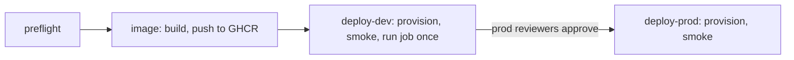

# Deployment

Nothing is deployed. The `deploy` workflow runs only its `preflight` job until the repository variable
`DEPLOY_ENABLED` is set to `true`.

## One-time setup

1. **Entra ID app registration** with a federated credential for this repository (`repo:<owner>/<repo>:environment:dev` and `...:environment:prod`). No client secret.
2. **Role assignments** for that app: Contributor and User Access Administrator on the target subscription (the stack creates role assignments for the job identity). Narrow to a resource group scope if your policy allows it.
3. **Terraform state**: a storage account and container; grant the app Storage Blob Data Contributor on it.
4. **GitHub variables**: `AZURE_CLIENT_ID`, `AZURE_TENANT_ID`, `AZURE_SUBSCRIPTION_ID`, `TFSTATE_RESOURCE_GROUP`, `TFSTATE_STORAGE_ACCOUNT`, optional `DEPLOY_TOOL` (terraform or bicep) and `AZURE_LOCATION`.
5. **GitHub environments** `dev` and `prod`; add required reviewers on `prod`.
6. Set `DEPLOY_ENABLED=true`.

## What a deployment does

## Cost at rest (smallest settings)

| Resource | Setting |
|---|---|
| Storage | Standard LRS, pay per GB |
| Log Analytics | PerGB2018, 30 days, 0.5 GB daily cap |
| Key Vault | Standard, per operation |
| Container Apps job | Consumption, 0.25 vCPU / 0.5 GiB, billed only while running |

## Teardown

Run `teardown` manually, choose the environment and type its name again. Prod teardown also waits for
the prod reviewers. The Key Vault stays soft-deleted for 7 days (purge protection) and is recovered on
the next deploy.
