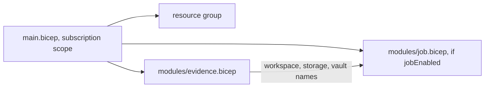

# Infrastructure: Bicep stack

The Bicep twin deploys the same plane at subscription scope: a resource group, an `evidence` module
(Log Analytics, storage, Key Vault, diagnostics) and an optional `job` module (identity, role assignments,
Container Apps environment and scheduled job).

Sections: [1. Purpose](#1-purpose) · [2. Architecture](#2-architecture) · [3. How it works](#3-how-it-works) · [4. Key files](#4-key-files) · [5. Code excerpts](#5-code-excerpts) · [6. Configuration](#6-configuration) · [7. Commands](#7-commands) · [8. Real output](#8-real-output) · [9. Tests and gates](#9-tests-and-gates) · [10. Guardrails](#10-guardrails) · [11. Security and governance](#11-security-and-governance) · [12. Observability](#12-observability) · [13. Failure modes](#13-failure-modes) · [14. Mapping to Azure services](#14-mapping-to-azure-services) · [15. Limitations](#15-limitations) · [16. Interview talking points](#16-interview-talking-points) · [17. Adopt this](#17-adopt-this)

## 1. Purpose

* Offer the same infrastructure to teams that standardise on Bicep, with parity enforced by tests.

## 2. Architecture



## 3. How it works

1. `main.bicep` computes names and tags, creates the resource group and calls both modules.
2. `job.bicep` references existing resources by name and assigns built-in roles by their well-known definition ids.
3. `bicep build` runs the linter; CI fails on any warning.

## 4. Key files

| File | Role |
|---|---|
| `infra/bicep/main.bicep` | Entry point |
| `infra/bicep/modules/evidence.bicep` | Workspace, storage, vault |
| `infra/bicep/modules/job.bicep` | Identity, roles, environment, job |
| `infra/bicep/main.parameters.json` | dev parameters |

## 5. Code excerpts

<!-- code: infra/bicep/modules/job.bicep::resource job -->
```bicep
resource job 'Microsoft.App/jobs@2024-03-01' = {
  name: 'caj-aimaturity-${suffix}'
  location: location
  tags: tags
  identity: {
    type: 'UserAssigned'
    userAssignedIdentities: { '${identity.id}': {} }
  }
  properties: {
    environmentId: env.id
    configuration: {
      triggerType: 'Schedule'
      replicaTimeout: 1800
      replicaRetryLimit: 1
      scheduleTriggerConfig: {
        cronExpression: schedule
        parallelism: 1
        replicaCompletionCount: 1
      }
    }
    template: {
      containers: [
        {
          name: 'assess'
          image: image
          command: ['aimaturity-scheduled']
          resources: { cpu: json('0.25'), memory: '0.5Gi' }
          env: [
            { name: 'AZURE_CLIENT_ID', value: identity.properties.clientId }
            { name: 'EVIDENCE_STORAGE_ACCOUNT', value: storage.name }
            { name: 'KEY_VAULT_URI', value: vault.properties.vaultUri }
            { name: 'AIMATURITY_ENV', value: environmentName }
          ]
        }
      ]
    }
  }
  dependsOn: [blobRole, secretsRole]
}
```
<!-- /code -->

<!-- code: infra/bicep/modules/evidence.bicep::resource vault -->
```bicep
resource vault 'Microsoft.KeyVault/vaults@2023-07-01' = {
  name: 'kv-aimat-${suffix}'
  location: location
  tags: tags
  properties: {
    tenantId: subscription().tenantId
    sku: { family: 'A', name: 'standard' }
    enableRbacAuthorization: true
    enableSoftDelete: true
    softDeleteRetentionInDays: 7
    enablePurgeProtection: true
  }
}
```
<!-- /code -->

## 6. Configuration

| Parameter | Default |
|---|---|
| environment | dev |
| location | eastus2 |
| logRetentionDays | 30 |
| jobImage | ghcr.io/jagadishmazure-jpg/ai-maturity-assessment:0.1.0 |
| jobSchedule | 0 6 * * 1 |
| jobEnabled | true |

## 7. Commands

```bash
az bicep build --file infra/bicep/main.bicep
az deployment sub what-if --location eastus2 --template-file infra/bicep/main.bicep --parameters infra/bicep/main.parameters.json
```

## 8. Real output

<!-- output: validate -->
```text
framework, rubric, schemas and sample orgs: OK
```
<!-- /output -->

## 9. Tests and gates

* CI `bicep` job: pinned Bicep CLI, build with linter, warnings fail.
* `tests/test_iac.py`: resource parity with Terraform and the same SKUs and security settings.

## 10. Guardrails

* Same security posture as Terraform: keyless storage, RBAC vault, identity-based job.

## 11. Security and governance

No Azure resources exist: nothing is deployed and the deploy workflow is gated by an unset `DEPLOY_ENABLED`.

## 12. Observability

Diagnostics for blob and vault go to the workspace.

## 13. Failure modes

| Failure | Behaviour |
|---|---|
| Template drift from Terraform | parity tests fail |

## 14. Mapping to Azure services

* Deployed with **Azure Resource Manager** at subscription scope; **Azure Policy** applies to the resource group.
* **Microsoft Foundry**: a hosted model replaces `MockLLM` for rationales, and Foundry evaluations score rationale groundedness against the cited evidence.
* **Microsoft Purview**: register the evidence store and reports as data assets with lineage back to the scanned repositories, and keep questionnaire answers under a sensitivity label.
* **Azure Monitor / Log Analytics**: job logs, blob access logs and Key Vault audit events land in one workspace, where a query can trend maturity runs over time.

## 15. Limitations

* The environment uses the workspace shared key for log routing (Container Apps requirement in this API version).

## 16. Interview talking points

* "Two IaC tools, one design, and a test that fails if they disagree."

## 17. Adopt this

1. Deploy with `az deployment sub create` and your own parameters file.
2. Set `jobEnabled=false` for storage and vault only.
3. Add modules for your extras and extend the parity test.
