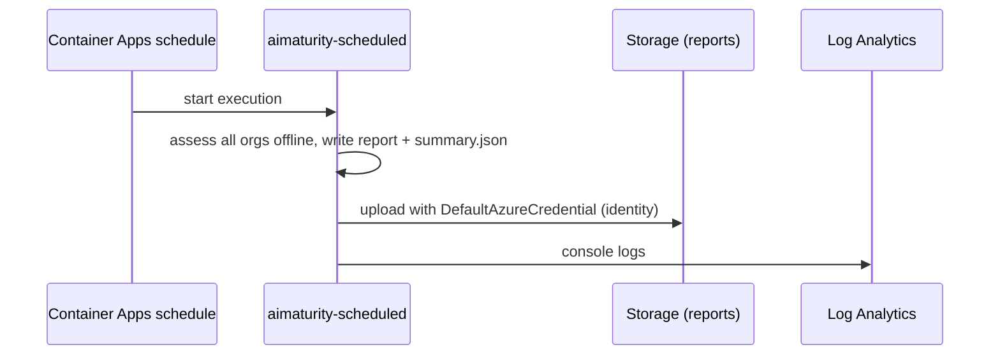

# Infrastructure: scheduled assessment job

A Container Apps job re-runs every assessment on a cron schedule (weekly in dev, monthly in prod),
writes reports and a JSON summary per organisation and uploads them to the evidence store with its
managed identity.

Sections: [1. Purpose](#1-purpose) · [2. Architecture](#2-architecture) · [3. How it works](#3-how-it-works) · [4. Key files](#4-key-files) · [5. Code excerpts](#5-code-excerpts) · [6. Configuration](#6-configuration) · [7. Commands](#7-commands) · [8. Real output](#8-real-output) · [9. Tests and gates](#9-tests-and-gates) · [10. Guardrails](#10-guardrails) · [11. Security and governance](#11-security-and-governance) · [12. Observability](#12-observability) · [13. Failure modes](#13-failure-modes) · [14. Mapping to Azure services](#14-mapping-to-azure-services) · [15. Limitations](#15-limitations) · [16. Interview talking points](#16-interview-talking-points) · [17. Adopt this](#17-adopt-this)

## 1. Purpose

* Keep assessments current without anyone remembering to run them, and keep each run's output.

## 2. Architecture



## 3. How it works

1. The image (Dockerfile) installs the package with the `azure` extra, sets `AIMATURITY_HOME=/app` so the installed package finds `framework/`, `rubric/` and `samples/`, and runs as a non-root user.
2. `aimaturity-scheduled` writes `out/<org>/report.md|html`, `radar.svg` and `summary.json`.
3. With `EVIDENCE_STORAGE_ACCOUNT` set, files are uploaded to `reports/<execution name>/...`; without it the run is local.
4. CI builds the image and runs it offline; deploy pushes it to GHCR and the job pulls it.

## 4. Key files

| File | Role |
|---|---|
| `src/aimaturity/scheduled.py` | Entry point |
| `Dockerfile` | Job image |
| `.dockerignore` | Keeps docs, tests and PDFs out of the image |

## 5. Code excerpts

<!-- code: src/aimaturity/scheduled.py::run -->
```python
def run(out: Path, orgs: list[str] | None = None) -> list[Path]:
    files: list[Path] = []
    for org_id in orgs or list_orgs():
        state = assess(org_id)
        d = out / org_id
        write(state, out_dir=d)
        (d / "summary.json").write_text(json.dumps(summary(state), indent=1) + "\n")
        files += sorted(d.iterdir())
    return files
```
<!-- /code -->

<!-- code: src/aimaturity/scheduled.py::main -->
```python
def main(argv: list[str] | None = None) -> int:
    ap = argparse.ArgumentParser(prog="aimaturity-scheduled")
    ap.add_argument("--out", default="out")
    ap.add_argument("--org", action="append")
    a = ap.parse_args(argv)
    out = Path(a.out)
    files = run(out, a.org)
    print(f"wrote {len(files)} files under {out}")
    account = os.environ.get("EVIDENCE_STORAGE_ACCOUNT")
    if account:
        prefix = os.environ.get("RUN_ID") or os.environ.get("CONTAINER_APP_JOB_EXECUTION_NAME") or "latest"
        print(f"uploaded {upload(files, out, account, prefix)} files to {account}/reports/{prefix}")
    return 0
```
<!-- /code -->

## 6. Configuration

| Env var | Meaning |
|---|---|
| EVIDENCE_STORAGE_ACCOUNT | upload target; unset means local only |
| AZURE_CLIENT_ID | which identity DefaultAzureCredential uses |
| KEY_VAULT_URI | optional secrets for a hosted LLM |
| AIMATURITY_ENV | dev or prod |

## 7. Commands

```bash
aimaturity-scheduled --out out --org kestrel-bay-bank
docker build -t ai-maturity-assessment . && docker run --rm ai-maturity-assessment --out /tmp/out
```

## 8. Real output

<!-- output: orgs -->
```text
org                      name                       evidence        repos  questionnaire
-----------------------  -------------------------  --------------  -----  --------------
kestrel-bay-bank         Kestrel Bay Bank           manifest        4      self-reported
portfolio                Jagadish Meduri portfolio  repos+snapshot  8      sample-answers
valemont-revenue-agency  Valemont Revenue Agency    manifest        3      self-reported
```
<!-- /output -->

## 9. Tests and gates

* `tests/test_cli.py::test_scheduled_run_writes_reports`.
* CI `docker` job builds and runs the image.

## 10. Guardrails

* Non-root container; identity-based upload; no secrets in env vars.

## 11. Security and governance

No Azure resources exist: nothing is deployed and the deploy workflow is gated by an unset `DEPLOY_ENABLED`.

## 12. Observability

Execution history in Container Apps; logs in Log Analytics; outputs versioned in storage.

## 13. Failure modes

| Failure | Behaviour |
|---|---|
| Upload denied | job fails, execution marked Failed; role assignment missing |
| Run exceeds 30 minutes | replica timeout, one retry |

## 14. Mapping to Azure services

* **Azure Container Apps jobs** (schedule trigger), **Azure Storage**, **Key Vault**, **Log Analytics**.
* **Microsoft Foundry**: a hosted model replaces `MockLLM` for rationales, and Foundry evaluations score rationale groundedness against the cited evidence.
* **Microsoft Purview**: register the evidence store and reports as data assets with lineage back to the scanned repositories, and keep questionnaire answers under a sensitivity label.
* **Azure Policy**: audit that the evidence store stays keyless and versioned and that the Key Vault keeps RBAC, so the controls the assessment relies on cannot drift silently.
* **Azure Monitor / Log Analytics**: job logs, blob access logs and Key Vault audit events land in one workspace, where a query can trend maturity runs over time.

## 15. Limitations

* Assesses the checked-in samples; scanning live repositories in the job would need clone credentials (a GitHub App), not included.

## 16. Interview talking points

* "Scheduled re-assessment is a 0.25 vCPU job that exists only while it runs."

## 17. Adopt this

1. Add your org folders to the image (they are copied from `samples/`).
2. Change the schedule in tfvars or the Bicep parameter.
3. Give the job a GitHub App token from Key Vault if it should clone live repositories.
