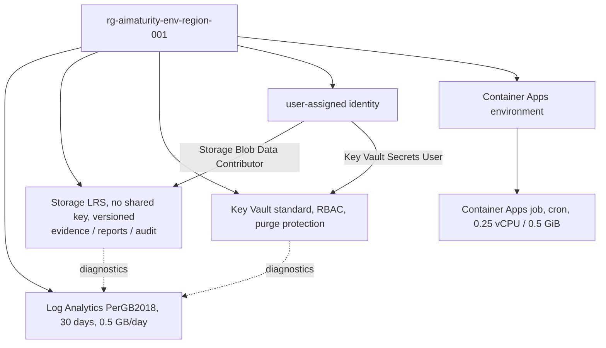

# Infrastructure: Terraform stack

Terraform (azurerm ~> 4.50) for the assessment plane: resource group, Log Analytics (capped), a keyless
versioned evidence store with three private containers and access logging, an RBAC Key Vault with audit
logging, a user-assigned identity with two data-plane roles, a consumption Container Apps environment and
a cron-triggered Container Apps job.

Sections: [1. Purpose](#1-purpose) · [2. Architecture](#2-architecture) · [3. How it works](#3-how-it-works) · [4. Key files](#4-key-files) · [5. Code excerpts](#5-code-excerpts) · [6. Configuration](#6-configuration) · [7. Commands](#7-commands) · [8. Real output](#8-real-output) · [9. Tests and gates](#9-tests-and-gates) · [10. Guardrails](#10-guardrails) · [11. Security and governance](#11-security-and-governance) · [12. Observability](#12-observability) · [13. Failure modes](#13-failure-modes) · [14. Mapping to Azure services](#14-mapping-to-azure-services) · [15. Limitations](#15-limitations) · [16. Interview talking points](#16-interview-talking-points) · [17. Adopt this](#17-adopt-this)

## 1. Purpose

* Smallest footprint that can run scheduled assessments and keep their evidence safely.

## 2. Architecture



## 3. How it works

1. Names follow `type-aimaturity-env-region-001`; the Key Vault uses a shorter prefix to fit 24 characters.
2. The job runs `aimaturity-scheduled` with `AZURE_CLIENT_ID`, `EVIDENCE_STORAGE_ACCOUNT`, `KEY_VAULT_URI` and `AIMATURITY_ENV`.
3. `job_enabled = false` removes the Container Apps resources for a storage-only footprint.
4. Remote state uses Entra ID auth; CI validates with `-backend=false`.

## 4. Key files

| File | Role |
|---|---|
| `infra/terraform/main.tf` | Resources |
| `infra/terraform/variables.tf` | Inputs with validation |
| `infra/terraform/tests/plan.tftest.hcl` | Offline plan tests |
| `infra/terraform/envs/` | dev and prod tfvars and backend keys |
| `.checkov.yaml` | Security scan config with justified skips |

## 5. Code excerpts

<!-- code: infra/terraform/main.tf::resource "azurerm_container_app_job" -->
```hcl
resource "azurerm_container_app_job" "assess" {
  count                        = var.job_enabled ? 1 : 0
  name                         = "caj-${local.short}-${local.suffix}"
  resource_group_name          = azurerm_resource_group.this.name
  location                     = var.location
  container_app_environment_id = azurerm_container_app_environment.this[0].id
  replica_timeout_in_seconds   = 1800
  replica_retry_limit          = 1
  tags                         = local.tags

  identity {
    type         = "UserAssigned"
    identity_ids = [azurerm_user_assigned_identity.job.id]
  }

  schedule_trigger_config {
    cron_expression          = var.job_schedule
    parallelism              = 1
    replica_completion_count = 1
  }

  template {
    container {
      name    = "assess"
      image   = var.job_image
      cpu     = 0.25
      memory  = "0.5Gi"
      command = ["aimaturity-scheduled"]

      env {
        name  = "AZURE_CLIENT_ID"
        value = azurerm_user_assigned_identity.job.client_id
      }
      env {
        name  = "EVIDENCE_STORAGE_ACCOUNT"
        value = azurerm_storage_account.evidence.name
      }
      env {
        name  = "KEY_VAULT_URI"
        value = azurerm_key_vault.this.vault_uri
      }
      env {
        name  = "AIMATURITY_ENV"
        value = var.environment
      }
    }
  }

  depends_on = [azurerm_role_assignment.job_blob, azurerm_role_assignment.job_secrets]
}
```
<!-- /code -->

<!-- code: infra/terraform/main.tf::resource "azurerm_key_vault" -->
```hcl
resource "azurerm_key_vault" "this" {
  name                       = "kv-aimat-${local.suffix}"
  resource_group_name        = azurerm_resource_group.this.name
  location                   = var.location
  tenant_id                  = data.azurerm_client_config.current.tenant_id
  sku_name                   = "standard"
  rbac_authorization_enabled = true
  purge_protection_enabled   = true
  soft_delete_retention_days = 7
  tags                       = local.tags
}
```
<!-- /code -->

## 6. Configuration

| Variable | Default |
|---|---|
| environment | dev |
| location | eastus2 |
| log_retention_days | 30 |
| log_daily_quota_gb | 0.5 |
| job_image | ghcr.io/jagadishmazure-jpg/ai-maturity-assessment:0.1.0 |
| job_schedule | 0 6 * * 1 (dev), 0 5 1 * * (prod) |
| job_enabled | true |

## 7. Commands

```bash
terraform -chdir=infra/terraform init -backend=false
terraform -chdir=infra/terraform validate
terraform -chdir=infra/terraform test
checkov -d infra/terraform --config-file .checkov.yaml
```

## 8. Real output

<!-- output: validate -->
```text
framework, rubric, schemas and sample orgs: OK
```
<!-- /output -->

## 9. Tests and gates

* `terraform test`: three runs (dev plane, job switched off, prod monthly) with a mocked provider.
* `tests/test_iac.py`: parity with Bicep, SKUs, keyless storage, RBAC vault, least-privilege roles, justified checkov skips.
* `infra.yml`: fmt, validate, test, tflint, checkov; plan only when OIDC variables exist.

## 10. Guardrails

* No keys: storage shared keys off, job uses its identity, Key Vault RBAC only.
* Log Analytics daily cap stops runaway ingestion costs.

## 11. Security and governance

No Azure resources exist: nothing is deployed and the deploy workflow is gated by an unset `DEPLOY_ENABLED`.

## 12. Observability

Blob read/write/delete and Key Vault AuditEvent go to Log Analytics; the job's console logs go there through the environment.

## 13. Failure modes

| Failure | Behaviour |
|---|---|
| Redeploy after teardown within 7 days | provider recovers the soft-deleted vault |
| Image not pushed yet | job execution fails; deploy pushes the image first |

## 14. Mapping to Azure services

* Every resource here is the Azure service named; **Azure Policy** can audit storage key settings and vault RBAC across subscriptions.
* **Microsoft Foundry**: a hosted model replaces `MockLLM` for rationales, and Foundry evaluations score rationale groundedness against the cited evidence.
* **Microsoft Purview**: register the evidence store and reports as data assets with lineage back to the scanned repositories, and keep questionnaire answers under a sensitivity label.
* **Azure Monitor / Log Analytics**: job logs, blob access logs and Key Vault audit events land in one workspace, where a query can trend maturity runs over time.

## 15. Limitations

* No private networking (cost); skips are justified in `.checkov.yaml`.

## 16. Interview talking points

* "The whole plane costs cents a day at rest: LRS storage, a capped workspace, a standard vault and a consumption job that only runs on schedule."

## 17. Adopt this

1. Change `locals.tf` tags and the short name; keep names under resource limits (tests check the vault name length).
2. Set `job_schedule` per environment in `envs/*.tfvars`.
3. Add private endpoints by removing the related checkov skips and adding a VNet; budget for them.
