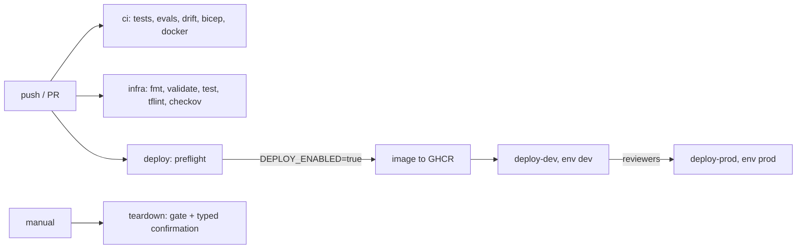

# Infrastructure: GitHub Actions workflows

Four workflows: `ci` (lint, schema validation, tests, eval gates, report and doc drift, PDF guard,
Bicep build, image build), `infra` (Terraform fmt/validate/test, tflint, checkov, optional plan),
`deploy` (image, dev, prod with approval, Terraform or Bicep, OIDC) and `teardown`. Deploy and teardown
are gated by `DEPLOY_ENABLED`, which is not set.

Sections: [1. Purpose](#1-purpose) · [2. Architecture](#2-architecture) · [3. How it works](#3-how-it-works) · [4. Key files](#4-key-files) · [5. Code excerpts](#5-code-excerpts) · [6. Configuration](#6-configuration) · [7. Commands](#7-commands) · [8. Real output](#8-real-output) · [9. Tests and gates](#9-tests-and-gates) · [10. Guardrails](#10-guardrails) · [11. Security and governance](#11-security-and-governance) · [12. Observability](#12-observability) · [13. Failure modes](#13-failure-modes) · [14. Mapping to Azure services](#14-mapping-to-azure-services) · [15. Limitations](#15-limitations) · [16. Interview talking points](#16-interview-talking-points) · [17. Adopt this](#17-adopt-this)

## 1. Purpose

* Every quality claim in the README is enforced on every push; deployment is ready but off.

## 2. Architecture



## 3. How it works

1. `ci` runs `aimaturity validate`, `pytest`, `aimaturity evals`, `aimaturity report --all --check`, `aimaturity links`, `render_docs.py --check` and fails if a PDF is tracked.
2. `infra` validates Terraform offline; plan runs only when Azure OIDC variables exist.
3. `deploy` always runs `preflight` (reports the gate); other jobs need `DEPLOY_ENABLED == 'true'`. Login is OIDC (`id-token: write`), no client secret.
4. `deploy-prod` waits for the `prod` environment's reviewers.
5. `teardown` needs the gate and the environment name typed twice.

## 4. Key files

| File | Role |
|---|---|
| `.github/workflows/ci.yml` | Quality gates |
| `.github/workflows/infra.yml` | IaC checks |
| `.github/workflows/deploy.yml` | Gated deployment |
| `.github/workflows/teardown.yml` | Gated teardown |
| `.github/scripts/deploy.sh` | provision, smoke, run-job, destroy |

## 5. Code excerpts

<!-- code: .github/scripts/deploy.sh::smoke() -->
```bash
smoke() {
  : "${RESOURCE_GROUP:?}" "${STORAGE_ACCOUNT:?}"
  v=$(az storage account blob-service-properties show --account-name "$STORAGE_ACCOUNT" -g "$RESOURCE_GROUP" --query isVersioningEnabled -o tsv)
  [[ "$v" == "true" ]] || { echo "::error::evidence store versioning is off"; exit 1; }
  k=$(az keyvault list -g "$RESOURCE_GROUP" --query "[0].properties.enableRbacAuthorization" -o tsv)
  [[ "$k" == "true" ]] || { echo "::error::Key Vault must use RBAC"; exit 1; }
  t=$(az containerapp job list -g "$RESOURCE_GROUP" --query "[0].properties.configuration.triggerType" -o tsv)
  [[ "$t" == "Schedule" ]] || { echo "::error::assessment job missing or not schedule-triggered"; exit 1; }
  echo "smoke checks passed: versioned evidence store, RBAC Key Vault, scheduled job"
}
```
<!-- /code -->

## 6. Configuration

| Variable | Purpose |
|---|---|
| DEPLOY_ENABLED | unset; set to true to deploy |
| DEPLOY_TOOL | terraform or bicep |
| AZURE_CLIENT_ID / TENANT_ID / SUBSCRIPTION_ID | OIDC federated credential |
| TFSTATE_RESOURCE_GROUP / TFSTATE_STORAGE_ACCOUNT | remote state |

## 7. Commands

```bash
gh workflow run deploy.yml -f deploy_tool=bicep      # only does something once DEPLOY_ENABLED is true
gh workflow run teardown.yml -f environment=dev -f confirm=dev
```

## 8. Real output

<!-- output: evals -->
```text
PASS  stability    shuffle_identical=True, dropout_runs=250, nonlocal_moves=0, max_categories_moved=2, mean_categories_moved=0.396, max_level_change_info=3
PASS  citations    completeness=1.0, valid_ids=1.0, verifier_catch=1.0, categories_checked=78, injected=166
PASS  calibration  items=406, exact=0.84, within_one=0.995, high_conf_accuracy=0.861, low_conf_accuracy=0.674, high_conf_items=360
```
<!-- /output -->

## 9. Tests and gates

* `tests/test_iac.py`: read-only default permissions, every CI gate present, deploy jobs gated and OIDC, preflight the only ungated job, teardown confirmation, deploy script subcommands.

## 10. Guardrails

* Least-privilege tokens (`contents: read` by default, `id-token: write` only where needed, `packages: write` only for the image job).

## 11. Security and governance

No Azure resources exist: nothing is deployed and the deploy workflow is gated by an unset `DEPLOY_ENABLED`.

## 12. Observability

Step summaries report the deploy gate and plans; evals JSON is uploaded as an artifact.

## 13. Failure modes

| Failure | Behaviour |
|---|---|
| Someone pushes with the gate off | preflight notice, nothing deployed |
| Prod deploy without approval | blocked by the environment |

## 14. Mapping to Azure services

* **GitHub OIDC to Microsoft Entra ID** federated credentials; **Azure Resource Manager** deployments; **GHCR** for the image.
* **Microsoft Foundry**: a hosted model replaces `MockLLM` for rationales, and Foundry evaluations score rationale groundedness against the cited evidence.
* **Microsoft Purview**: register the evidence store and reports as data assets with lineage back to the scanned repositories, and keep questionnaire answers under a sensitivity label.
* **Azure Policy**: audit that the evidence store stays keyless and versioned and that the Key Vault keeps RBAC, so the controls the assessment relies on cannot drift silently.
* **Azure Monitor / Log Analytics**: job logs, blob access logs and Key Vault audit events land in one workspace, where a query can trend maturity runs over time.

## 15. Limitations

* Environments and reviewers must be configured in GitHub settings (see docs/deployment.md).

## 16. Interview talking points

* "CI enforces the README: tests, evals, drift checks. Deploy is wired with OIDC and approvals but switched off."

## 17. Adopt this

1. Copy the workflows; change the image name in `deploy.yml`.
2. Configure the variables above and the `dev`/`prod` environments.
3. Set `DEPLOY_ENABLED=true` when you are ready.
