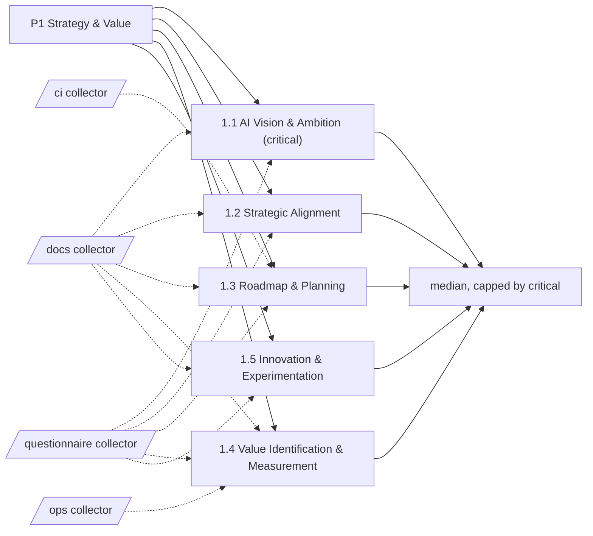

# Pillar 1: Strategy & Value

Why the organisation uses AI, where it pays off and how it plans the journey. 5 categories; levels Basic, Ready, Dynamic, Advanced.

> Framework structure adapted from UNESCO, *AI Maturity Framework* (Stratejai for UNESCO), [CC BY-SA 3.0 IGO](https://creativecommons.org/licenses/by-sa/3.0/igo/). Wording is this project's own; UNESCO does not endorse it. The framework-derived tables on this page are shared under the same license.

Sections: [1. Purpose](#1-purpose) · [2. Architecture](#2-architecture) · [3. How it works](#3-how-it-works) · [4. Key files](#4-key-files) · [5. Code excerpts](#5-code-excerpts) · [6. Configuration](#6-configuration) · [7. Commands](#7-commands) · [8. Real output](#8-real-output) · [9. Tests and gates](#9-tests-and-gates) · [10. Guardrails](#10-guardrails) · [11. Security and governance](#11-security-and-governance) · [12. Observability](#12-observability) · [13. Failure modes](#13-failure-modes) · [14. Mapping to Azure services](#14-mapping-to-azure-services) · [15. Limitations](#15-limitations) · [16. Interview talking points](#16-interview-talking-points) · [17. Adopt this](#17-adopt-this)

## 1. Purpose

* Strategy is where AI money is either aimed or scattered. This pillar asks whether the organisation can say what AI is for, ties each initiative to a goal, plans the journey, measures the value it gets back and keeps a disciplined pipeline of experiments.
* Default critical category: 1.1; it caps the pillar level.

## 2. Architecture



## 3. How it works

Strategy is where AI money is either aimed or scattered. This pillar asks whether the organisation can say what AI is for, ties each initiative to a goal, plans the journey, measures the value it gets back and keeps a disciplined pipeline of experiments.

Evidence comes from `docs` (vision, roadmap, ADRs, experiment write-ups, scouting), `ops` (business metrics in telemetry) and the questionnaire for decisions that live in meetings rather than files.

The pillar level is the median of its 5 category levels, capped by the critical category 1.1.

**1.1 AI Vision & Ambition** (critical): Whether there is a stated purpose for AI that tells teams what it is for and what it should change.

| Level | What it looks like | Evidence the assessor needs |
|---|---|---|
| 1 Basic | AI comes up in conversation but nobody has written down what it is meant to achieve. | nothing (starting point) |
| 2 Ready | A short written purpose exists and the people who matter know it, though it is not yet tied to goals. | `vision_statement` |
| 3 Dynamic | The purpose is published widely, tied to measurable targets and backed by department heads. | `vision_targets`; `q_vision_published` |
| 4 Advanced | The purpose is part of the core strategy, revisited on results, and steers budgets and priorities. | `q_vision_in_budget`; `strategy_review` |

**1.2 Strategic Alignment**: Whether AI work is chosen because it serves organisational goals rather than because the technology is available.

| Level | What it looks like | Evidence the assessor needs |
|---|---|---|
| 1 Basic | Projects start because a tool looks interesting; links to goals are missing. | nothing (starting point) |
| 2 Ready | Some proposals are checked against goals, but not every time and not the same way. | `q_goal_field`; `business_case` |
| 3 Dynamic | Every significant AI proposal goes through a business case that names the goal it serves. | `q_business_case_mandatory`; `business_case` |
| 4 Advanced | AI capability feeds back into strategy, opening goals that were not possible before. | `q_strategy_session` |

**1.3 Roadmap & Planning**: Whether a sequenced, resourced plan for AI adoption exists and is kept current.

| Level | What it looks like | Evidence the assessor needs |
|---|---|---|
| 1 Basic | Planning happens project by project; there is no multi-step view. | nothing (starting point) |
| 2 Ready | A first roadmap lists milestones, though resourcing and detail are thin. | `roadmap_doc`; `changelog` |
| 3 Dynamic | A detailed roadmap with owners and budget is managed alongside normal planning cycles. | `roadmap_owned`; `adr`; `doc_drift_check` |
| 4 Advanced | The roadmap is refreshed from delivery data, changing priorities and horizon scanning. | `q_roadmap_refresh` |

**1.4 Value Identification & Measurement**: How use cases are picked for impact and how their benefits and costs are tracked afterwards.

| Level | What it looks like | Evidence the assessor needs |
|---|---|---|
| 1 Basic | Benefits are assumed or told as stories; costs are not tracked per use case. | nothing (starting point) |
| 2 Ready | A use-case intake exists and simple metrics such as hours or money saved are defined, unevenly applied. | `value_metrics` |
| 3 Dynamic | Every use case is scored for feasibility and impact up front and its realised value is reported. | `value_tracking_code`; `business_case` |
| 4 Advanced | Value tracking includes strategic and intangible benefits and drives portfolio decisions. | `q_intangible_value`; `business_metric_link` |

**1.5 Innovation & Experimentation**: The room, money and habits for trying new AI ideas safely and learning from them.

| Level | What it looks like | Evidence the assessor needs |
|---|---|---|
| 1 Basic | Almost no experimentation; new ideas wait for proof that nobody can produce. | nothing (starting point) |
| 2 Ready | Pilots happen here and there and lessons travel by word of mouth. | `experiments` |
| 3 Dynamic | A sandbox and a light funding route exist; results are written up and shared. | `experiment_writeups`; `adr` |
| 4 Advanced | New techniques are scouted on purpose and promising experiments are scaled quickly. | `scouting`; `q_pilot_scaling` |

## 4. Key files

| File | Role |
|---|---|
| `framework/framework.yaml` | P1 categories, summaries and level descriptors (CC BY-SA 3.0 IGO) |
| `rubric/categories.yaml` | Signals per level, effort, dependencies, critical list |
| `rubric/signals.yaml` | What each file-based signal looks for |
| `rubric/questionnaire.yaml` | Questions for items code cannot show |

## 5. Code excerpts

<!-- code: src/aimaturity/gaps.py::gap_analysis -->
```python
def gap_analysis(results, statuses, target_of) -> list[dict[str, Any]]:
    cats = categories()
    rows = []
    for cid, res in results.items():
        current = statuses[cid]["final_level"]
        target = target_of(cid)
        steps = []
        for lvl in range(current + 1, target + 1):
            need = cats[cid]["rubric"]["levels"][lvl]
            missing = [s for s in need if res.signals[s].present < 1]
            steps.append(
                {
                    "to_level": lvl,
                    "level_name": LEVEL_NAMES[lvl],
                    "missing": missing,
                    "missing_text": [describe(s) for s in missing],
                    "action": cats[cid]["actions"].get(lvl, ""),
                    "effort": cats[cid]["rubric"]["effort"][lvl],
                }
            )
        rows.append(
            {
                "category": cid,
                "name": res.name,
                "pillar": res.pillar,
                "critical": res.critical,
                "current": current,
                "target": target,
                "gap": max(0, target - current),
                "confidence": res.confidence,
                "status": statuses[cid]["status"],
                "steps": steps,
            }
        )
    return rows
```
<!-- /code -->

## 6. Configuration

| Category | Effort per step | Depends on | Critical (default) |
|---|---|---|---|
| 1.1 | 2:S, 3:M, 4:M | - | yes |
| 1.2 | 2:S, 3:M, 4:L | 1.1 | no |
| 1.3 | 2:S, 3:M, 4:M | 1.1 | no |
| 1.4 | 2:S, 3:M, 4:L | 1.2 | no |
| 1.5 | 2:S, 3:S, 4:M | - | no |

| Signal or question | Meaning |
|---|---|
| `adr` | Architecture decision records with a status |
| `business_case` | Use cases carry a business case or value estimate |
| `business_metric_link` | Monitoring links model behaviour to business or cost metrics |
| `changelog` | Changes are recorded in a changelog |
| `doc_drift_check` | Documentation is regenerated and drift-checked in CI |
| `experiment_writeups` | Experiments are written up with results or lessons |
| `experiments` | A place for experiments (labs, notebooks, sandboxes, learning topics) |
| `q_business_case_mandatory` | Is a business case with goal linkage required before an AI build is funded? |
| `q_goal_field` | Does every AI proposal state which organisational goal it serves? |
| `q_intangible_value` | Are strategic or intangible benefits tracked and used to rebalance the AI portfolio? |
| `q_pilot_scaling` | Is there a fast, funded route from a successful pilot to a product? |
| `q_roadmap_refresh` | Is the AI roadmap refreshed from delivery data and horizon scanning? |
| `q_strategy_session` | Can AI capability proposals change organisational goals in strategy sessions? |
| `q_vision_in_budget` | Does the AI purpose steer budget and prioritisation decisions? |
| `q_vision_published` | Is the AI purpose published to all staff and tied to measurable targets? |
| `roadmap_doc` | A roadmap document exists |
| `roadmap_owned` | The roadmap names owners and phases or months |
| `scouting` | Technology scouting (a tech radar or horizon scan) is kept |
| `strategy_review` | A record of periodic strategy reviews that include AI results |
| `value_metrics` | Value or cost metrics (ROI, savings, cost per task) are reported |
| `value_tracking_code` | Value or cost is computed in code with tests, not only described |
| `vision_statement` | A README or vision doc states what AI is for (purpose, vision or at-a-glance section) |
| `vision_targets` | Measurable AI targets (OKRs or KPIs with numbers) are written down |

## 7. Commands

```bash
aimaturity framework --pillar P1
aimaturity category 1.1
aimaturity explain --org portfolio --category 1.3
aimaturity gaps --org kestrel-bay-bank
```

## 8. Real output

<!-- output: framework --pillar P1 -->
```text
category  name                                critical
--------  ----------------------------------  --------
1.1       AI Vision & Ambition                yes
1.2       Strategic Alignment
1.3       Roadmap & Planning
1.4       Value Identification & Measurement
1.5       Innovation & Experimentation
```
<!-- /output -->

<!-- output: category 1.1 -->
```text
1.1 AI Vision & Ambition (P1 Strategy & Value) - critical
Whether there is a stated purpose for AI that tells teams what it is for and what it should change.
  1 Basic: AI comes up in conversation but nobody has written down what it is meant to achieve.
  2 Ready: A short written purpose exists and the people who matter know it, though it is not yet tied to goals.
  3 Dynamic: The purpose is published widely, tied to measurable targets and backed by department heads.
  4 Advanced: The purpose is part of the core strategy, revisited on results, and steers budgets and priorities.
  evidence for 2: vision_statement (A README or vision doc states what AI is for (purpose, vision or at-a-glance section))
  evidence for 3: vision_targets (Measurable AI targets (OKRs or KPIs with numbers) are written down); q_vision_published (Is the AI purpose published to all staff and tied to measurable targets?)
  evidence for 4: q_vision_in_budget (Does the AI purpose steer budget and prioritisation decisions?); strategy_review (A record of periodic strategy reviews that include AI results)
```
<!-- /output -->

<!-- output: explain --org portfolio --category 1.3 -->
```text
1.3 Roadmap & Planning: level 3 (Dynamic), confidence 0.93, status auto
rationale: Level 3 (Dynamic). Supported by [E642], [E126], [E127], [E128]. Next level needs: q_roadmap_refresh. Confidence 0.93.
  [x] roadmap_doc                  artifact         E642
  [x] changelog                    artifact         E126, E127, E128
  [x] roadmap_owned                artifact         E643
  [x] adr                          artifact         E017, E018, E019
  [x] doc_drift_check              artifact         E287, E288, E289
  [ ] q_roadmap_refresh            sample-answers   
  E642 profile-readme:docs/roadmap.md (file present)
  E126 agentic-ai-model-risk:CHANGELOG.md (file present)
  E127 agentic-ai-portfolio:CHANGELOG.md (file present)
  E128 ai-learning-lab:CHANGELOG.md (file present)
  E129 azure-agent-labs:CHANGELOG.md (file present)
  E130 azure-agent-platform:CHANGELOG.md (file present)
  E131 azure-ai-integration-platform:CHANGELOG.md (file present)
  E132 azure-finops:CHANGELOG.md (file present)
```
<!-- /output -->

## 9. Tests and gates

* `tests/test_framework.py`: every category has four descriptors, three actions and a rubric entry.
* `tests/test_scoring.py`: no evidence gives Basic, full evidence gives Advanced, stepwise levels for every category.
* `tests/test_samples.py`: sample results, labelled answers and cross-links.
* Eval gates: calibration against labelled levels covers every category of this pillar.

## 10. Guardrails

* Strategy documents only count when they say something checkable: `vision_targets` needs targets or KPIs near the vision, `roadmap_owned` needs owners and phases.
* Budget influence and strategy sessions are never inferred from files; they are questionnaire items.

## 11. Security and governance

Assessments read repositories without executing them and cite file paths, never file contents. Questionnaire answers can hold internal judgements: keep them in the evidence store's `evidence` container (private, versioned, Entra-only).

## 12. Observability

Each assessment run writes a `summary.json` per organisation (scheduled job) with pillar levels, confidence and the review queue; trend them in Log Analytics after upload.

## 13. Failure modes

| Failure | What the assessor does |
|---|---|
| A slide-deck strategy that never reaches the repositories | 1.1 and 1.3 stay at Basic with `absent-scanned` confidence; the gap list asks for a written statement |
| Value claimed but not measured | 1.4 level 3 needs `value_tracking_code`, not only a README number |

## 14. Mapping to Azure services

* **Azure Monitor** workbooks show value KPIs next to cost from the FinOps exports, which is the evidence 1.4 looks for.
* **Microsoft Foundry** project descriptions hold the goal each AI use case serves (1.2).
* **Microsoft Purview**: register the evidence store and reports as data assets with lineage back to the scanned repositories, and keep questionnaire answers under a sensitivity label.
* **Azure Policy**: audit that the evidence store stays keyless and versioned and that the Key Vault keeps RBAC, so the controls the assessment relies on cannot drift silently.

## 15. Limitations

* Text patterns can be satisfied by a well-written document that nobody follows; the questionnaire and the human review are the counterweight.
* Strategy reviews are rare events, so 1.1 level 4 usually rests on answers.

## 16. Interview talking points

* "Value is the pillar that connects to FinOps: the portfolio's 1.4 evidence comes from the cost repository, not from a claim in a README."
* "A roadmap without owners is a wish list, so the rubric looks for owners and phases."

## 17. Adopt this

1. Point `samples/<your-org>/org.yaml` at your strategy repository (or add a manifest of its files).
2. If your vision lives in a wiki, export it to Markdown under `docs/` so `vision_statement` and `vision_targets` can see it.
3. Change the evidence for a level in `rubric/categories.yaml` (for example, require `strategy_review` at level 3) and run `aimaturity evals` to see the effect on calibration.
