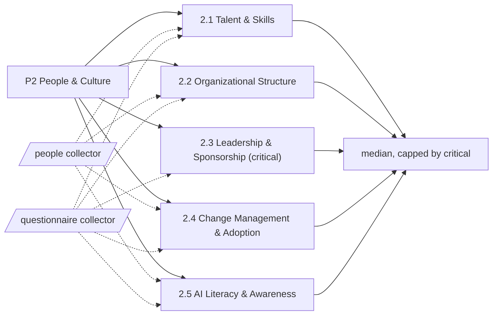

# Pillar 2: People & Culture

Skills, structures, leadership and adoption habits that let AI take root. 5 categories; levels Basic, Ready, Dynamic, Advanced.

> Framework structure adapted from UNESCO, *AI Maturity Framework* (Stratejai for UNESCO), [CC BY-SA 3.0 IGO](https://creativecommons.org/licenses/by-sa/3.0/igo/). Wording is this project's own; UNESCO does not endorse it. The framework-derived tables on this page are shared under the same license.

Sections: [1. Purpose](#1-purpose) · [2. Architecture](#2-architecture) · [3. How it works](#3-how-it-works) · [4. Key files](#4-key-files) · [5. Code excerpts](#5-code-excerpts) · [6. Configuration](#6-configuration) · [7. Commands](#7-commands) · [8. Real output](#8-real-output) · [9. Tests and gates](#9-tests-and-gates) · [10. Guardrails](#10-guardrails) · [11. Security and governance](#11-security-and-governance) · [12. Observability](#12-observability) · [13. Failure modes](#13-failure-modes) · [14. Mapping to Azure services](#14-mapping-to-azure-services) · [15. Limitations](#15-limitations) · [16. Interview talking points](#16-interview-talking-points) · [17. Adopt this](#17-adopt-this)

## 1. Purpose

* People and culture decide whether AI is adopted or quietly ignored. Skills, structure, sponsorship, change management and literacy are mostly invisible in code, so this pillar is where the assessor relies on the questionnaire and where human review matters most.
* Default critical category: 2.3; it caps the pillar level.

## 2. Architecture



## 3. How it works

People and culture decide whether AI is adopted or quietly ignored. Skills, structure, sponsorship, change management and literacy are mostly invisible in code, so this pillar is where the assessor relies on the questionnaire and where human review matters most.

Evidence comes from the questionnaire first; `people` (CONTRIBUTING, CODEOWNERS, onboarding, learning material) for the parts that leave artifacts.

The pillar level is the median of its 5 category levels, capped by the critical category 2.3.

**2.1 Talent & Skills**: Whether AI roles are defined and people with the needed skills are hired, trained and kept.

| Level | What it looks like | Evidence the assessor needs |
|---|---|---|
| 1 Basic | Skills are rare and roles undefined; the organisation leans on consultants or a few enthusiasts. | nothing (starting point) |
| 2 Ready | Key roles are named and first hiring or training efforts have started. | `q_ai_roles_defined` |
| 3 Dynamic | Workforce planning covers AI roles, with formal training and career paths. | `q_training_paths`; `learning_material` |
| 4 Advanced | Skill growth is built into HR processes, with cross-skilling and internal mobility. | `q_hr_integration` |

**2.2 Organizational Structure**: How AI work is organised, who is responsible for what and how teams are arranged.

| Level | What it looks like | Evidence the assessor needs |
|---|---|---|
| 1 Basic | AI work sits inside existing departments with no clear owner. | nothing (starting point) |
| 2 Ready | An informal working group or a named coordinator exists. | `q_coordinator` |
| 3 Dynamic | A formal AI team or centre of excellence has a mandate and a reporting line. | `q_coe`; `codeowners` |
| 4 Advanced | The operating model (hub and spoke, federated) is tuned to need and reviewed. | `q_operating_model_review` |

**2.3 Leadership & Sponsorship** (critical): How visibly and actively senior leaders back AI work.

| Level | What it looks like | Evidence the assessor needs |
|---|---|---|
| 1 Basic | Leaders treat AI as an IT topic and nobody sponsors it. | nothing (starting point) |
| 2 Ready | A few leaders sponsor individual projects when asked. | `q_project_sponsors` |
| 3 Dynamic | An executive sponsor owns the AI agenda and talks about it openly. | `q_exec_owner` |
| 4 Advanced | Leaders drive the AI agenda, fund it strategically and hold teams to account. | `q_leadership_objectives` |

**2.4 Change Management & Adoption**: How the human side of AI rollouts is planned so people actually use and trust the systems.

| Level | What it looks like | Evidence the assessor needs |
|---|---|---|
| 1 Basic | Rollouts focus on the technology; users find out late. | nothing (starting point) |
| 2 Ready | Deployments come with some communication and training. | `q_rollout_comms`; `onboarding_guide` |
| 3 Dynamic | A change method with stakeholder mapping, communication and support is applied to AI rollouts. | `q_change_method`; `contributing_guide` |
| 4 Advanced | User feedback is gathered continuously and changes both the systems and how they are introduced. | `q_feedback_loop` |

**2.5 AI Literacy & Awareness**: How well the wider workforce understands what AI can and cannot do, including its ethical limits.

| Level | What it looks like | Evidence the assessor needs |
|---|---|---|
| 1 Basic | Most staff know little about AI and misconceptions are common. | nothing (starting point) |
| 2 Ready | Awareness material exists and some sessions run now and then. | `learning_material`; `q_awareness_material` |
| 3 Dynamic | Role-based literacy programmes run across the organisation, including ethics. | `q_role_literacy` |
| 4 Advanced | Learning is continuous and AI literacy shows up in everyday decisions. | `q_continuous_learning` |

## 4. Key files

| File | Role |
|---|---|
| `framework/framework.yaml` | P2 categories, summaries and level descriptors (CC BY-SA 3.0 IGO) |
| `rubric/categories.yaml` | Signals per level, effort, dependencies, critical list |
| `rubric/signals.yaml` | What each file-based signal looks for |
| `rubric/questionnaire.yaml` | Questions for items code cannot show |

## 5. Code excerpts

<!-- code: src/aimaturity/collectors/__init__.py::collect_questionnaire -->
```python
def collect_questionnaire(answers: dict[str, Any]) -> list[Evidence]:
    origin = answers.get("label", "self-reported")
    out = []
    for qid, a in sorted(answers.get("answers", {}).items()):
        if qid not in questions():
            raise ValueError(f"unknown question {qid}")
        value = a["answer"] if isinstance(a, dict) else a
        note = a.get("note", "") if isinstance(a, dict) else ""
        if isinstance(value, bool):  # YAML 1.1 reads bare yes/no as booleans
            value = "yes" if value else "no"
        strength = ANSWER_STRENGTH[value]
        out.append(Evidence(qid, "questionnaire", "questionnaire", qid, f"answer {value}" + (f": {note}" if note else ""), strength, origin))
    return out
```
<!-- /code -->

## 6. Configuration

| Category | Effort per step | Depends on | Critical (default) |
|---|---|---|---|
| 2.1 | 2:S, 3:M, 4:L | 2.3 | no |
| 2.2 | 2:S, 3:L, 4:M | 2.3 | no |
| 2.3 | 2:S, 3:M, 4:M | - | yes |
| 2.4 | 2:S, 3:M, 4:M | 2.3 | no |
| 2.5 | 2:S, 3:M, 4:M | - | no |

| Signal or question | Meaning |
|---|---|
| `codeowners` | Ownership of code areas is declared (CODEOWNERS) |
| `contributing_guide` | A contribution guide sets shared working rules |
| `learning_material` | Learning or training material about AI is maintained |
| `onboarding_guide` | An onboarding or implementation guide helps new people adopt the work |
| `q_ai_roles_defined` | Are the AI roles the organisation needs named, with a skills matrix? |
| `q_awareness_material` | Is introductory AI material available to all staff? |
| `q_change_method` | Is a change method with stakeholder analysis and adoption metrics applied? |
| `q_coe` | Is there a chartered AI team or centre of excellence with a mandate and reporting line? |
| `q_continuous_learning` | Is AI learning continuous and part of team routines? |
| `q_coordinator` | Is there a named AI coordinator or working group? |
| `q_exec_owner` | Does an executive own the AI agenda and report on it regularly? |
| `q_feedback_loop` | Is user feedback collected continuously and fed into the backlog? |
| `q_hr_integration` | Are AI skills part of performance, mobility and cross-skilling processes? |
| `q_leadership_objectives` | Are AI outcomes part of leadership objectives and resourcing reviews? |
| `q_operating_model_review` | Is the AI operating model reviewed and adjusted on a cadence? |
| `q_project_sponsors` | Does every live AI project have a named senior sponsor? |
| `q_role_literacy` | Do role-based AI literacy tracks (including ethics) run with completion tracking? |
| `q_rollout_comms` | Do AI rollouts come with communication and training for users? |
| `q_training_paths` | Do AI roles have funded training paths and appear in workforce planning? |

## 7. Commands

```bash
aimaturity framework --pillar P2
aimaturity category 2.1
aimaturity explain --org portfolio --category 2.3
aimaturity gaps --org kestrel-bay-bank
```

## 8. Real output

<!-- output: framework --pillar P2 -->
```text
category  name                          critical
--------  ----------------------------  --------
2.1       Talent & Skills
2.2       Organizational Structure
2.3       Leadership & Sponsorship      yes
2.4       Change Management & Adoption
2.5       AI Literacy & Awareness
```
<!-- /output -->

<!-- output: category 2.1 -->
```text
2.1 Talent & Skills (P2 People & Culture)
Whether AI roles are defined and people with the needed skills are hired, trained and kept.
  1 Basic: Skills are rare and roles undefined; the organisation leans on consultants or a few enthusiasts.
  2 Ready: Key roles are named and first hiring or training efforts have started.
  3 Dynamic: Workforce planning covers AI roles, with formal training and career paths.
  4 Advanced: Skill growth is built into HR processes, with cross-skilling and internal mobility.
  evidence for 2: q_ai_roles_defined (Are the AI roles the organisation needs named, with a skills matrix?)
  evidence for 3: q_training_paths (Do AI roles have funded training paths and appear in workforce planning?); learning_material (Learning or training material about AI is maintained)
  evidence for 4: q_hr_integration (Are AI skills part of performance, mobility and cross-skilling processes?)
```
<!-- /output -->

<!-- output: explain --org portfolio --category 2.3 -->
```text
2.3 Leadership & Sponsorship: level 2 (Ready), confidence 0.31, status pending-review
rationale: Level 2 (Ready). Supported by [E551]. Next level needs: q_exec_owner. Confidence 0.31.
  [x] q_project_sponsors           sample-answers   E551
  [~] q_exec_owner                 sample-answers   E541
  [ ] q_leadership_objectives      sample-answers   
  E551 questionnaire:q_project_sponsors (answer yes: the maintainer sponsors every repository)
needs review: confidence 0.31 below 0.6; level rests on sample answers: q_project_sponsors
```
<!-- /output -->

## 9. Tests and gates

* `tests/test_framework.py`: every category has four descriptors, three actions and a rubric entry.
* `tests/test_scoring.py`: no evidence gives Basic, full evidence gives Advanced, stepwise levels for every category.
* `tests/test_samples.py`: sample results, labelled answers and cross-links.
* Eval gates: calibration against labelled levels covers every category of this pillar.

## 10. Guardrails

* Answers labelled `sample-answers` are weighted 0.35 and any level that rests on them is queued for a human, whatever the confidence.
* A reviewer can confirm or override, but never the assessor itself.

## 11. Security and governance

Assessments read repositories without executing them and cite file paths, never file contents. Questionnaire answers can hold internal judgements: keep them in the evidence store's `evidence` container (private, versioned, Entra-only).

## 12. Observability

Each assessment run writes a `summary.json` per organisation (scheduled job) with pillar levels, confidence and the review queue; trend them in Log Analytics after upload.

## 13. Failure modes

| Failure | What the assessor does |
|---|---|
| Self-assessment inflation | self-reported answers weigh 0.6, below artifacts; overrides need a comment and are audit-logged |
| Portfolio people items scored from demo answers | every such category waits in the review queue and the report says SAMPLE ANSWERS |

## 14. Mapping to Azure services

* **Microsoft Entra ID** groups and access reviews are evidence for 2.2 (who is in the AI team) and 2.3 (who sponsors).
* **Microsoft Viva Learning** completion data can replace the literacy questions in 2.5.
* **Microsoft Foundry**: a hosted model replaces `MockLLM` for rationales, and Foundry evaluations score rationale groundedness against the cited evidence.
* **Microsoft Purview**: register the evidence store and reports as data assets with lineage back to the scanned repositories, and keep questionnaire answers under a sensitivity label.
* **Azure Policy**: audit that the evidence store stays keyless and versioned and that the Key Vault keeps RBAC, so the controls the assessment relies on cannot drift silently.
* **Azure Monitor / Log Analytics**: job logs, blob access logs and Key Vault audit events land in one workspace, where a query can trend maturity runs over time.

## 15. Limitations

* A one-person portfolio cannot honestly reach level 3 here; the sample answers say so.
* Culture surveys are out of scope; the questionnaire asks about practices, not feelings.

## 16. Interview talking points

* "I refuse to infer culture from code. People items come from labelled answers, and demo answers can never pass as facts."
* "The separation-of-duties rule is enforced in code: the agent that scores cannot sign off."

## 17. Adopt this

1. Copy `rubric/questionnaire.yaml` into your survey tool, collect yes/partial/no answers and save them as `samples/<org>/questionnaire.yaml` with `label: self-reported`.
2. Add HR or learning-platform exports as files and a signal for them in `rubric/signals.yaml` to replace questions with evidence.
3. Keep the review queue: assign a reviewer per pillar and record decisions with `aimaturity review`.
