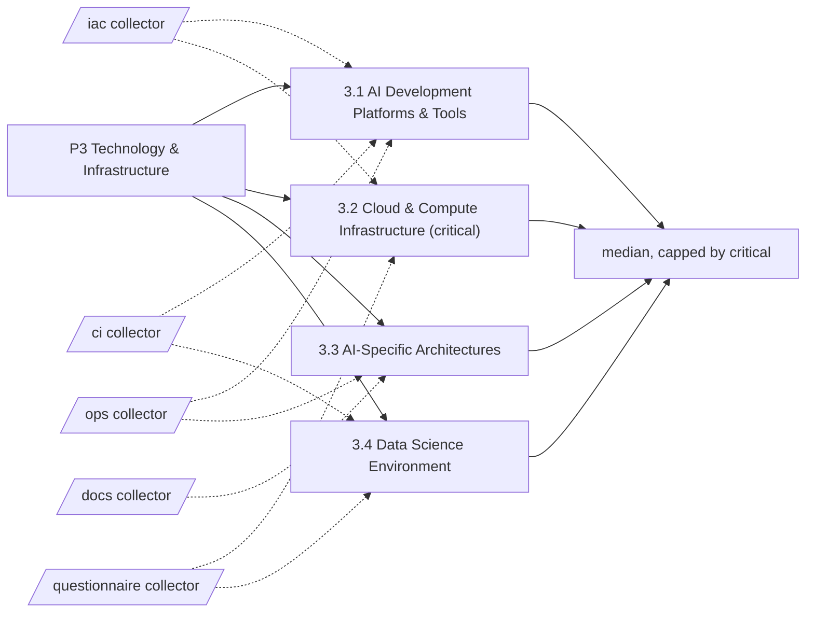

# Pillar 3: Technology & Infrastructure

Platforms, compute, architecture and working environments for AI. 4 categories; levels Basic, Ready, Dynamic, Advanced.

> Framework structure adapted from UNESCO, *AI Maturity Framework* (Stratejai for UNESCO), [CC BY-SA 3.0 IGO](https://creativecommons.org/licenses/by-sa/3.0/igo/). Wording is this project's own; UNESCO does not endorse it. The framework-derived tables on this page are shared under the same license.

Sections: [1. Purpose](#1-purpose) · [2. Architecture](#2-architecture) · [3. How it works](#3-how-it-works) · [4. Key files](#4-key-files) · [5. Code excerpts](#5-code-excerpts) · [6. Configuration](#6-configuration) · [7. Commands](#7-commands) · [8. Real output](#8-real-output) · [9. Tests and gates](#9-tests-and-gates) · [10. Guardrails](#10-guardrails) · [11. Security and governance](#11-security-and-governance) · [12. Observability](#12-observability) · [13. Failure modes](#13-failure-modes) · [14. Mapping to Azure services](#14-mapping-to-azure-services) · [15. Limitations](#15-limitations) · [16. Interview talking points](#16-interview-talking-points) · [17. Adopt this](#17-adopt-this)

## 1. Purpose

* Technology is the easiest pillar to evidence and the easiest to over-rate. The rubric asks for platforms that are tested, infrastructure that is coded, guarded and identity-based, architectures that are documented and interoperable, and environments people can reproduce.
* Default critical category: 3.2; it caps the pillar level.

## 2. Architecture



## 3. How it works

Technology is the easiest pillar to evidence and the easiest to over-rate. The rubric asks for platforms that are tested, infrastructure that is coded, guarded and identity-based, architectures that are documented and interoperable, and environments people can reproduce.

Evidence comes from `iac` (Terraform, Bicep, cost guards, identities, Key Vault, scans), `ci` (tests, linting, pinning, eval gates, container builds), `ops` (APIs, gateways, MCP, A2A) and `docs` (ADRs).

The pillar level is the median of its 4 category levels, capped by the critical category 3.2.

**3.1 AI Development Platforms & Tools**: The tooling available across the AI lifecycle, from preparing data to deploying models.

| Level | What it looks like | Evidence the assessor needs |
|---|---|---|
| 1 Basic | Everyone uses their own tools; there is no common platform. | nothing (starting point) |
| 2 Ready | Common libraries are in use and cloud AI services are being explored. | `dependency_pinning`; `ci_tests`; `ci_lint` |
| 3 Dynamic | A supported standard platform covers data preparation, modelling and deployment. | `cloud_ai_service`; `shared_library`; `eval_suite` |
| 4 Advanced | An integrated platform covers the full lifecycle and is optimised for collaboration. | `eval_gate_ci`; `container_build`; `telemetry` |

**3.2 Cloud & Compute Infrastructure** (critical): Access to enough elastic compute, storage and networking for AI workloads, and control of its cost.

| Level | What it looks like | Evidence the assessor needs |
|---|---|---|
| 1 Basic | Work runs on laptops or fixed servers that limit experimentation. | nothing (starting point) |
| 2 Ready | Basic cloud services are used and scaling is manual. | `iac_any` |
| 3 Dynamic | Cloud capacity configured for AI is available on demand, provisioned as code. | `iac_tests`; `cost_guard`; `managed_identity`; `key_vault` |
| 4 Advanced | Provisioning is automated and elastic, with cost and performance actively optimised. | `autoscale`; `iac_scan`; `q_cost_optimisation_cadence` |

**3.3 AI-Specific Architectures**: Whether systems are designed so AI components can be plugged in through clean interfaces.

| Level | What it looks like | Evidence the assessor needs |
|---|---|---|
| 1 Basic | Monolithic systems make AI integration slow and bespoke. | nothing (starting point) |
| 2 Ready | Some systems expose APIs and new designs start to consider AI. | `api_contract` |
| 3 Dynamic | Patterns such as APIs, events and microservices are standard for AI integration. | `adr`; `api_gateway`; `event_driven` |
| 4 Advanced | The architecture is built for AI, with reusable AI services across the estate. | `mcp_server`; `a2a_card` |

**3.4 Data Science Environment**: Secure, shared environments where AI teams can build, track and reproduce work.

| Level | What it looks like | Evidence the assessor needs |
|---|---|---|
| 1 Basic | People work on isolated desktops; sharing results is hard. | nothing (starting point) |
| 2 Ready | Shared storage and basic collaboration tools exist. | `dependency_pinning` |
| 3 Dynamic | A secure shared workbench supports version control, experiment tracking and collaboration. | `experiment_tracking`; `dev_environment` |
| 4 Advanced | A self-service platform integrates data, tracking and deployment pipelines. | `q_self_service_env` |

## 4. Key files

| File | Role |
|---|---|
| `framework/framework.yaml` | P3 categories, summaries and level descriptors (CC BY-SA 3.0 IGO) |
| `rubric/categories.yaml` | Signals per level, effort, dependencies, critical list |
| `rubric/signals.yaml` | What each file-based signal looks for |
| `rubric/questionnaire.yaml` | Questions for items code cannot show |

## 5. Code excerpts

<!-- code: src/aimaturity/collectors/__init__.py::matches -->
```python
def matches(signal_id: str, rel_path: str, text: str) -> bool:
    s = signals()[signal_id]
    p = PurePosixPath(rel_path)
    if not any(p.full_match(g) for g in s["paths"]):
        return False
    rx = _compiled(signal_id)
    return rx is None or bool(rx.search(text))
```
<!-- /code -->

<!-- code: src/aimaturity/sources.py::RepoSource -->
```python
@dataclass
class RepoSource:
    name: str
    path: Path

    def files(self) -> list[str]:
        try:
            out = subprocess.run(["git", "-C", str(self.path), "ls-files"], capture_output=True, text=True, check=True).stdout.split("\n")
            files = [f for f in out if f]
        except (subprocess.CalledProcessError, FileNotFoundError):
            files = [str(p.relative_to(self.path)) for p in self.path.rglob("*") if p.is_file() and not SKIP & set(p.parts)]
        return sorted(f for f in files if Path(f).suffix in TEXT or Path(f).name in {"Dockerfile", "Makefile", "CODEOWNERS"})

    def read(self, rel: str) -> str:
        p = self.path / rel
        if not p.is_file() or p.stat().st_size > MAX_BYTES:
            return ""
        return p.read_text(errors="ignore")
```
<!-- /code -->

## 6. Configuration

| Category | Effort per step | Depends on | Critical (default) |
|---|---|---|---|
| 3.1 | 2:S, 3:M, 4:L | - | no |
| 3.2 | 2:S, 3:M, 4:M | - | yes |
| 3.3 | 2:S, 3:L, 4:M | 3.2 | no |
| 3.4 | 2:S, 3:M, 4:L | 3.1 | no |

| Signal or question | Meaning |
|---|---|
| `a2a_card` | Agents publish an A2A agent card |
| `adr` | Architecture decision records with a status |
| `api_contract` | Services expose documented APIs |
| `api_gateway` | An API gateway fronts AI services |
| `autoscale` | Elastic scaling is configured |
| `ci_lint` | CI runs a linter |
| `ci_tests` | CI runs automated tests |
| `cloud_ai_service` | Managed AI services are provisioned as code |
| `container_build` | Workloads are packaged as containers |
| `cost_guard` | Cost guards (budgets or ingestion caps) are provisioned as code |
| `dependency_pinning` | Dependencies are pinned for reproducible environments |
| `dev_environment` | A reproducible developer environment (devcontainer, compose or Makefile) |
| `eval_gate_ci` | CI blocks merges on evaluation results |
| `eval_suite` | An evaluation suite for AI behaviour exists |
| `event_driven` | Event or message infrastructure connects systems |
| `experiment_tracking` | Experiment or evaluation results are tracked as files or in a tracking tool |
| `iac_any` | Infrastructure is defined as code (Terraform or Bicep) |
| `iac_scan` | Infrastructure code is scanned (checkov or tflint configuration) |
| `iac_tests` | Infrastructure code has automated tests |
| `key_vault` | Secrets are held in Key Vault |
| `managed_identity` | Workloads use managed identities instead of keys |
| `mcp_server` | Tools are exposed over the Model Context Protocol |
| `q_cost_optimisation_cadence` | Is cloud cost and performance for AI reviewed and optimised on a cadence? |
| `q_self_service_env` | Can AI teams create governed environments on their own within minutes? |
| `shared_library` | Shared code is packaged for reuse across projects |
| `telemetry` | Services emit telemetry (OpenTelemetry or Application Insights) |

## 7. Commands

```bash
aimaturity framework --pillar P3
aimaturity category 3.1
aimaturity explain --org portfolio --category 3.2
aimaturity gaps --org kestrel-bay-bank
```

## 8. Real output

<!-- output: framework --pillar P3 -->
```text
category  name                              critical
--------  --------------------------------  --------
3.1       AI Development Platforms & Tools
3.2       Cloud & Compute Infrastructure    yes
3.3       AI-Specific Architectures
3.4       Data Science Environment
```
<!-- /output -->

<!-- output: category 3.1 -->
```text
3.1 AI Development Platforms & Tools (P3 Technology & Infrastructure)
The tooling available across the AI lifecycle, from preparing data to deploying models.
  1 Basic: Everyone uses their own tools; there is no common platform.
  2 Ready: Common libraries are in use and cloud AI services are being explored.
  3 Dynamic: A supported standard platform covers data preparation, modelling and deployment.
  4 Advanced: An integrated platform covers the full lifecycle and is optimised for collaboration.
  evidence for 2: dependency_pinning (Dependencies are pinned for reproducible environments); ci_tests (CI runs automated tests); ci_lint (CI runs a linter)
  evidence for 3: cloud_ai_service (Managed AI services are provisioned as code); shared_library (Shared code is packaged for reuse across projects); eval_suite (An evaluation suite for AI behaviour exists)
  evidence for 4: eval_gate_ci (CI blocks merges on evaluation results); container_build (Workloads are packaged as containers); telemetry (Services emit telemetry (OpenTelemetry or Application Insights))
```
<!-- /output -->

<!-- output: explain --org portfolio --category 3.2 -->
```text
3.2 Cloud & Compute Infrastructure: level 4 (Advanced), confidence 0.75, status pending-review
rationale: Level 4 (Advanced). Supported by [E377], [E378], [E379], [E380]. Confidence 0.75.
  [x] iac_any                      artifact         E377, E378, E379
  [x] iac_tests                    artifact         E413, E414, E415
  [x] cost_guard                   artifact         E173, E174, E175
  [x] managed_identity             artifact         E455, E456, E457
  [x] key_vault                    artifact         E423, E424, E425
  [x] autoscale                    artifact         E063, E064, E065
  [x] iac_scan                     artifact         E398, E399, E400
  [~] q_cost_optimisation_cadence  sample-answers   E533
  E377 agentic-ai-model-risk:infra/bicep/main.bicep (file present)
  E378 agentic-ai-model-risk:infra/bicep/modules/policies.bicep (file present)
  E379 agentic-ai-model-risk:infra/bicep/modules/registry.bicep (file present)
  E380 agentic-ai-portfolio:infra/bicep/main.bicep (file present)
  E381 agentic-ai-portfolio:infra/terraform/backend.tf (file present)
  E382 agentic-ai-portfolio:infra/terraform/locals.tf (file present)
  E383 azure-agent-labs:infra/terraform/modules/cognitive/main.tf (file present)
  E384 azure-agent-labs:infra/terraform/modules/cognitive/outputs.tf (file present)
needs review: level rests on sample answers: q_cost_optimisation_cadence
```
<!-- /output -->

## 9. Tests and gates

* `tests/test_framework.py`: every category has four descriptors, three actions and a rubric entry.
* `tests/test_scoring.py`: no evidence gives Basic, full evidence gives Advanced, stepwise levels for every category.
* `tests/test_samples.py`: sample results, labelled answers and cross-links.
* Eval gates: calibration against labelled levels covers every category of this pillar.

## 10. Guardrails

* Only files tracked by git are read, and only text files under 400 KB.
* At most three citations per signal per repository, so one large repository cannot drown the others.

## 11. Security and governance

Assessments read repositories without executing them and cite file paths, never file contents. Questionnaire answers can hold internal judgements: keep them in the evidence store's `evidence` container (private, versioned, Entra-only).

## 12. Observability

Each assessment run writes a `summary.json` per organisation (scheduled job) with pillar levels, confidence and the review queue; trend them in Log Analytics after upload.

## 13. Failure modes

| Failure | What the assessor does |
|---|---|
| Copy-pasted IaC that never deploys | `iac_tests` (terraform test or what-if) is required for 3.2 level 3 |
| A signal pattern that matches unrelated code | the risk scoring signal was tightened after a turbine-feature file matched; tests pin each signal to its example |

## 14. Mapping to Azure services

* **Azure Container Apps**, **Azure Functions** and **Azure API Management** are the services the `ops` signals recognise.
* **Microsoft Defender for Cloud** and checkov findings feed `iac_scan`.
* **Microsoft Foundry**: a hosted model replaces `MockLLM` for rationales, and Foundry evaluations score rationale groundedness against the cited evidence.
* **Microsoft Purview**: register the evidence store and reports as data assets with lineage back to the scanned repositories, and keep questionnaire answers under a sensitivity label.
* **Azure Policy**: audit that the evidence store stays keyless and versioned and that the Key Vault keeps RBAC, so the controls the assessment relies on cannot drift silently.
* **Azure Monitor / Log Analytics**: job logs, blob access logs and Key Vault audit events land in one workspace, where a query can trend maturity runs over time.

## 15. Limitations

* Presence is not quality: a Terraform file counts even if the design is poor; reviewers judge design.
* Cloud-only evidence: on-premises platforms need their own signals.

## 16. Interview talking points

* "The portfolio is strongest here (level 4), and the evidence shows why: tests, IaC tests, cost guards, MCP and A2A across eight repositories."
* "Strong technology with weak people and governance is the classic imbalance; the pillar cap stops the overall level hiding it."

## 17. Adopt this

1. List your repositories in `org.yaml` and run `aimaturity collect --org <org> --live --write` to snapshot what the collectors see.
2. Add signals for your stack (for example, Kubernetes manifests) with a path glob, an optional pattern and an example; the tests require the example to match.
3. Raise the target for P3 in `targets.pillars` if technology is your differentiator.
