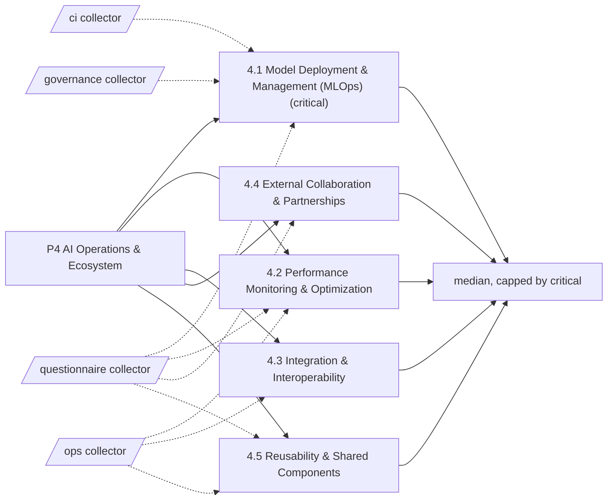

# Pillar 4: AI Operations & Ecosystem

Running AI in production and working with others. 5 categories; levels Basic, Ready, Dynamic, Advanced.

> Framework structure adapted from UNESCO, *AI Maturity Framework* (Stratejai for UNESCO), [CC BY-SA 3.0 IGO](https://creativecommons.org/licenses/by-sa/3.0/igo/). Wording is this project's own; UNESCO does not endorse it. The framework-derived tables on this page are shared under the same license.

Sections: [1. Purpose](#1-purpose) · [2. Architecture](#2-architecture) · [3. How it works](#3-how-it-works) · [4. Key files](#4-key-files) · [5. Code excerpts](#5-code-excerpts) · [6. Configuration](#6-configuration) · [7. Commands](#7-commands) · [8. Real output](#8-real-output) · [9. Tests and gates](#9-tests-and-gates) · [10. Guardrails](#10-guardrails) · [11. Security and governance](#11-security-and-governance) · [12. Observability](#12-observability) · [13. Failure modes](#13-failure-modes) · [14. Mapping to Azure services](#14-mapping-to-azure-services) · [15. Limitations](#15-limitations) · [16. Interview talking points](#16-interview-talking-points) · [17. Adopt this](#17-adopt-this)

## 1. Purpose

* Operations is where pilots become services. The pillar looks at how models and agents are deployed and managed, how they are monitored, how well they integrate, whether the organisation works with outside partners and whether it reuses what it builds.
* Default critical category: 4.1; it caps the pillar level.

## 2. Architecture



## 3. How it works

Operations is where pilots become services. The pillar looks at how models and agents are deployed and managed, how they are monitored, how well they integrate, whether the organisation works with outside partners and whether it reuses what it builds.

Evidence comes from `ci` (deployment pipelines, approvals, teardown, OIDC, eval gates), `ops` (telemetry, alerts, drift, APIs, events, reuse) and the questionnaire for partnerships.

The pillar level is the median of its 5 category levels, capped by the critical category 4.1.

**4.1 Model Deployment & Management (MLOps)** (critical): How reliably models and agents move into production, are versioned and are rolled back or retrained.

| Level | What it looks like | Evidence the assessor needs |
|---|---|---|
| 1 Basic | Deployment is manual and rare, without versioning or tests. | nothing (starting point) |
| 2 Ready | Scripts handle some deployments and some versioning exists. | `cd_pipeline` |
| 3 Dynamic | Automated pipelines test, deploy and roll back models, with versioning. | `eval_gate_ci`; `env_approval`; `teardown`; `oidc` |
| 4 Advanced | The full lifecycle is automated, including retraining, staged rollout and retirement. | `q_auto_retrain`; `lifecycle_gates` |

**4.2 Performance Monitoring & Optimization**: How the behaviour of running AI systems (quality, drift, fairness, latency, cost) is watched and improved.

| Level | What it looks like | Evidence the assessor needs |
|---|---|---|
| 1 Basic | Nothing is monitored; problems surface through complaints. | nothing (starting point) |
| 2 Ready | Uptime and errors are watched; quality is checked by hand now and then. | `telemetry` |
| 3 Dynamic | Quality, drift and fairness metrics are monitored with thresholds and alerts. | `alert_rules`; `drift_monitoring` |
| 4 Advanced | Monitoring links model behaviour to business impact and triggers improvement automatically. | `business_metric_link`; `q_auto_improve` |

**4.3 Integration & Interoperability**: How AI systems exchange data and fit into existing applications and processes.

| Level | What it looks like | Evidence the assessor needs |
|---|---|---|
| 1 Basic | AI runs in isolation and results are moved by hand. | nothing (starting point) |
| 2 Ready | Point-to-point integrations exist for specific systems. | `api_contract` |
| 3 Dynamic | Standard APIs and integration patterns connect AI to business systems. | `api_gateway`; `event_driven` |
| 4 Advanced | AI services are discoverable and composable through gateways, events and open protocols. | `mcp_server`; `a2a_card` |

**4.4 External Collaboration & Partnerships**: How the organisation learns from and works with universities, peers, vendors and communities.

| Level | What it looks like | Evidence the assessor needs |
|---|---|---|
| 1 Basic | The organisation builds AI on its own, with no outside partners or peer exchange. | nothing (starting point) |
| 2 Ready | Contacts are informal and collaborations occasional. | `q_partnership_informal` |
| 3 Dynamic | Strategic partnerships exist for specific AI projects or knowledge sharing. | `q_partnership_formal` |
| 4 Advanced | The organisation helps lead its AI ecosystem and manages partnerships systematically. | `q_ecosystem_lead` |

**4.5 Reusability & Shared Components**: Whether models, pipelines, tools and data are built once and reused across projects.

| Level | What it looks like | Evidence the assessor needs |
|---|---|---|
| 1 Basic | Every project starts from nothing. | nothing (starting point) |
| 2 Ready | People share snippets informally. | `shared_library` |
| 3 Dynamic | A shared catalogue and processes for reusing components exist. | `adopt_guide`; `reuse_catalog` |
| 4 Advanced | Reusable assets are curated and promoted as an organisation-wide strategy. | `q_reuse_measured` |

## 4. Key files

| File | Role |
|---|---|
| `framework/framework.yaml` | P4 categories, summaries and level descriptors (CC BY-SA 3.0 IGO) |
| `rubric/categories.yaml` | Signals per level, effort, dependencies, critical list |
| `rubric/signals.yaml` | What each file-based signal looks for |
| `rubric/questionnaire.yaml` | Questions for items code cannot show |

## 5. Code excerpts

<!-- code: src/aimaturity/crosslinks.py::check_links -->
```python
def check_links(state: dict[str, Any]) -> list[dict[str, Any]]:
    links = state["org"].config.get("links", {})
    ev = state["evidence_by_id"]
    rows = []
    for repo, cats in links.items():
        for cid in cats:
            cited = [i for i in state["results"][cid].evidence if ev[i].source == repo]
            rows.append({"repo": repo, "category": cid, "cited": len(cited), "examples": sorted({ev[i].path for i in cited})[:3], "ok": bool(cited)})
    return rows
```
<!-- /code -->

## 6. Configuration

| Category | Effort per step | Depends on | Critical (default) |
|---|---|---|---|
| 4.1 | 2:S, 3:M, 4:L | 3.1, 3.2 | yes |
| 4.2 | 2:S, 3:M, 4:L | 4.1 | no |
| 4.3 | 2:S, 3:M, 4:M | 3.3 | no |
| 4.4 | 2:S, 3:M, 4:L | - | no |
| 4.5 | 2:S, 3:M, 4:M | 3.1 | no |

| Signal or question | Meaning |
|---|---|
| `a2a_card` | Agents publish an A2A agent card |
| `adopt_guide` | Docs explain how another team adopts or reuses the work |
| `alert_rules` | Alert rules and action groups are defined |
| `api_contract` | Services expose documented APIs |
| `api_gateway` | An API gateway fronts AI services |
| `business_metric_link` | Monitoring links model behaviour to business or cost metrics |
| `cd_pipeline` | A deployment pipeline exists |
| `drift_monitoring` | Model or data drift is measured in code |
| `env_approval` | Production deployment waits for an environment approval |
| `eval_gate_ci` | CI blocks merges on evaluation results |
| `event_driven` | Event or message infrastructure connects systems |
| `lifecycle_gates` | Lifecycle stages with approval gates are enforced in code |
| `mcp_server` | Tools are exposed over the Model Context Protocol |
| `oidc` | Pipelines authenticate with OIDC federation (no stored cloud secret) |
| `q_auto_improve` | Do monitoring results trigger improvement work automatically? |
| `q_auto_retrain` | Are retraining or re-evaluation triggered automatically, with staged rollout? |
| `q_ecosystem_lead` | Does the organisation help lead its AI ecosystem or contribute shared assets? |
| `q_partnership_formal` | Are there formal AI partnerships with goals (academia, peers, vendors)? |
| `q_partnership_informal` | Does the organisation take part in AI communities or peer networks? |
| `q_reuse_measured` | Is reuse of shared AI components funded and measured? |
| `reuse_catalog` | A catalogue of reusable components is published |
| `shared_library` | Shared code is packaged for reuse across projects |
| `teardown` | Environments can be torn down by pipeline |
| `telemetry` | Services emit telemetry (OpenTelemetry or Application Insights) |

## 7. Commands

```bash
aimaturity framework --pillar P4
aimaturity category 4.1
aimaturity explain --org portfolio --category 4.1
aimaturity gaps --org kestrel-bay-bank
```

## 8. Real output

<!-- output: framework --pillar P4 -->
```text
category  name                                   critical
--------  -------------------------------------  --------
4.1       Model Deployment & Management (MLOps)  yes
4.2       Performance Monitoring & Optimization
4.3       Integration & Interoperability
4.4       External Collaboration & Partnerships
4.5       Reusability & Shared Components
```
<!-- /output -->

<!-- output: category 4.1 -->
```text
4.1 Model Deployment & Management (MLOps) (P4 AI Operations & Ecosystem) - critical
How reliably models and agents move into production, are versioned and are rolled back or retrained.
  1 Basic: Deployment is manual and rare, without versioning or tests.
  2 Ready: Scripts handle some deployments and some versioning exists.
  3 Dynamic: Automated pipelines test, deploy and roll back models, with versioning.
  4 Advanced: The full lifecycle is automated, including retraining, staged rollout and retirement.
  evidence for 2: cd_pipeline (A deployment pipeline exists)
  evidence for 3: eval_gate_ci (CI blocks merges on evaluation results); env_approval (Production deployment waits for an environment approval); teardown (Environments can be torn down by pipeline); oidc (Pipelines authenticate with OIDC federation (no stored cloud secret))
  evidence for 4: q_auto_retrain (Are retraining or re-evaluation triggered automatically, with staged rollout?); lifecycle_gates (Lifecycle stages with approval gates are enforced in code)
```
<!-- /output -->

<!-- output: explain --org portfolio --category 4.1 -->
```text
4.1 Model Deployment & Management (MLOps): level 3 (Dynamic), confidence 0.64, status auto
rationale: Level 3 (Dynamic). Supported by [E085], [E086], [E087], [E088]. Next level needs: q_auto_retrain. Confidence 0.64.
  [x] cd_pipeline                  artifact         E085, E086, E087
  [x] eval_gate_ci                 artifact         E278, E279, E280
  [x] env_approval                 artifact         E271, E272, E273
  [x] teardown                     artifact         E664, E665, E666
  [x] oidc                         artifact         E491, E492, E493
  [ ] q_auto_retrain               sample-answers   
  [x] lifecycle_gates              artifact         E440, E441, E442
  E085 agentic-ai-model-risk:.github/workflows/deploy.yml (matched 'azure/login')
  E086 agentic-ai-model-risk:.github/workflows/infra.yml (matched 'azure/login')
  E087 agentic-ai-model-risk:.github/workflows/teardown.yml (matched 'azure/login')
  E088 agentic-ai-portfolio:.github/workflows/deploy.yml (matched 'azure/login')
  E089 agentic-ai-portfolio:.github/workflows/infra.yml (matched 'azure/login')
  E090 agentic-ai-portfolio:.github/workflows/teardown.yml (matched 'azure/login')
  E091 azure-agent-labs:.github/workflows/deploy.yml (matched 'azure/login')
  E092 azure-agent-labs:.github/workflows/infra.yml (matched 'azure/login')
```
<!-- /output -->

## 9. Tests and gates

* `tests/test_framework.py`: every category has four descriptors, three actions and a rubric entry.
* `tests/test_scoring.py`: no evidence gives Basic, full evidence gives Advanced, stepwise levels for every category.
* `tests/test_samples.py`: sample results, labelled answers and cross-links.
* Eval gates: calibration against labelled levels covers every category of this pillar.

## 10. Guardrails

* A deployment pipeline counts toward 4.1 only with approvals and teardown at level 3, so a push-to-prod script does not pass.
* Partnership levels are questionnaire items; the reviewer can override when there is a signed agreement.

## 11. Security and governance

Assessments read repositories without executing them and cite file paths, never file contents. Questionnaire answers can hold internal judgements: keep them in the evidence store's `evidence` container (private, versioned, Entra-only).

## 12. Observability

Each assessment run writes a `summary.json` per organisation (scheduled job) with pillar levels, confidence and the review queue; trend them in Log Analytics after upload.

## 13. Failure modes

| Failure | What the assessor does |
|---|---|
| Monitoring that only checks uptime | 4.2 level 3 needs drift monitoring and alert rules |
| Shared code nobody reuses | 4.5 level 3 asks for an adopt guide and a reuse catalogue |

## 14. Mapping to Azure services

* **GitHub Actions with OIDC** to Azure, **Azure Container Apps jobs** and **Azure Monitor alerts** are the patterns the signals look for.
* **Azure API Center** is the natural home for the reuse catalogue in 4.5.
* **Microsoft Foundry**: a hosted model replaces `MockLLM` for rationales, and Foundry evaluations score rationale groundedness against the cited evidence.
* **Microsoft Purview**: register the evidence store and reports as data assets with lineage back to the scanned repositories, and keep questionnaire answers under a sensitivity label.
* **Azure Policy**: audit that the evidence store stays keyless and versioned and that the Key Vault keeps RBAC, so the controls the assessment relies on cannot drift silently.

## 15. Limitations

* External collaboration is hard to evidence from repositories; it is questionnaire-led.
* Reuse is measured by presence of guides and catalogues, not by actual reuse counts.

## 16. Interview talking points

* "Ecosystem maturity is the one place the agency beats the bank: a reviewer overrode 4.4 to Dynamic after seeing the university agreement."
* "Every repository in my portfolio has an 'Adopt this' section, which is exactly the 4.5 signal."

## 17. Adopt this

1. Add your pipeline folders to the `ci` signal globs if you do not use GitHub Actions (for example, `azure-pipelines.yml`).
2. Write an 'Adopt this' section in your component docs; `adopt_guide` will find it.
3. If partnerships are strategic for you, mark 4.4 critical in `org.yaml` so it caps the pillar.
