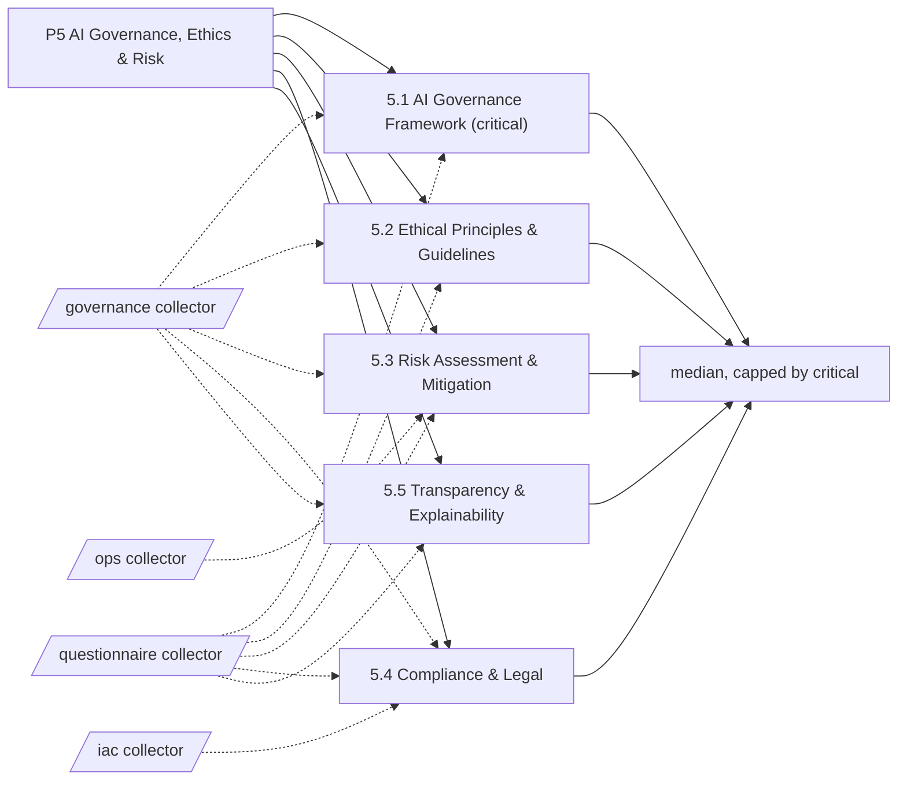

# Pillar 5: AI Governance, Ethics & Risk

Rules, ethics, risk, law and transparency for AI. 5 categories; levels Basic, Ready, Dynamic, Advanced.

> Framework structure adapted from UNESCO, *AI Maturity Framework* (Stratejai for UNESCO), [CC BY-SA 3.0 IGO](https://creativecommons.org/licenses/by-sa/3.0/igo/). Wording is this project's own; UNESCO does not endorse it. The framework-derived tables on this page are shared under the same license.

Sections: [1. Purpose](#1-purpose) · [2. Architecture](#2-architecture) · [3. How it works](#3-how-it-works) · [4. Key files](#4-key-files) · [5. Code excerpts](#5-code-excerpts) · [6. Configuration](#6-configuration) · [7. Commands](#7-commands) · [8. Real output](#8-real-output) · [9. Tests and gates](#9-tests-and-gates) · [10. Guardrails](#10-guardrails) · [11. Security and governance](#11-security-and-governance) · [12. Observability](#12-observability) · [13. Failure modes](#13-failure-modes) · [14. Mapping to Azure services](#14-mapping-to-azure-services) · [15. Limitations](#15-limitations) · [16. Interview talking points](#16-interview-talking-points) · [17. Adopt this](#17-adopt-this)

## 1. Purpose

* Governance, ethics and risk decide whether AI can be trusted with consequential work. The pillar asks for a governance framework with gates, principles that change designs, risk assessment with mitigations, compliance mapping and explanations people can use.
* Default critical category: 5.1; it caps the pillar level.

## 2. Architecture



## 3. How it works

Governance, ethics and risk decide whether AI can be trusted with consequential work. The pillar asks for a governance framework with gates, principles that change designs, risk assessment with mitigations, compliance mapping and explanations people can use.

Evidence comes from `governance` (security policy, AI policy, inventory, lifecycle gates, model and risk cards, risk scoring, scenario tests, regulation mapping, policy as code, HITL, audit logs, fairness, explainability) and the questionnaire for review boards and affected-people involvement.

The pillar level is the median of its 5 category levels, capped by the critical category 5.1.

**5.1 AI Governance Framework** (critical): The policies, decision rights, roles and accountability that apply specifically to AI.

| Level | What it looks like | Evidence the assessor needs |
|---|---|---|
| 1 Basic | General IT rules are assumed to cover AI. | nothing (starting point) |
| 2 Ready | First AI policies are drafted and roles are set per project. | `ai_policy_doc`; `security_policy` |
| 3 Dynamic | A formal framework with policies, a review body and clear accountability is in force. | `inventory`; `lifecycle_gates`; `q_review_board` |
| 4 Advanced | Governance spans the lifecycle, adherence is monitored and the framework is improved. | `compliance_in_pipeline`; `audit_log`; `secret_hygiene` |

**5.2 Ethical Principles & Guidelines**: How ethical commitments such as fairness, human oversight and transparency are defined and put into practice.

| Level | What it looks like | Evidence the assessor needs |
|---|---|---|
| 1 Basic | Ethics is rarely discussed and people affected by AI are not the starting point. | nothing (starting point) |
| 2 Ready | General principles are acknowledged and discussed for risky projects. | `q_ethics_principles` |
| 3 Dynamic | A principles framework is part of standard review, with practical checks. | `fairness_tests`; `hitl_approval` |
| 4 Advanced | Ethics is embedded across culture, strategy and every lifecycle stage. | `q_affected_people` |

**5.3 Risk Assessment & Mitigation**: How AI-specific risks such as bias, security, privacy and misuse are identified, scored and treated.

| Level | What it looks like | Evidence the assessor needs |
|---|---|---|
| 1 Basic | AI risk is not considered separately. | nothing (starting point) |
| 2 Ready | Some projects identify risks, often after the fact. | `risk_cards` |
| 3 Dynamic | A standard AI risk process with scoring and controls is applied to every system. | `risk_scoring`; `scenario_tests` |
| 4 Advanced | AI risk is managed continuously and quantitatively as part of enterprise risk. | `drift_monitoring`; `q_erm_integration` |

**5.4 Compliance & Legal**: How compliance with AI-relevant law (for example the EU AI Act and data protection) is ensured and shown.

| Level | What it looks like | Evidence the assessor needs |
|---|---|---|
| 1 Basic | Compliance is assumed from general rules. | nothing (starting point) |
| 2 Ready | Specific obligations are known and checked by hand for key projects. | `reg_mapping` |
| 3 Dynamic | Compliance processes are documented and connected to delivery. | `policy_as_code`; `compliance_in_pipeline` |
| 4 Advanced | Regulation is watched proactively and checks are automated in pipelines. | `q_reg_watch` |

**5.5 Transparency & Explainability**: How AI decisions are made understandable to developers, users, auditors and the public.

| Level | What it looks like | Evidence the assessor needs |
|---|---|---|
| 1 Basic | Models are black boxes and documentation is thin. | nothing (starting point) |
| 2 Ready | Basic model documentation exists. | `model_cards` |
| 3 Dynamic | Explanation techniques and documentation standards are applied where they matter. | `explainability`; `model_cards` |
| 4 Advanced | Explanations are tailored to each audience and transparency is routine. | `q_audience_explanations` |

## 4. Key files

| File | Role |
|---|---|
| `framework/framework.yaml` | P5 categories, summaries and level descriptors (CC BY-SA 3.0 IGO) |
| `rubric/categories.yaml` | Signals per level, effort, dependencies, critical list |
| `rubric/signals.yaml` | What each file-based signal looks for |
| `rubric/questionnaire.yaml` | Questions for items code cannot show |

## 5. Code excerpts

<!-- code: src/aimaturity/hitl.py::validate_review -->
```python
def validate_review(review: dict[str, Any], assessor: str, results: dict[str, CategoryResult]) -> None:
    if review["category"] not in results:
        raise ReviewError(f"unknown category {review['category']}")
    if review["reviewer"].strip().lower() == assessor.strip().lower():
        raise ReviewError("the assessor cannot review their own assessment")
    if review["decision"] not in DECISIONS:
        raise ReviewError(f"decision must be one of {DECISIONS}")
    if len(review.get("comment", "").strip()) < 10:
        raise ReviewError("a review needs a comment of at least 10 characters")
    if review["decision"] == "override" and review.get("level") not in (1, 2, 3, 4):
        raise ReviewError("an override needs a level from 1 to 4")
```
<!-- /code -->

<!-- code: src/aimaturity/hitl.py::verify_audit_log -->
```python
def verify_audit_log(path: Path) -> list[str]:
    problems, prev = [], GENESIS
    for n, e in enumerate(read_log(path), 1):
        if e.get("seq") != n:
            problems.append(f"entry {n}: sequence {e.get('seq')} out of order")
        if e.get("prev") != prev:
            problems.append(f"entry {n}: previous hash does not match")
        if _entry_hash(e) != e.get("hash"):
            problems.append(f"entry {n}: content changed after it was written")
        prev = e.get("hash", "")
    return problems
```
<!-- /code -->

## 6. Configuration

| Category | Effort per step | Depends on | Critical (default) |
|---|---|---|---|
| 5.1 | 2:S, 3:M, 4:L | 2.3 | yes |
| 5.2 | 2:S, 3:M, 4:L | 5.1 | no |
| 5.3 | 2:S, 3:M, 4:L | 5.1 | no |
| 5.4 | 2:S, 3:M, 4:M | 5.1 | no |
| 5.5 | 2:S, 3:M, 4:M | 5.1 | no |

| Signal or question | Meaning |
|---|---|
| `ai_policy_doc` | Written AI practices or policy (best practices, responsible AI, AI policy) |
| `audit_log` | Decisions are written to an audit log (ideally tamper-evident) |
| `compliance_in_pipeline` | Compliance or governance gates run in the pipeline |
| `drift_monitoring` | Model or data drift is measured in code |
| `explainability` | Outputs carry explanations (key factors, rationale, citations) |
| `fairness_tests` | Fairness is tested (adverse impact, disparate impact, parity) |
| `hitl_approval` | Human-in-the-loop approval or sign-off is implemented |
| `inventory` | An inventory of AI systems is kept |
| `lifecycle_gates` | Lifecycle stages with approval gates are enforced in code |
| `model_cards` | Model cards document AI systems |
| `policy_as_code` | Azure Policy definitions or assignments are code |
| `q_affected_people` | Are people affected by AI involved in design and in tracking ethical outcomes? |
| `q_audience_explanations` | Are explanations tailored for users, auditors and the public, with transparency notes? |
| `q_erm_integration` | Is AI risk reported through enterprise risk management with quantitative measures? |
| `q_ethics_principles` | Has the organisation adopted written AI ethics principles? |
| `q_reg_watch` | Is regulatory change tracked proactively with owners for each obligation? |
| `q_review_board` | Is there an AI review body with decision rights? |
| `reg_mapping` | Regulatory obligations are mapped (EU AI Act, NIST AI RMF, ISO/IEC 42001, GDPR) |
| `risk_cards` | Risk cards or a risk register list AI risks |
| `risk_scoring` | Risks are scored (likelihood × impact, residual) in code |
| `scenario_tests` | Adversarial or what-if scenarios are tested (injection, red teaming, what-if) |
| `secret_hygiene` | Secret hygiene is enforced (env example, secret scanning config or secret tests) |
| `security_policy` | A security policy (SECURITY.md) exists |

## 7. Commands

```bash
aimaturity framework --pillar P5
aimaturity category 5.1
aimaturity explain --org portfolio --category 5.3
aimaturity gaps --org kestrel-bay-bank
```

## 8. Real output

<!-- output: framework --pillar P5 -->
```text
category  name                             critical
--------  -------------------------------  --------
5.1       AI Governance Framework          yes
5.2       Ethical Principles & Guidelines
5.3       Risk Assessment & Mitigation
5.4       Compliance & Legal
5.5       Transparency & Explainability
```
<!-- /output -->

<!-- output: category 5.1 -->
```text
5.1 AI Governance Framework (P5 AI Governance, Ethics & Risk) - critical
The policies, decision rights, roles and accountability that apply specifically to AI.
  1 Basic: General IT rules are assumed to cover AI.
  2 Ready: First AI policies are drafted and roles are set per project.
  3 Dynamic: A formal framework with policies, a review body and clear accountability is in force.
  4 Advanced: Governance spans the lifecycle, adherence is monitored and the framework is improved.
  evidence for 2: ai_policy_doc (Written AI practices or policy (best practices, responsible AI, AI policy)); security_policy (A security policy (SECURITY.md) exists)
  evidence for 3: inventory (An inventory of AI systems is kept); lifecycle_gates (Lifecycle stages with approval gates are enforced in code); q_review_board (Is there an AI review body with decision rights?)
  evidence for 4: compliance_in_pipeline (Compliance or governance gates run in the pipeline); audit_log (Decisions are written to an audit log (ideally tamper-evident)); secret_hygiene (Secret hygiene is enforced (env example, secret scanning config or secret tests))
```
<!-- /output -->

<!-- output: explain --org portfolio --category 5.3 -->
```text
5.3 Risk Assessment & Mitigation: level 3 (Dynamic), confidence 0.62, status auto
rationale: Level 3 (Dynamic). Supported by [E584], [E585], [E586], [E587]. Next level needs: q_erm_integration. Confidence 0.62.
  [x] risk_cards                   artifact         E584, E585, E586
  [x] risk_scoring                 artifact         E587, E588, E589
  [x] scenario_tests               artifact         E590, E591, E592
  [x] drift_monitoring             artifact         E258, E259, E260
  [ ] q_erm_integration            sample-answers   
  E584 agentic-ai-model-risk:registry/bramblewood-claims-triage/risk-cards.yaml (file present)
  E585 agentic-ai-model-risk:registry/cedarhollow-underwriting-assistant/risk-cards.yaml (file present)
  E586 agentic-ai-model-risk:registry/halcyon-fraud-triage/risk-cards.yaml (file present)
  E587 agentic-ai-model-risk:src/modelrisk/cli.py (matched 'likelihood", "impact')
  E588 agentic-ai-model-risk:src/modelrisk/combine.py (matched 'residual risk')
  E589 agentic-ai-model-risk:src/modelrisk/gate.py (matched 'residual risk')
  E590 agentic-ai-model-risk:registry/bramblewood-claims-triage/scenarios.yaml (matched 'prompt-injection')
  E591 agentic-ai-model-risk:registry/cedarhollow-underwriting-assistant/scenarios.yaml (matched 'prompt-injection')
```
<!-- /output -->

## 9. Tests and gates

* `tests/test_framework.py`: every category has four descriptors, three actions and a rubric entry.
* `tests/test_scoring.py`: no evidence gives Basic, full evidence gives Advanced, stepwise levels for every category.
* `tests/test_samples.py`: sample results, labelled answers and cross-links.
* Eval gates: calibration against labelled levels covers every category of this pillar.

## 10. Guardrails

* The pillar is capped by 5.1 by default: without a governance framework the rest cannot lift it.
* The assessor's own sign-off rules (no self-review, digest binding, hash chain) are the same controls it looks for in others.

## 11. Security and governance

Assessments read repositories without executing them and cite file paths, never file contents. Questionnaire answers can hold internal judgements: keep them in the evidence store's `evidence` container (private, versioned, Entra-only).

## 12. Observability

Each assessment run writes a `summary.json` per organisation (scheduled job) with pillar levels, confidence and the review queue; trend them in Log Analytics after upload.

## 13. Failure modes

| Failure | What the assessor does |
|---|---|
| Model cards without risk cards | 5.3 stays at Basic; the gap names the missing risk register |
| Principles on paper only | 5.2 level 3 needs fairness tests and HITL approvals in code |

## 14. Mapping to Azure services

* **Azure Policy** and **Microsoft Purview** compliance manager map to 5.1 and 5.4.
* **Azure AI Content Safety** and **Foundry evaluations** produce the scenario and fairness evidence 5.2 and 5.3 look for.
* **Azure Monitor / Log Analytics**: job logs, blob access logs and Key Vault audit events land in one workspace, where a query can trend maturity runs over time.

## 15. Limitations

* Regulatory mapping is detected, not verified; legal review is out of scope.
* Ethics in practice (who was consulted) is questionnaire-led.

## 16. Interview talking points

* "The governance pillar pulls its strongest evidence from my model risk repository: risk cards, scenario tests and model cards for five fictional agents."
* "This tool practises what it checks: the assessor's own HITL flow is a 5.1 control."

## 17. Adopt this

1. Keep model cards and risk cards next to the code (`**/model-card*.yaml`, `**/risk-card*.yaml`) so the collectors can cite them.
2. Choose your critical categories: a regulator-facing organisation might add 5.4.
3. Link a dedicated governance repository in `org.yaml` `links` so the report shows where pillar 5 evidence comes from.
