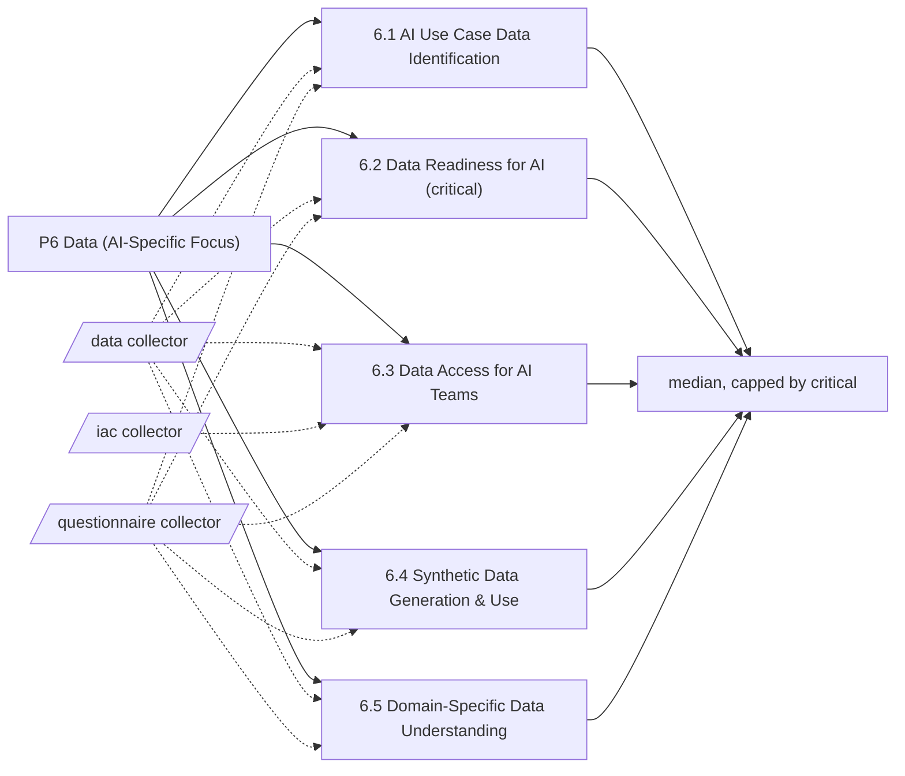

# Pillar 6: Data (AI-Specific Focus)

Finding, preparing, accessing, synthesising and understanding data for AI. 5 categories; levels Basic, Ready, Dynamic, Advanced.

> Framework structure adapted from UNESCO, *AI Maturity Framework* (Stratejai for UNESCO), [CC BY-SA 3.0 IGO](https://creativecommons.org/licenses/by-sa/3.0/igo/). Wording is this project's own; UNESCO does not endorse it. The framework-derived tables on this page are shared under the same license.

Sections: [1. Purpose](#1-purpose) · [2. Architecture](#2-architecture) · [3. How it works](#3-how-it-works) · [4. Key files](#4-key-files) · [5. Code excerpts](#5-code-excerpts) · [6. Configuration](#6-configuration) · [7. Commands](#7-commands) · [8. Real output](#8-real-output) · [9. Tests and gates](#9-tests-and-gates) · [10. Guardrails](#10-guardrails) · [11. Security and governance](#11-security-and-governance) · [12. Observability](#12-observability) · [13. Failure modes](#13-failure-modes) · [14. Mapping to Azure services](#14-mapping-to-azure-services) · [15. Limitations](#15-limitations) · [16. Interview talking points](#16-interview-talking-points) · [17. Adopt this](#17-adopt-this)

## 1. Purpose

* Data is where AI projects most often stall. The pillar looks at whether data needs are identified per use case, whether data is ready (contracts and quality), whether AI teams can get access safely, whether synthetic data is used well and whether domain knowledge travels with the data.
* Default critical category: 6.2; it caps the pillar level.

## 2. Architecture



## 3. How it works

Data is where AI projects most often stall. The pillar looks at whether data needs are identified per use case, whether data is ready (contracts and quality), whether AI teams can get access safely, whether synthetic data is used well and whether domain knowledge travels with the data.

Evidence comes from `data` (data needs, catalogues, contracts, quality tests, access platforms, synthetic generators and validation, domain docs, data sheets) and the questionnaire for access processes and embedded experts.

The pillar level is the median of its 5 category levels, capped by the critical category 6.2.

**6.1 AI Use Case Data Identification**: How the data a use case needs is found, judged and obtained.

| Level | What it looks like | Evidence the assessor needs |
|---|---|---|
| 1 Basic | Finding data is slow and manual; sources are often unknown. | nothing (starting point) |
| 2 Ready | Data needs are listed per project, though sourcing is ad hoc. | `data_needs` |
| 3 Dynamic | A systematic process, often with a catalogue, identifies and sources data for planned use cases. | `data_catalog` |
| 4 Advanced | Strategic data assets are identified ahead of need and sharing agreements are in place. | `q_data_sharing_agreements` |

**6.2 Data Readiness for AI** (critical): How data is checked and prepared for AI, including quality, labelling and feature work.

| Level | What it looks like | Evidence the assessor needs |
|---|---|---|
| 1 Basic | Data is used as found; quality problems appear late. | nothing (starting point) |
| 2 Ready | Basic cleaning is done per project and some practices repeat. | `data_contracts` |
| 3 Dynamic | Standard preparation pipelines include quality checks and contracts. | `data_quality_tests` |
| 4 Advanced | Preparation is automated and reusable, with quality monitored continuously. | `q_dq_monitoring` |

**6.3 Data Access for AI Teams**: How quickly, safely and lawfully AI teams and systems can reach the data they need.

| Level | What it looks like | Evidence the assessor needs |
|---|---|---|
| 1 Basic | Access is slow and bureaucratic, often by custom extract. | nothing (starting point) |
| 2 Ready | An access request process exists; teams get copies. | `q_access_process` |
| 3 Dynamic | Policy-compliant access through a data platform with role-based controls. | `rbac_data`; `data_access_platform` |
| 4 Advanced | Self-service access within policy, with fine-grained control and automated auditing. | `q_self_service_data` |

**6.4 Synthetic Data Generation & Use**: The ability to create and validate artificial data for building and testing AI.

| Level | What it looks like | Evidence the assessor needs |
|---|---|---|
| 1 Basic | Only real data is used; synthetic data has not been tried or considered. | nothing (starting point) |
| 2 Ready | First experiments with synthetic data for specific problems. | `synthetic_generator` |
| 3 Dynamic | Synthetic data is generated and validated for defined use cases. | `synthetic_validation` |
| 4 Advanced | Synthetic data is part of the data strategy, with strong validation. | `q_synthetic_strategy` |

**6.5 Domain-Specific Data Understanding**: Whether the people building AI understand what the data means in its business setting.

| Level | What it looks like | Evidence the assessor needs |
|---|---|---|
| 1 Basic | Technical teams work apart from domain experts. | nothing (starting point) |
| 2 Ready | Domain experts are consulted now and then. | `q_domain_experts` |
| 3 Dynamic | Domain experts work with AI teams throughout and data documentation carries business meaning. | `domain_docs`; `data_sheets` |
| 4 Advanced | Domain knowledge is embedded in teams and captured systematically. | `q_embedded_smes` |

## 4. Key files

| File | Role |
|---|---|
| `framework/framework.yaml` | P6 categories, summaries and level descriptors (CC BY-SA 3.0 IGO) |
| `rubric/categories.yaml` | Signals per level, effort, dependencies, critical list |
| `rubric/signals.yaml` | What each file-based signal looks for |
| `rubric/questionnaire.yaml` | Questions for items code cannot show |

## 5. Code excerpts

<!-- code: src/aimaturity/orgs.py::manifest_sources -->
```python
def manifest_sources(manifest: dict[str, Any]) -> list[ManifestSource]:
    out = []
    for repo in manifest["repos"]:
        files: dict[str, str] = {}
        for sid in repo.get("signals", []):
            ex = signals()[sid]["example"]
            files[ex["path"]] = files.get(ex["path"], "") + ex["content"]
        for path, content in (repo.get("files") or {}).items():
            files[path] = files.get(path, "") + content
        out.append(ManifestSource(repo["name"], files))
    return out
```
<!-- /code -->

## 6. Configuration

| Category | Effort per step | Depends on | Critical (default) |
|---|---|---|---|
| 6.1 | 2:S, 3:M, 4:L | 1.4 | no |
| 6.2 | 2:S, 3:M, 4:M | 6.1 | yes |
| 6.3 | 2:S, 3:M, 4:L | 6.1 | no |
| 6.4 | 2:S, 3:S, 4:M | - | no |
| 6.5 | 2:S, 3:M, 4:M | 6.1 | no |

| Signal or question | Meaning |
|---|---|
| `data_access_platform` | Data is served through a governed data platform |
| `data_catalog` | Data is catalogued with lineage (for example Microsoft Purview) |
| `data_contracts` | Data contracts or schemas define datasets |
| `data_needs` | Data needs or sources are listed per use case |
| `data_quality_tests` | Data quality is tested automatically |
| `data_sheets` | Data sheets describe datasets and their meaning |
| `domain_docs` | Domain knowledge is documented (domain docs, glossary, semantic model) |
| `q_access_process` | Is there a published data access request process? |
| `q_data_sharing_agreements` | Are strategic data assets and sharing agreements planned ahead of need? |
| `q_domain_experts` | Are domain experts part of each AI project? |
| `q_dq_monitoring` | Is data quality monitored continuously in production? |
| `q_embedded_smes` | Are domain experts embedded in AI teams with a shared knowledge base? |
| `q_self_service_data` | Can AI teams get policy-compliant data access through self-service? |
| `q_synthetic_strategy` | Is synthetic data a standard option in the data strategy with fidelity and privacy checks? |
| `rbac_data` | Data access is granted through data-plane roles |
| `synthetic_generator` | Synthetic data is generated in code |
| `synthetic_validation` | Synthetic data is validated (determinism or property tests) |

## 7. Commands

```bash
aimaturity framework --pillar P6
aimaturity category 6.1
aimaturity explain --org portfolio --category 6.3
aimaturity gaps --org kestrel-bay-bank
```

## 8. Real output

<!-- output: framework --pillar P6 -->
```text
category  name                                critical
--------  ----------------------------------  --------
6.1       AI Use Case Data Identification
6.2       Data Readiness for AI               yes
6.3       Data Access for AI Teams
6.4       Synthetic Data Generation & Use
6.5       Domain-Specific Data Understanding
```
<!-- /output -->

<!-- output: category 6.1 -->
```text
6.1 AI Use Case Data Identification (P6 Data (AI-Specific Focus))
How the data a use case needs is found, judged and obtained.
  1 Basic: Finding data is slow and manual; sources are often unknown.
  2 Ready: Data needs are listed per project, though sourcing is ad hoc.
  3 Dynamic: A systematic process, often with a catalogue, identifies and sources data for planned use cases.
  4 Advanced: Strategic data assets are identified ahead of need and sharing agreements are in place.
  evidence for 2: data_needs (Data needs or sources are listed per use case)
  evidence for 3: data_catalog (Data is catalogued with lineage (for example Microsoft Purview))
  evidence for 4: q_data_sharing_agreements (Are strategic data assets and sharing agreements planned ahead of need?)
```
<!-- /output -->

<!-- output: explain --org portfolio --category 6.3 -->
```text
6.3 Data Access for AI Teams: level 1 (Basic), confidence 0.31, status pending-review
rationale: Level 1 (Basic). No artifact or answer supports a level above Basic. Next level needs: q_access_process. Confidence 0.31.
  [~] q_access_process             sample-answers   E570
  [x] rbac_data                    artifact         E614, E615, E616
  [x] data_access_platform         artifact         E222, E223, E224
  [ ] q_self_service_data          sample-answers   
needs review: confidence 0.31 below 0.6
```
<!-- /output -->

## 9. Tests and gates

* `tests/test_framework.py`: every category has four descriptors, three actions and a rubric entry.
* `tests/test_scoring.py`: no evidence gives Basic, full evidence gives Advanced, stepwise levels for every category.
* `tests/test_samples.py`: sample results, labelled answers and cross-links.
* Eval gates: calibration against labelled levels covers every category of this pillar.

## 10. Guardrails

* 6.2 is critical by default: data readiness caps the pillar.
* Access is never inferred from RBAC files alone; a published request process (question) is the level 2 entry point.

## 11. Security and governance

Assessments read repositories without executing them and cite file paths, never file contents. Questionnaire answers can hold internal judgements: keep them in the evidence store's `evidence` container (private, versioned, Entra-only).

## 12. Observability

Each assessment run writes a `summary.json` per organisation (scheduled job) with pillar levels, confidence and the review queue; trend them in Log Analytics after upload.

## 13. Failure modes

| Failure | What the assessor does |
|---|---|
| Platform without process | the portfolio has RBAC and a data platform but only a partial access-process answer, so 6.3 stays at Basic and the gap says so |
| Synthetic data that is never checked | 6.4 level 3 needs validation code, not only a generator |

## 14. Mapping to Azure services

* **Microsoft Fabric** lakehouses and data contracts, **Purview** catalogue and **Fabric data quality** checks are the services behind 6.1-6.3.
* **Azure Machine Learning** data assets hold the data sheets in 6.5.
* **Microsoft Foundry**: a hosted model replaces `MockLLM` for rationales, and Foundry evaluations score rationale groundedness against the cited evidence.
* **Azure Policy**: audit that the evidence store stays keyless and versioned and that the Key Vault keeps RBAC, so the controls the assessment relies on cannot drift silently.
* **Azure Monitor / Log Analytics**: job logs, blob access logs and Key Vault audit events land in one workspace, where a query can trend maturity runs over time.

## 15. Limitations

* Data quality is evidenced by tests in code, not by measuring the data.
* Domain expertise is questionnaire-led.

## 16. Interview talking points

* "Pillar 6 evidence for the portfolio comes from the Fabric BI repository: contracts and quality tests."
* "The 6.3 result is a good example of the rule that a level needs the level below: platform evidence does not compensate for a missing process."

## 17. Adopt this

1. Put data contracts under `contracts/` or name them `*contract*.yaml` so `data_contracts` finds them.
2. If your catalogue lives in Purview, export the asset list into the repository or add a manifest entry.
3. Lower the 6.4 target if synthetic data is not relevant, as the agency sample does.
