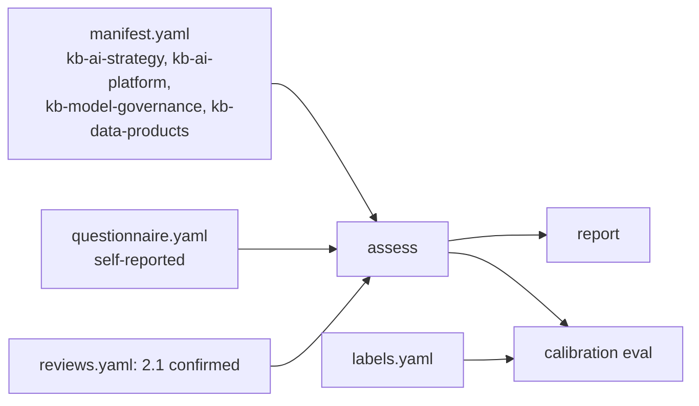

# Sample 2: Kestrel Bay Bank (fictional)

A fictional mid-sized bank with a model risk function. Governance is strong (level 4 categories in P5),
technology and operations are solid, people and culture lag. Evidence is a synthetic manifest of four
repositories; answers are self-reported; expert labels support calibration.

Sections: [1. Purpose](#1-purpose) · [2. Architecture](#2-architecture) · [3. How it works](#3-how-it-works) · [4. Key files](#4-key-files) · [5. Code excerpts](#5-code-excerpts) · [6. Configuration](#6-configuration) · [7. Commands](#7-commands) · [8. Real output](#8-real-output) · [9. Tests and gates](#9-tests-and-gates) · [10. Guardrails](#10-guardrails) · [11. Security and governance](#11-security-and-governance) · [12. Observability](#12-observability) · [13. Failure modes](#13-failure-modes) · [14. Mapping to Azure services](#14-mapping-to-azure-services) · [15. Limitations](#15-limitations) · [16. Interview talking points](#16-interview-talking-points) · [17. Adopt this](#17-adopt-this)

## 1. Purpose

* Show a regulated organisation where governance leads and people practices lag.

## 2. Architecture



## 3. How it works

1. The manifest lists signals per repository; files are built from each signal's example.
2. Targets: default 3, P5 at 4, 3.1 and 4.1 at 4; capacity 4.
3. One review is seeded: 2.1 confirmed by a fictional model-risk reviewer.
4. Labels differ from computed levels in two categories (3.1 and 4.3), which is realistic and visible in calibration.

## 4. Key files

| File | Role |
|---|---|
| `samples/kestrel-bay-bank/org.yaml` | Config and targets |
| `samples/kestrel-bay-bank/manifest.yaml` | Synthetic repositories |
| `samples/kestrel-bay-bank/questionnaire.yaml` | Self-reported answers |
| `samples/kestrel-bay-bank/labels.yaml` | Expert labels |
| `samples/kestrel-bay-bank/reviews.yaml` | Seeded review |

## 5. Code excerpts

<!-- code: src/aimaturity/orgs.py::manifest_sources -->
```python
def manifest_sources(manifest: dict[str, Any]) -> list[ManifestSource]:
    out = []
    for repo in manifest["repos"]:
        files: dict[str, str] = {}
        for sid in repo.get("signals", []):
            ex = signals()[sid]["example"]
            files[ex["path"]] = files.get(ex["path"], "") + ex["content"]
        for path, content in (repo.get("files") or {}).items():
            files[path] = files.get(path, "") + content
        out.append(ManifestSource(repo["name"], files))
    return out
```
<!-- /code -->

## 6. Configuration

See `samples/kestrel-bay-bank/org.yaml`.

## 7. Commands

```bash
aimaturity assess --org kestrel-bay-bank
aimaturity roadmap --org kestrel-bay-bank
```

## 8. Real output

<!-- output: assess --org kestrel-bay-bank -->
```text
Kestrel Bay Bank: overall Level 3 (Dynamic), mean 2.8
pillar  name                          level           mean  capped by
------  ----------------------------  -----  -------  ----  ---------
P1      Strategy & Value              3      Dynamic  2.8   -
P2      People & Culture              2      Ready    2.4   -
P3      Technology & Infrastructure   3      Dynamic  3     -
P4      AI Operations & Ecosystem     3      Dynamic  2.6   -
P5      AI Governance, Ethics & Risk  3      Dynamic  3.4   -
P6      Data (AI-Specific Focus)      3      Dynamic  2.6   -

cat  level  computed  conf  status          target
---  -----  --------  ----  --------------  ------
1.1  3      3         0.88  auto            3
1.2  3      3         0.82  auto            3
1.3  3      3         0.96  auto            3
1.4  3      3         0.93  auto            3
1.5  2      2         0.66  auto            3
2.1  2      2         0.54  confirmed       3
2.2  3      3         0.82  auto            3
2.3  3      3         0.76  auto            3
2.4  2      2         0.85  auto            3
2.5  2      2         0.84  auto            3
3.1  4      4         0.59  pending-review  4
3.2  3      3         0.94  auto            3
3.3  3      3         0.96  auto            3
3.4  2      2         0.92  auto            3
4.1  3      3         0.66  auto            4
4.2  3      3         0.93  auto            3
4.3  3      3         0.95  auto            3
4.4  2      2         0.76  auto            3
4.5  2      2         0.92  auto            3
5.1  4      4         0.97  auto            4
5.2  3      3         0.88  auto            4
5.3  4      4         0.95  auto            4
5.4  3      3         0.64  auto            4
5.5  3      3         0.92  auto            4
6.1  3      3         0.92  auto            3
6.2  3      3         0.92  auto            3
6.3  3      3         0.88  auto            3
6.4  2      2         0.94  auto            3
6.5  2      2         0.84  auto            3

review queue: 3.1; final: False
```
<!-- /output -->

## 9. Tests and gates

* `tests/test_samples.py`: overall level, seeded review applied, labels agree on at least 85% of categories.

## 10. Guardrails

* Fictional name; no real bank data.

## 11. Security and governance

Read-only and offline. Sample organisations other than the portfolio are fictional; their repositories are synthetic manifests built from signal examples.

## 12. Observability

Report under `samples/kestrel-bay-bank/report/`.

## 13. Failure modes

| Failure | Behaviour |
|---|---|
| Manifest signal not found by collectors | test fails (`test_manifest_orgs_find_their_signals`) |

## 14. Mapping to Azure services

* A real bank would add Azure Policy compliance exports and Purview scans as evidence files.
* **Microsoft Foundry**: a hosted model replaces `MockLLM` for rationales, and Foundry evaluations score rationale groundedness against the cited evidence.
* **Azure Monitor / Log Analytics**: job logs, blob access logs and Key Vault audit events land in one workspace, where a query can trend maturity runs over time.

## 15. Limitations

* Synthetic files are one-line examples; real repositories are messier.

## 16. Interview talking points

* "The bank sample shows governance carrying the score while talent and change management hold it back."

## 17. Adopt this

1. Use it as a template for a regulated organisation: copy the folder and edit the manifest.
2. Add your expert labels to grow the calibration set.
