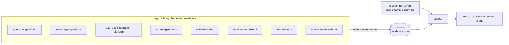

# Sample 1: Jagadish Meduri's portfolio as the assessed organisation

The first sample treats the author's eight public repositories as a small AI organisation and assesses
them read-only. Artifacts come from a checked-in snapshot of a scan of the sibling checkouts; people,
culture and partnership items come from questionnaire inputs labelled **sample answers**, so every
category that rests on them waits for a human reviewer and no review has been recorded.

Sections: [1. Purpose](#1-purpose) · [2. Architecture](#2-architecture) · [3. How it works](#3-how-it-works) · [4. Key files](#4-key-files) · [5. Code excerpts](#5-code-excerpts) · [6. Configuration](#6-configuration) · [7. Commands](#7-commands) · [8. Real output](#8-real-output) · [9. Tests and gates](#9-tests-and-gates) · [10. Guardrails](#10-guardrails) · [11. Security and governance](#11-security-and-governance) · [12. Observability](#12-observability) · [13. Failure modes](#13-failure-modes) · [14. Mapping to Azure services](#14-mapping-to-azure-services) · [15. Limitations](#15-limitations) · [16. Interview talking points](#16-interview-talking-points) · [17. Adopt this](#17-adopt-this)

## 1. Purpose

* Show the assessor on real artifacts, honestly: strong where code is evidence, provisional where only sample answers exist.

## 2. Architecture



## 3. How it works

1. `samples/portfolio/org.yaml` lists the eight repositories, targets (default 3; P3 and P5 at 4), capacity 3 and cross-links.
2. `evidence.json` holds the read-only scan; refresh it with `aimaturity collect --org portfolio --live --write`.
3. `questionnaire.yaml` is labelled `sample-answers` (weight 0.35, forced review).
4. No reviews are seeded: the result stays provisional until a real reviewer signs off.
5. Technology is the strongest pillar; people and culture is the weakest, as expected for a one-person portfolio.

## 4. Key files

| File | Role |
|---|---|
| `samples/portfolio/org.yaml` | Config, targets, links |
| `samples/portfolio/evidence.json` | Snapshot of the scan |
| `samples/portfolio/questionnaire.yaml` | Sample answers (labelled) |
| `samples/portfolio/report/` | Report, HTML and radar |

## 5. Code excerpts

<!-- code: src/aimaturity/orgs.py::gather -->
```python
def gather(org: Org, live: bool = False, root: Path | None = None) -> list[Evidence]:
    """Numbered evidence for an org: artifacts (live scan, snapshot or manifest) plus questionnaire."""
    if "manifest" in org.config:
        items = scan(manifest_sources(org.manifest()))
    elif live:
        items = scan(live_sources(org, root))
    else:
        items = read_snapshot(org)
    answers = org.answers()
    if answers:
        items += collect_questionnaire(answers)
    return number(items)
```
<!-- /code -->

## 6. Configuration

See `samples/portfolio/org.yaml`.

## 7. Commands

```bash
aimaturity assess --org portfolio
aimaturity collect --org portfolio --live --write   # needs the checkouts next to this repository
```

## 8. Real output

<!-- output: assess --org portfolio -->
```text
Jagadish Meduri portfolio: overall Level 3 (Dynamic), mean 2.59
pillar  name                          level            mean  capped by
------  ----------------------------  -----  --------  ----  ---------
P1      Strategy & Value              3      Dynamic   2.4   -
P2      People & Culture              2      Ready     1.8   -
P3      Technology & Infrastructure   4      Advanced  3.75  -
P4      AI Operations & Ecosystem     3      Dynamic   2.6   -
P5      AI Governance, Ethics & Risk  3      Dynamic   2.8   -
P6      Data (AI-Specific Focus)      3      Dynamic   2.2   -

cat  level  computed  conf  status          target
---  -----  --------  ----  --------------  ------
1.1  3      3         0.53  pending-review  3
1.2  2      2         0.44  pending-review  3
1.3  1      1         0.64  auto            3
1.4  3      3         0.62  auto            3
1.5  3      3         0.75  auto            3
2.1  1      1         0.31  pending-review  3
2.2  2      2         0.7   pending-review  3
2.3  2      2         0.31  pending-review  3
2.4  2      2         0.5   pending-review  3
2.5  2      2         0.74  pending-review  3
3.1  4      4         1.0   auto            4
3.2  4      4         0.75  pending-review  4
3.3  4      4         1.0   auto            4
3.4  3      3         0.9   auto            4
4.1  3      3         0.64  auto            3
4.2  3      3         0.62  auto            3
4.3  4      4         1.0   auto            3
4.4  1      1         0.31  pending-review  3
4.5  2      2         0.66  auto            3
5.1  4      4         0.95  auto            4
5.2  1      1         0.31  pending-review  4
5.3  3      3         0.62  auto            4
5.4  3      3         0.9   auto            4
5.5  3      3         0.87  auto            4
6.1  3      3         0.87  auto            3
6.2  3      3         0.87  auto            3
6.3  1      1         0.31  pending-review  3
6.4  3      3         0.57  pending-review  3
6.5  1      1         0.61  auto            3

review queue: 1.1, 1.2, 2.1, 2.2, 2.3, 2.4, 2.5, 3.2, 4.4, 5.2, 6.3, 6.4; final: False
```
<!-- /output -->

<!-- output: links --org portfolio -->
```text
repo                   category  cited  ok
---------------------  --------  -----  ----
agentic-ai-model-risk  5.1       14     True
agentic-ai-model-risk  5.3       9      True
agentic-ai-model-risk  5.5       6      True
azure-finops           1.4       9      True
azure-finops           3.2       12     True
fabric-enterprise-bi   6.1       3      True
fabric-enterprise-bi   6.2       6      True
```
<!-- /output -->

## 9. Tests and gates

* `tests/test_samples.py`: labelled answers, people items never auto-accepted, no seeded reviews, eight repositories, cross-links, strongest pillar.
* `tests/test_report.py`: the checked-in report matches a fresh render.

## 10. Guardrails

* Sample answers are labelled in the data, forced into review and announced in the report.

## 11. Security and governance

Read-only and offline. Sample organisations other than the portfolio are fictional; their repositories are synthetic manifests built from signal examples.

## 12. Observability

The report lists 12 categories waiting for review with reasons.

## 13. Failure modes

| Failure | Behaviour |
|---|---|
| Snapshot older than the repositories | live comparison test (opt-in) and a one-command refresh |
| A checkout is missing | live mode fails with the path; snapshot mode still works |

## 14. Mapping to Azure services

* In Azure, the scheduled job would scan clones in its container and upload the snapshot to the `evidence` container.
* **Microsoft Foundry**: a hosted model replaces `MockLLM` for rationales, and Foundry evaluations score rationale groundedness against the cited evidence.
* **Microsoft Purview**: register the evidence store and reports as data assets with lineage back to the scanned repositories, and keep questionnaire answers under a sensitivity label.
* **Azure Policy**: audit that the evidence store stays keyless and versioned and that the Key Vault keeps RBAC, so the controls the assessment relies on cannot drift silently.
* **Azure Monitor / Log Analytics**: job logs, blob access logs and Key Vault audit events land in one workspace, where a query can trend maturity runs over time.

## 15. Limitations

* A one-person portfolio cannot evidence organisational culture; the result says so instead of guessing.

## 16. Interview talking points

* "I assessed my own portfolio with the tool: level 4 on technology, 2 on people, and the people items are marked as sample answers waiting for review."

## 17. Adopt this

1. Copy `samples/portfolio/` to `samples/<your-org>/`, change `repos` and `links`.
2. Replace the questionnaire with real answers (`label: self-reported`).
3. Run `aimaturity collect --org <your-org> --live --write`, then `aimaturity report --org <your-org>`.
