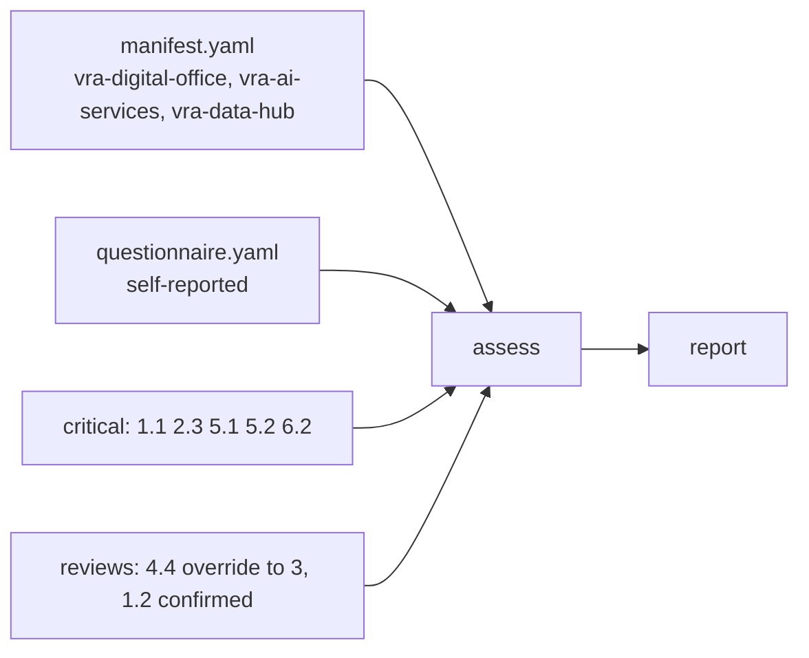

# Sample 3: Valemont Revenue Agency (fictional public administration)

A fictional national tax administration early in its AI journey: strong leadership, literacy and
ethics, weaker technology and operations. It chose its own critical categories (public trust first)
and lowered the synthetic-data target. A reviewer overrode 4.4 after seeing a partnership agreement.

Sections: [1. Purpose](#1-purpose) · [2. Architecture](#2-architecture) · [3. How it works](#3-how-it-works) · [4. Key files](#4-key-files) · [5. Code excerpts](#5-code-excerpts) · [6. Configuration](#6-configuration) · [7. Commands](#7-commands) · [8. Real output](#8-real-output) · [9. Tests and gates](#9-tests-and-gates) · [10. Guardrails](#10-guardrails) · [11. Security and governance](#11-security-and-governance) · [12. Observability](#12-observability) · [13. Failure modes](#13-failure-modes) · [14. Mapping to Azure services](#14-mapping-to-azure-services) · [15. Limitations](#15-limitations) · [16. Interview talking points](#16-interview-talking-points) · [17. Adopt this](#17-adopt-this)

## 1. Purpose

* Show the public-sector case the original framework was written for, including a custom critical list and an override.

## 2. Architecture



## 3. How it works

1. Critical categories: 1.1, 2.3, 5.1, 5.2, 6.2 (set in `org.yaml`).
2. Targets: default 3, 5.2 and 5.5 at 4, 6.4 at 2; capacity 3.
3. Reviews: 4.4 overridden from 2 to 3 (partnership agreement seen), 1.2 confirmed; both are in the audit log.
4. The remaining review item is 2.1.

## 4. Key files

| File | Role |
|---|---|
| `samples/valemont-revenue-agency/org.yaml` | Config, critical list, targets |
| `samples/valemont-revenue-agency/manifest.yaml` | Synthetic repositories |
| `samples/valemont-revenue-agency/questionnaire.yaml` | Self-reported answers |
| `samples/valemont-revenue-agency/labels.yaml` | Expert labels |
| `samples/valemont-revenue-agency/audit-log.jsonl` | Two chained review entries |

## 5. Code excerpts

<!-- code: src/aimaturity/hitl.py::apply_reviews -->
```python
def apply_reviews(
    results: dict[str, CategoryResult], evidence: dict[str, Evidence], reviews: list[dict[str, Any]], assessor: str, log: list[dict[str, Any]]
) -> dict[str, dict[str, Any]]:
    """Status and final level per category. The latest valid review for a category wins."""
    logged = {e["hash"] for e in log}
    latest: dict[str, dict[str, Any]] = {}
    rejected: dict[str, str] = {}
    for r in reviews:
        try:
            validate_review(r, assessor, results)
        except ReviewError as err:
            rejected[r.get("category", "?")] = str(err)
            continue
        if r.get("audit_hash") not in logged:
            rejected[r["category"]] = "review has no matching audit log entry"
            continue
        latest[r["category"]] = r
    out = {}
    for cid, res in results.items():
        r = latest.get(cid)
        if r and r["evidence_digest"] == category_digest(res, evidence):
            status = "overridden" if r["decision"] == "override" and r["level"] != res.level else "confirmed"
            out[cid] = {"status": status, "final_level": r["level"], "review": r}
        elif r:
            out[cid] = {"status": "stale-review", "final_level": res.level, "review": r}
        elif res.needs_review:
            out[cid] = {"status": "pending-review", "final_level": res.level, "review": None}
        else:
            out[cid] = {"status": "auto", "final_level": res.level, "review": None}
        if cid in rejected and out[cid]["status"] in {"pending-review", "auto"}:
            out[cid]["rejected_review"] = rejected[cid]
    return out
```
<!-- /code -->

## 6. Configuration

See `samples/valemont-revenue-agency/org.yaml`.

## 7. Commands

```bash
aimaturity assess --org valemont-revenue-agency
aimaturity explain --org valemont-revenue-agency --category 4.4
aimaturity audit --org valemont-revenue-agency
```

## 8. Real output

<!-- output: assess --org valemont-revenue-agency -->
```text
Valemont Revenue Agency: overall Level 2 (Ready), mean 2.2
pillar  name                          level           mean  capped by
------  ----------------------------  -----  -------  ----  ---------
P1      Strategy & Value              2      Ready    2     -
P2      People & Culture              3      Dynamic  2.6   -
P3      Technology & Infrastructure   2      Ready    2     -
P4      AI Operations & Ecosystem     2      Ready    1.8   -
P5      AI Governance, Ethics & Risk  3      Dynamic  2.8   -
P6      Data (AI-Specific Focus)      2      Ready    2     -

cat  level  computed  conf  status          target
---  -----  --------  ----  --------------  ------
1.1  2      2         0.88  auto            3
1.2  2      2         0.54  confirmed       3
1.3  2      2         0.93  auto            3
1.4  2      2         0.66  auto            3
1.5  2      2         0.92  auto            3
2.1  2      2         0.54  pending-review  3
2.2  2      2         0.8   auto            3
2.3  3      3         0.76  auto            3
2.4  3      3         0.86  auto            3
2.5  3      3         0.82  auto            3
3.1  2      2         0.94  auto            3
3.2  2      2         0.9   auto            3
3.3  2      2         0.91  auto            3
3.4  2      2         0.92  auto            3
4.1  2      2         0.9   auto            3
4.2  1      1         0.88  auto            3
4.3  2      2         0.92  auto            3
4.4  3      2         0.46  overridden      3
4.5  1      1         0.88  auto            3
5.1  3      3         0.74  auto            3
5.2  3      3         0.88  auto            4
5.3  2      2         0.92  auto            3
5.4  3      3         0.94  auto            3
5.5  3      3         0.92  auto            4
6.1  2      2         0.94  auto            3
6.2  2      2         0.94  auto            3
6.3  2      2         0.84  auto            3
6.4  1      1         0.88  auto            2
6.5  3      3         0.88  auto            3

review queue: 2.1; final: False
```
<!-- /output -->

<!-- output: roadmap --org valemont-revenue-agency -->
```text
step    kind       months  effort  priority  waits on
------  ---------  ------  ------  --------  --------
4.2->2  quick-win  1-1     S       22.36     -
4.5->2  quick-win  1-1     S       22.36     -
6.4->2  quick-win  1-1     S       10.36     -
4.2->3  strategic  2-3     M       20.36     4.2->2
4.5->3  strategic  2-3     M       20.36     4.5->2
1.5->3  quick-win  2-2     S       10.24     -
1.1->3  strategic  3-4     M       16.36     -
3.2->3  strategic  4-5     M       16.3      -
4.1->3  strategic  4-5     M       16.3      -
6.2->3  strategic  5-6     M       16.18     -
1.2->3  strategic  6-7     M       11.38     -
2.1->3  strategic  6-7     M       11.38     -
1.4->3  strategic  7-8     M       11.02     -
2.2->3  strategic  8-10    L       10.6      -
6.3->3  strategic  8-9     M       10.48     -
5.2->4  strategic  9-11    L       10.36     -
3.3->3  strategic  10-12   L       10.27     -
3.4->3  strategic  11-12   M       10.24     -

Month  1: 4.2->2, 4.5->2, 6.4->2
Month  2: 4.2->3, 4.5->3, 1.5->3
Month  3: 4.2->3, 4.5->3, 1.1->3
Month  4: 1.1->3, 3.2->3, 4.1->3
Month  5: 3.2->3, 4.1->3, 6.2->3
Month  6: 6.2->3, 1.2->3, 2.1->3
Month  7: 1.2->3, 2.1->3, 1.4->3
Month  8: 1.4->3, 2.2->3, 6.3->3
Month  9: 2.2->3, 6.3->3, 5.2->4
Month 10: 2.2->3, 5.2->4, 3.3->3
Month 11: 5.2->4, 3.3->3, 3.4->3
Month 12: 3.3->3, 3.4->3
backlog: 1.3->3, 3.1->3, 4.3->3, 5.3->3, 5.5->4, 6.1->3
```
<!-- /output -->

## 9. Tests and gates

* `tests/test_samples.py`: custom critical list, override applied, overall level.
* `tests/test_hitl.py`: checked-in logs intact.

## 10. Guardrails

* Override reasons are recorded and chained.

## 11. Security and governance

Read-only and offline. Sample organisations other than the portfolio are fictional; their repositories are synthetic manifests built from signal examples.

## 12. Observability

Report under `samples/valemont-revenue-agency/report/`.

## 13. Failure modes

| Failure | Behaviour |
|---|---|
| Review edited by hand | audit chain or digest check fails |

## 14. Mapping to Azure services

* A public body would run the job in its own tenant and publish the HTML report internally behind Entra ID.
* **Microsoft Foundry**: a hosted model replaces `MockLLM` for rationales, and Foundry evaluations score rationale groundedness against the cited evidence.
* **Microsoft Purview**: register the evidence store and reports as data assets with lineage back to the scanned repositories, and keep questionnaire answers under a sensitivity label.
* **Azure Policy**: audit that the evidence store stays keyless and versioned and that the Key Vault keeps RBAC, so the controls the assessment relies on cannot drift silently.
* **Azure Monitor / Log Analytics**: job logs, blob access logs and Key Vault audit events land in one workspace, where a query can trend maturity runs over time.

## 15. Limitations

* Fictional agency; its answers are invented to illustrate the method.

## 16. Interview talking points

* "The agency shows why critical categories must be configurable: it chose ethics and trust over infrastructure."

## 17. Adopt this

1. Copy the folder for a public body, set `critical:` to its non-negotiables.
2. Record overrides with evidence-based comments using `aimaturity review`.
