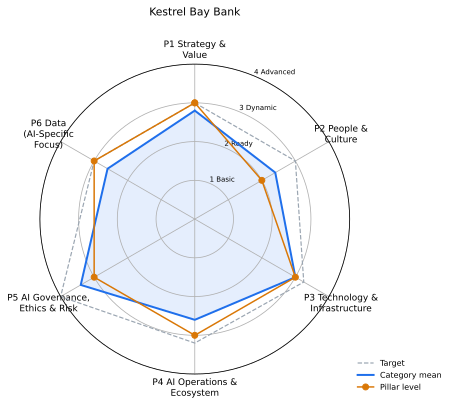

# AI maturity report: Kestrel Bay Bank

_Fictional retail and business bank_

## Executive summary

Overall maturity: **Level 3 (Dynamic)**, category mean 2.8 of 4. Assessment status: provisional: 1 categories wait for human review.

Strongest pillar: P5 AI Governance, Ethics & Risk (mean 3.4). Weakest: P2 People & Culture (mean 2.4).

Evidence: 109 items from 4 repositories and the questionnaire. Roadmap: 13 steps, 2 quick wins in Months 1-3, 0 beyond Month 12.

Top priorities: 4.1->4 Model Deployment & Management (MLOps) (priority 17.02); 2.1->3 Talent & Skills (priority 11.38); 5.4->4 Compliance & Legal (priority 11.08).

This organisation is fictional; its repositories are synthetic manifests.

## Pillars

| Pillar | Level | Category mean | Target (mean) | Capped by critical |
|---|---|---|---|---|
| P1 Strategy & Value | 3 Dynamic | 2.8 | 3.0 | - |
| P2 People & Culture | 2 Ready | 2.4 | 3.0 | - |
| P3 Technology & Infrastructure | 3 Dynamic | 3 | 3.25 | - |
| P4 AI Operations & Ecosystem | 3 Dynamic | 2.6 | 3.2 | - |
| P5 AI Governance, Ethics & Risk | 3 Dynamic | 3.4 | 4.0 | - |
| P6 Data (AI-Specific Focus) | 3 Dynamic | 2.6 | 3.0 | - |

## Categories

| Category | Level | Target | Confidence | Status | Evidence |
|---|---|---|---|---|---|
| 1.1 AI Vision & Ambition (critical) | 3 | 3 | 0.88 | auto | 4 |
| 1.2 Strategic Alignment | 3 | 3 | 0.82 | auto | 3 |
| 1.3 Roadmap & Planning | 3 | 3 | 0.96 | auto | 5 |
| 1.4 Value Identification & Measurement | 3 | 3 | 0.93 | auto | 5 |
| 1.5 Innovation & Experimentation | 2 | 3 | 0.66 | auto | 1 |
| 2.1 Talent & Skills | 2 | 3 | 0.54 | confirmed | 1 |
| 2.2 Organizational Structure | 3 | 3 | 0.82 | auto | 3 |
| 2.3 Leadership & Sponsorship (critical) | 3 | 3 | 0.76 | auto | 2 |
| 2.4 Change Management & Adoption | 2 | 3 | 0.85 | auto | 2 |
| 2.5 AI Literacy & Awareness | 2 | 3 | 0.84 | auto | 2 |
| 3.1 AI Development Platforms & Tools | 4 | 4 | 0.59 | pending-review | 8 |
| 3.2 Cloud & Compute Infrastructure (critical) | 3 | 3 | 0.94 | auto | 7 |
| 3.3 AI-Specific Architectures | 3 | 3 | 0.96 | auto | 4 |
| 3.4 Data Science Environment | 2 | 3 | 0.92 | auto | 1 |
| 4.1 Model Deployment & Management (MLOps) (critical) | 3 | 4 | 0.66 | auto | 5 |
| 4.2 Performance Monitoring & Optimization | 3 | 3 | 0.93 | auto | 3 |
| 4.3 Integration & Interoperability | 3 | 3 | 0.95 | auto | 3 |
| 4.4 External Collaboration & Partnerships | 2 | 3 | 0.76 | auto | 1 |
| 4.5 Reusability & Shared Components | 2 | 3 | 0.92 | auto | 1 |
| 5.1 AI Governance Framework (critical) | 4 | 4 | 0.97 | auto | 9 |
| 5.2 Ethical Principles & Guidelines | 3 | 4 | 0.88 | auto | 3 |
| 5.3 Risk Assessment & Mitigation | 4 | 4 | 0.95 | auto | 5 |
| 5.4 Compliance & Legal | 3 | 4 | 0.64 | auto | 4 |
| 5.5 Transparency & Explainability | 3 | 4 | 0.92 | auto | 2 |
| 6.1 AI Use Case Data Identification | 3 | 3 | 0.92 | auto | 2 |
| 6.2 Data Readiness for AI (critical) | 3 | 3 | 0.92 | auto | 2 |
| 6.3 Data Access for AI Teams | 3 | 3 | 0.88 | auto | 3 |
| 6.4 Synthetic Data Generation & Use | 2 | 3 | 0.94 | auto | 1 |
| 6.5 Domain-Specific Data Understanding | 2 | 3 | 0.84 | auto | 1 |

## Human review

1 pending, 1 signed off. Audit log chain: intact.

| Category | Name | Why it needs a human |
|---|---|---|
| 3.1 | AI Development Platforms & Tools | confidence 0.59 below 0.6 |

| Category | Reviewer | Outcome | Comment |
|---|---|---|---|
| 2.1 | Amara Lindqvist (Model Risk) | confirmed | Skills matrix seen in the HR workforce plan; training paths are not funded yet, so Ready is right. |

## Gap analysis

13 of 29 categories are below target.

| Category | Now | Target | Gap | First action |
|---|---|---|---|---|
| 1.5 Innovation & Experimentation | 2 | 3 | 1 | Provide a sandbox, a small pilot fund and a standard write-up template. |
| 2.1 Talent & Skills | 2 | 3 | 1 | Fund a training path per role and add AI roles to workforce planning. |
| 2.4 Change Management & Adoption | 2 | 3 | 1 | Adopt a change method with stakeholder analysis and adoption metrics. |
| 2.5 AI Literacy & Awareness | 2 | 3 | 1 | Launch role-based literacy tracks with completion tracking. |
| 3.4 Data Science Environment | 2 | 3 | 1 | Provide a reproducible workbench with pinned dependencies and experiment tracking. |
| 4.1 Model Deployment & Management (MLOps) | 3 | 4 | 1 | Automate retraining triggers, staged rollout and retirement. |
| 4.4 External Collaboration & Partnerships | 2 | 3 | 1 | Formalise two partnerships with clear goals. |
| 4.5 Reusability & Shared Components | 2 | 3 | 1 | Publish a catalogue with ownership, versioning and adoption guides. |
| 5.2 Ethical Principles & Guidelines | 3 | 4 | 1 | Track ethics outcomes and involve affected people in design. |
| 5.4 Compliance & Legal | 3 | 4 | 1 | Automate compliance checks in pipelines and track regulatory change. |
| 5.5 Transparency & Explainability | 3 | 4 | 1 | Tailor explanations per audience and publish transparency notes. |
| 6.4 Synthetic Data Generation & Use | 2 | 3 | 1 | Build seeded generators with validation tests for each use case. |
| 6.5 Domain-Specific Data Understanding | 2 | 3 | 1 | Add business definitions to data documentation (data sheets, glossaries, semantic models). |

## Roadmap (Month 1-12)

Capacity 4 items in flight. Milestones: Month 6: Re-assess all categories and refresh the plan; Month 12: Full re-assessment and target reset.

| Step | Kind | Months | Effort | Priority | Waits on |
|---|---|---|---|---|---|
| 4.1->4 Model Deployment & Management (MLOps) | strategic | 1-3 | L | 17.02 | - |
| 2.1->3 Talent & Skills | strategic | 1-2 | M | 11.38 | - |
| 1.5->3 Innovation & Experimentation | quick-win | 1 | S | 11.02 | - |
| 6.4->3 Synthetic Data Generation & Use | quick-win | 1 | S | 10.18 | - |
| 5.4->4 Compliance & Legal | strategic | 2-3 | M | 11.08 | - |
| 4.4->3 External Collaboration & Partnerships | strategic | 2-3 | M | 10.72 | - |
| 2.5->3 AI Literacy & Awareness | strategic | 3-4 | M | 10.48 | - |
| 6.5->3 Domain-Specific Data Understanding | strategic | 4-5 | M | 10.48 | - |
| 2.4->3 Change Management & Adoption | strategic | 4-5 | M | 10.45 | - |
| 5.2->4 Ethical Principles & Guidelines | strategic | 4-6 | L | 10.36 | - |
| 3.4->3 Data Science Environment | strategic | 5-6 | M | 10.24 | - |
| 4.5->3 Reusability & Shared Components | strategic | 6-7 | M | 10.24 | - |
| 5.5->4 Transparency & Explainability | strategic | 6-7 | M | 10.24 | - |

| Month | In flight |
|---|---|
| 1 | 4.1->4, 2.1->3, 1.5->3, 6.4->3 |
| 2 | 4.1->4, 2.1->3, 5.4->4, 4.4->3 |
| 3 | 4.1->4, 5.4->4, 4.4->3, 2.5->3 |
| 4 | 2.5->3, 6.5->3, 2.4->3, 5.2->4 |
| 5 | 6.5->3, 2.4->3, 5.2->4, 3.4->3 |
| 6 | 5.2->4, 3.4->3, 4.5->3, 5.5->4 |
| 7 | 4.5->3, 5.5->4 |
| 8 | - |
| 9 | - |
| 10 | - |
| 11 | - |
| 12 | - |

Everything fits in the twelve months.

## Evidence

| Collector | Items |
|---|---|
| ci | 10 |
| data | 6 |
| docs | 13 |
| governance | 16 |
| iac | 10 |
| ops | 7 |
| people | 3 |
| questionnaire | 44 |

| Source | Items |
|---|---|
| kb-ai-platform | 28 |
| kb-ai-strategy | 16 |
| kb-data-products | 6 |
| kb-model-governance | 15 |
| questionnaire | 44 |

## Method and attribution

Levels come from evidence signals per category (rubric/categories.yaml); a level needs two thirds of its signals and the level below. Confidence blends source trust and decision margin; pillars use the median of categories capped by critical categories.

Framework structure (six pillars, 29 categories, four levels) adapted from UNESCO, *AI Maturity Framework* (subtitle: "A self-positioning guide for public administrations"), developed by Stratejai for UNESCO, under CC BY-SA 3.0 IGO (https://creativecommons.org/licenses/by-sa/3.0/igo/). Descriptors, rubric, scoring and wording are this project's own; UNESCO does not endorse this tool or its results.
