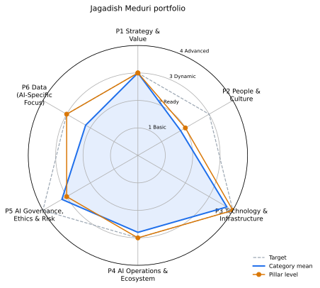

# AI maturity report: Jagadish Meduri portfolio

_Engineering portfolio (one maintainer, eight repositories)_

## Executive summary

Overall maturity: **Level 3 (Dynamic)**, category mean 2.59 of 4. Assessment status: provisional: 12 categories wait for human review.

Strongest pillar: P3 Technology & Infrastructure (mean 3.75). Weakest: P2 People & Culture (mean 1.8).

Evidence: 710 items from 8 repositories and the questionnaire. Roadmap: 23 steps, 6 quick wins in Months 1-3, 4 beyond Month 12.

Top priorities: 5.2->2 Ethical Principles & Guidelines (priority 34.07); 5.2->3 Ethical Principles & Guidelines (priority 34.07); 5.2->4 Ethical Principles & Guidelines (priority 32.07).

People, culture and partnership answers are SAMPLE ANSWERS (illustrative inputs, not survey results). Categories that rest on them wait for human review.

## Pillars

| Pillar | Level | Category mean | Target (mean) | Capped by critical |
|---|---|---|---|---|
| P1 Strategy & Value | 3 Dynamic | 2.4 | 3.0 | - |
| P2 People & Culture | 2 Ready | 1.8 | 3.0 | - |
| P3 Technology & Infrastructure | 4 Advanced | 3.75 | 4.0 | - |
| P4 AI Operations & Ecosystem | 3 Dynamic | 2.6 | 3.0 | - |
| P5 AI Governance, Ethics & Risk | 3 Dynamic | 2.8 | 4.0 | - |
| P6 Data (AI-Specific Focus) | 3 Dynamic | 2.2 | 3.0 | - |

## Categories

| Category | Level | Target | Confidence | Status | Evidence |
|---|---|---|---|---|---|
| 1.1 AI Vision & Ambition (critical) | 3 | 3 | 0.53 | pending-review | 11 |
| 1.2 Strategic Alignment | 2 | 3 | 0.44 | pending-review | 7 |
| 1.3 Roadmap & Planning | 1 | 3 | 0.64 | auto | 0 |
| 1.4 Value Identification & Measurement | 3 | 3 | 0.62 | auto | 18 |
| 1.5 Innovation & Experimentation | 3 | 3 | 0.75 | auto | 33 |
| 2.1 Talent & Skills | 1 | 3 | 0.31 | pending-review | 0 |
| 2.2 Organizational Structure | 2 | 3 | 0.70 | pending-review | 1 |
| 2.3 Leadership & Sponsorship (critical) | 2 | 3 | 0.31 | pending-review | 1 |
| 2.4 Change Management & Adoption | 2 | 3 | 0.50 | pending-review | 4 |
| 2.5 AI Literacy & Awareness | 2 | 3 | 0.74 | pending-review | 4 |
| 3.1 AI Development Platforms & Tools | 4 | 4 | 1.00 | auto | 85 |
| 3.2 Cloud & Compute Infrastructure (critical) | 4 | 4 | 0.75 | pending-review | 108 |
| 3.3 AI-Specific Architectures | 4 | 4 | 1.00 | auto | 70 |
| 3.4 Data Science Environment | 3 | 4 | 0.90 | auto | 19 |
| 4.1 Model Deployment & Management (MLOps) (critical) | 3 | 3 | 0.64 | auto | 61 |
| 4.2 Performance Monitoring & Optimization | 3 | 3 | 0.62 | auto | 35 |
| 4.3 Integration & Interoperability | 4 | 3 | 1.00 | auto | 49 |
| 4.4 External Collaboration & Partnerships | 1 | 3 | 0.31 | pending-review | 0 |
| 4.5 Reusability & Shared Components | 2 | 3 | 0.66 | auto | 6 |
| 5.1 AI Governance Framework (critical) | 4 | 4 | 0.95 | auto | 76 |
| 5.2 Ethical Principles & Guidelines | 1 | 4 | 0.31 | pending-review | 0 |
| 5.3 Risk Assessment & Mitigation | 3 | 4 | 0.62 | auto | 22 |
| 5.4 Compliance & Legal | 3 | 4 | 0.90 | auto | 30 |
| 5.5 Transparency & Explainability | 3 | 4 | 0.87 | auto | 27 |
| 6.1 AI Use Case Data Identification | 3 | 3 | 0.87 | auto | 13 |
| 6.2 Data Readiness for AI (critical) | 3 | 3 | 0.87 | auto | 14 |
| 6.3 Data Access for AI Teams | 1 | 3 | 0.31 | pending-review | 0 |
| 6.4 Synthetic Data Generation & Use | 3 | 3 | 0.57 | pending-review | 33 |
| 6.5 Domain-Specific Data Understanding | 1 | 3 | 0.61 | auto | 0 |

## Human review

12 pending, 0 signed off. Audit log chain: intact.

| Category | Name | Why it needs a human |
|---|---|---|
| 1.1 | AI Vision & Ambition | confidence 0.53 below 0.6; level rests on sample answers: q_vision_published |
| 1.2 | Strategic Alignment | confidence 0.44 below 0.6; level rests on sample answers: q_goal_field |
| 2.1 | Talent & Skills | confidence 0.31 below 0.6 |
| 2.2 | Organizational Structure | level rests on sample answers: q_coordinator |
| 2.3 | Leadership & Sponsorship | confidence 0.31 below 0.6; level rests on sample answers: q_project_sponsors |
| 2.4 | Change Management & Adoption | confidence 0.50 below 0.6; level rests on sample answers: q_rollout_comms |
| 2.5 | AI Literacy & Awareness | level rests on sample answers: q_awareness_material |
| 3.2 | Cloud & Compute Infrastructure | level rests on sample answers: q_cost_optimisation_cadence |
| 4.4 | External Collaboration & Partnerships | confidence 0.31 below 0.6 |
| 5.2 | Ethical Principles & Guidelines | confidence 0.31 below 0.6 |
| 6.3 | Data Access for AI Teams | confidence 0.31 below 0.6 |
| 6.4 | Synthetic Data Generation & Use | confidence 0.57 below 0.6 |

## Gap analysis

16 of 29 categories are below target.

| Category | Now | Target | Gap | First action |
|---|---|---|---|---|
| 5.2 Ethical Principles & Guidelines | 1 | 4 | 3 | Adopt a short set of principles and discuss them for high-risk projects. |
| 1.3 Roadmap & Planning | 1 | 3 | 2 | Draft a twelve-month roadmap with milestones per quarter. |
| 2.1 Talent & Skills | 1 | 3 | 2 | Name the AI roles needed and write a skills matrix. |
| 4.4 External Collaboration & Partnerships | 1 | 3 | 2 | Join one relevant community or peer network. |
| 6.3 Data Access for AI Teams | 1 | 3 | 2 | Publish a data access request process. |
| 6.5 Domain-Specific Data Understanding | 1 | 3 | 2 | Invite a domain expert into each AI project. |
| 1.2 Strategic Alignment | 2 | 3 | 1 | Make a business case with goal linkage mandatory before funding any AI build. |
| 2.2 Organizational Structure | 2 | 3 | 1 | Charter a centre of excellence with mandate, budget and reporting line. |
| 2.3 Leadership & Sponsorship | 2 | 3 | 1 | Appoint an executive owner of the AI agenda with regular updates to the board. |
| 2.4 Change Management & Adoption | 2 | 3 | 1 | Adopt a change method with stakeholder analysis and adoption metrics. |
| 2.5 AI Literacy & Awareness | 2 | 3 | 1 | Launch role-based literacy tracks with completion tracking. |
| 3.4 Data Science Environment | 3 | 4 | 1 | Offer self-service environments wired into data and deployment pipelines. |
| 4.5 Reusability & Shared Components | 2 | 3 | 1 | Publish a catalogue with ownership, versioning and adoption guides. |
| 5.3 Risk Assessment & Mitigation | 3 | 4 | 1 | Feed monitoring and scenarios into continuous, quantitative risk management. |
| 5.4 Compliance & Legal | 3 | 4 | 1 | Automate compliance checks in pipelines and track regulatory change. |
| 5.5 Transparency & Explainability | 3 | 4 | 1 | Tailor explanations per audience and publish transparency notes. |

## Roadmap (Month 1-12)

Capacity 3 items in flight. Milestones: Month 6: Re-assess all categories and refresh the plan; Month 12: Full re-assessment and target reset.

| Step | Kind | Months | Effort | Priority | Waits on |
|---|---|---|---|---|---|
| 5.2->2 Ethical Principles & Guidelines | quick-win | 1 | S | 34.07 | - |
| 2.1->2 Talent & Skills | quick-win | 1 | S | 24.07 | - |
| 4.4->2 External Collaboration & Partnerships | quick-win | 1 | S | 24.07 | - |
| 6.3->2 Data Access for AI Teams | quick-win | 2 | S | 24.07 | - |
| 6.5->2 Domain-Specific Data Understanding | quick-win | 2 | S | 23.17 | - |
| 1.3->2 Roadmap & Planning | quick-win | 2 | S | 23.08 | - |
| 5.2->3 Ethical Principles & Guidelines | strategic | 3-4 | M | 34.07 | 5.2->2 |
| 2.1->3 Talent & Skills | strategic | 3-4 | M | 22.07 | 2.1->2 |
| 4.4->3 External Collaboration & Partnerships | strategic | 3-4 | M | 22.07 | 4.4->2 |
| 5.2->4 Ethical Principles & Guidelines | strategic | 5-7 | L | 32.07 | 5.2->3 |
| 6.3->3 Data Access for AI Teams | strategic | 5-6 | M | 22.07 | 6.3->2 |
| 6.5->3 Domain-Specific Data Understanding | strategic | 5-6 | M | 21.17 | 6.5->2 |
| 1.3->3 Roadmap & Planning | strategic | 7-8 | M | 21.08 | 1.3->2 |
| 2.3->3 Leadership & Sponsorship | strategic | 7-8 | M | 18.07 | - |
| 1.2->3 Strategic Alignment | strategic | 8-9 | M | 11.68 | - |
| 2.4->3 Change Management & Adoption | strategic | 9-10 | M | 11.5 | - |
| 5.3->4 Risk Assessment & Mitigation | strategic | 9-11 | L | 11.14 | - |
| 4.5->3 Reusability & Shared Components | strategic | 10-11 | M | 11.02 | - |
| 2.5->3 AI Literacy & Awareness | strategic | 11-12 | M | 10.78 | - |

| Month | In flight |
|---|---|
| 1 | 5.2->2, 2.1->2, 4.4->2 |
| 2 | 6.3->2, 6.5->2, 1.3->2 |
| 3 | 5.2->3, 2.1->3, 4.4->3 |
| 4 | 5.2->3, 2.1->3, 4.4->3 |
| 5 | 5.2->4, 6.3->3, 6.5->3 |
| 6 | 5.2->4, 6.3->3, 6.5->3 |
| 7 | 5.2->4, 1.3->3, 2.3->3 |
| 8 | 1.3->3, 2.3->3, 1.2->3 |
| 9 | 1.2->3, 2.4->3, 5.3->4 |
| 10 | 2.4->3, 5.3->4, 4.5->3 |
| 11 | 5.3->4, 4.5->3, 2.5->3 |
| 12 | 2.5->3 |

Backlog beyond Month 12: 2.2->3, 3.4->4, 5.4->4, 5.5->4.

## Cross-repository evidence

| Repository | Category | Cited files | Examples |
|---|---|---|---|
| agentic-ai-model-risk | 5.1 | 14 | .github/workflows/ci.yml, .github/workflows/deploy.yml, .github/workflows/infra.yml |
| agentic-ai-model-risk | 5.3 | 9 | registry/bramblewood-claims-triage/risk-cards.yaml, registry/bramblewood-claims-triage/scenarios.yaml, registry/cedarhollow-underwriting-assistant/risk-cards.yaml |
| agentic-ai-model-risk | 5.5 | 6 | docs/pillars/model-cards.md, registry/bramblewood-claims-triage/model-card.yaml, registry/cedarhollow-underwriting-assistant/model-card.yaml |
| azure-finops | 1.4 | 9 | CHANGELOG.md, README.md, data/README.md |
| azure-finops | 3.2 | 12 | .checkov.yaml, infra/bicep/main.bicep, infra/bicep/modules/guardrails.bicep |
| fabric-enterprise-bi | 6.1 | 3 | CHANGELOG.md, CONTRIBUTING.md, README.md |
| fabric-enterprise-bi | 6.2 | 6 | contracts/README.md, contracts/products/README.md, contracts/products/customer-care-insights.yaml |

## Evidence

| Collector | Items |
|---|---|
| ci | 120 |
| data | 82 |
| docs | 69 |
| governance | 150 |
| iac | 136 |
| ops | 95 |
| people | 14 |
| questionnaire | 44 |

| Source | Items |
|---|---|
| agentic-ai-model-risk | 96 |
| agentic-ai-portfolio | 107 |
| ai-learning-lab | 25 |
| azure-agent-labs | 88 |
| azure-agent-platform | 88 |
| azure-ai-integration-platform | 90 |
| azure-finops | 82 |
| fabric-enterprise-bi | 90 |
| questionnaire | 44 |

## Method and attribution

Levels come from evidence signals per category (rubric/categories.yaml); a level needs two thirds of its signals and the level below. Confidence blends source trust and decision margin; pillars use the median of categories capped by critical categories.

Framework structure (six pillars, 29 categories, four levels) adapted from UNESCO, *AI Maturity Framework* (subtitle: "A self-positioning guide for public administrations"), developed by Stratejai for UNESCO, under CC BY-SA 3.0 IGO (https://creativecommons.org/licenses/by-sa/3.0/igo/). Descriptors, rubric, scoring and wording are this project's own; UNESCO does not endorse this tool or its results.
