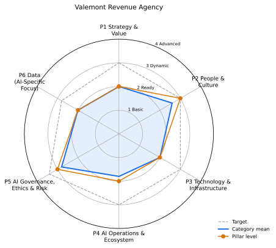

# AI maturity report: Valemont Revenue Agency

_Fictional public administration (tax and revenue)_

## Executive summary

Overall maturity: **Level 2 (Ready)**, category mean 2.2 of 4. Assessment status: provisional: 1 categories wait for human review.

Strongest pillar: P5 AI Governance, Ethics & Risk (mean 2.8). Weakest: P4 AI Operations & Ecosystem (mean 1.8).

Evidence: 76 items from 3 repositories and the questionnaire. Roadmap: 24 steps, 4 quick wins in Months 1-3, 6 beyond Month 12.

Top priorities: 4.2->2 Performance Monitoring & Optimization (priority 22.36); 4.5->2 Reusability & Shared Components (priority 22.36); 4.2->3 Performance Monitoring & Optimization (priority 20.36).

This organisation is fictional; its repositories are synthetic manifests.

## Pillars

| Pillar | Level | Category mean | Target (mean) | Capped by critical |
|---|---|---|---|---|
| P1 Strategy & Value | 2 Ready | 2 | 3.0 | - |
| P2 People & Culture | 3 Dynamic | 2.6 | 3.0 | - |
| P3 Technology & Infrastructure | 2 Ready | 2 | 3.0 | - |
| P4 AI Operations & Ecosystem | 2 Ready | 1.8 | 3.0 | - |
| P5 AI Governance, Ethics & Risk | 3 Dynamic | 2.8 | 3.4 | - |
| P6 Data (AI-Specific Focus) | 2 Ready | 2 | 2.8 | - |

## Categories

| Category | Level | Target | Confidence | Status | Evidence |
|---|---|---|---|---|---|
| 1.1 AI Vision & Ambition (critical) | 2 | 3 | 0.88 | auto | 1 |
| 1.2 Strategic Alignment | 2 | 3 | 0.54 | confirmed | 2 |
| 1.3 Roadmap & Planning | 2 | 3 | 0.93 | auto | 2 |
| 1.4 Value Identification & Measurement | 2 | 3 | 0.66 | auto | 1 |
| 1.5 Innovation & Experimentation | 2 | 3 | 0.92 | auto | 1 |
| 2.1 Talent & Skills | 2 | 3 | 0.54 | pending-review | 1 |
| 2.2 Organizational Structure | 2 | 3 | 0.80 | auto | 1 |
| 2.3 Leadership & Sponsorship (critical) | 3 | 3 | 0.76 | auto | 2 |
| 2.4 Change Management & Adoption | 3 | 3 | 0.86 | auto | 4 |
| 2.5 AI Literacy & Awareness | 3 | 3 | 0.82 | auto | 3 |
| 3.1 AI Development Platforms & Tools | 2 | 3 | 0.94 | auto | 3 |
| 3.2 Cloud & Compute Infrastructure (critical) | 2 | 3 | 0.90 | auto | 2 |
| 3.3 AI-Specific Architectures | 2 | 3 | 0.91 | auto | 1 |
| 3.4 Data Science Environment | 2 | 3 | 0.92 | auto | 1 |
| 4.1 Model Deployment & Management (MLOps) (critical) | 2 | 3 | 0.90 | auto | 1 |
| 4.2 Performance Monitoring & Optimization | 1 | 3 | 0.88 | auto | 0 |
| 4.3 Integration & Interoperability | 2 | 3 | 0.92 | auto | 1 |
| 4.4 External Collaboration & Partnerships | 3 (computed 2) | 3 | 0.46 | overridden | 1 |
| 4.5 Reusability & Shared Components | 1 | 3 | 0.88 | auto | 0 |
| 5.1 AI Governance Framework (critical) | 3 | 3 | 0.74 | auto | 5 |
| 5.2 Ethical Principles & Guidelines | 3 | 4 | 0.88 | auto | 3 |
| 5.3 Risk Assessment & Mitigation | 2 | 3 | 0.92 | auto | 1 |
| 5.4 Compliance & Legal | 3 | 3 | 0.94 | auto | 3 |
| 5.5 Transparency & Explainability | 3 | 4 | 0.92 | auto | 2 |
| 6.1 AI Use Case Data Identification | 2 | 3 | 0.94 | auto | 1 |
| 6.2 Data Readiness for AI (critical) | 2 | 3 | 0.94 | auto | 1 |
| 6.3 Data Access for AI Teams | 2 | 3 | 0.84 | auto | 1 |
| 6.4 Synthetic Data Generation & Use | 1 | 2 | 0.88 | auto | 0 |
| 6.5 Domain-Specific Data Understanding | 3 | 3 | 0.88 | auto | 3 |

## Human review

1 pending, 2 signed off. Audit log chain: intact.

| Category | Name | Why it needs a human |
|---|---|---|
| 2.1 | Talent & Skills | confidence 0.54 below 0.6 |

| Category | Reviewer | Outcome | Comment |
|---|---|---|---|
| 1.2 | Tomas Reyes (Digital Assurance) | confirmed | Project intake form has a goal field; business cases are not yet mandatory, so Ready stands. |
| 4.4 | Tomas Reyes (Digital Assurance) | overridden | Signed research agreement with the national university and a peer exchange with two other tax administrations; the partial answer undersold it. |

## Gap analysis

22 of 29 categories are below target.

| Category | Now | Target | Gap | First action |
|---|---|---|---|---|
| 4.2 Performance Monitoring & Optimization | 1 | 3 | 2 | Add uptime and error monitoring to every AI service. |
| 4.5 Reusability & Shared Components | 1 | 3 | 2 | Collect reusable components in a shared repository. |
| 1.1 AI Vision & Ambition | 2 | 3 | 1 | Attach measurable targets to each outcome and publish them with an owner per target. |
| 1.2 Strategic Alignment | 2 | 3 | 1 | Make a business case with goal linkage mandatory before funding any AI build. |
| 1.3 Roadmap & Planning | 2 | 3 | 1 | Add owners, budget and dependencies to each milestone and review it monthly. |
| 1.4 Value Identification & Measurement | 2 | 3 | 1 | Track realised value and run cost per use case and report it every month. |
| 1.5 Innovation & Experimentation | 2 | 3 | 1 | Provide a sandbox, a small pilot fund and a standard write-up template. |
| 2.1 Talent & Skills | 2 | 3 | 1 | Fund a training path per role and add AI roles to workforce planning. |
| 2.2 Organizational Structure | 2 | 3 | 1 | Charter a centre of excellence with mandate, budget and reporting line. |
| 3.1 AI Development Platforms & Tools | 2 | 3 | 1 | Standardise on a supported platform with templates for new projects. |
| 3.2 Cloud & Compute Infrastructure | 2 | 3 | 1 | Provision AI infrastructure as code with tagging and budgets. |
| 3.3 AI-Specific Architectures | 2 | 3 | 1 | Adopt standard integration patterns and record them in architecture decisions. |
| 3.4 Data Science Environment | 2 | 3 | 1 | Provide a reproducible workbench with pinned dependencies and experiment tracking. |
| 4.1 Model Deployment & Management (MLOps) | 2 | 3 | 1 | Build CI/CD with tests, evaluation gates, approvals and rollback. |
| 4.3 Integration & Interoperability | 2 | 3 | 1 | Standardise integration through an API gateway and documented contracts. |
| 5.2 Ethical Principles & Guidelines | 3 | 4 | 1 | Track ethics outcomes and involve affected people in design. |
| 5.3 Risk Assessment & Mitigation | 2 | 3 | 1 | Standardise risk cards with scoring, controls, owners and scenario tests. |
| 5.5 Transparency & Explainability | 3 | 4 | 1 | Tailor explanations per audience and publish transparency notes. |
| 6.1 AI Use Case Data Identification | 2 | 3 | 1 | Catalogue data assets and link them to use cases. |
| 6.2 Data Readiness for AI | 2 | 3 | 1 | Introduce data contracts and automated quality tests in pipelines. |
| 6.3 Data Access for AI Teams | 2 | 3 | 1 | Serve data through a governed platform with role-based access and managed identities. |
| 6.4 Synthetic Data Generation & Use | 1 | 2 | 1 | Try a synthetic dataset for one test or privacy problem. |

## Roadmap (Month 1-12)

Capacity 3 items in flight. Milestones: Month 6: Re-assess all categories and refresh the plan; Month 12: Full re-assessment and target reset.

| Step | Kind | Months | Effort | Priority | Waits on |
|---|---|---|---|---|---|
| 4.2->2 Performance Monitoring & Optimization | quick-win | 1 | S | 22.36 | - |
| 4.5->2 Reusability & Shared Components | quick-win | 1 | S | 22.36 | - |
| 6.4->2 Synthetic Data Generation & Use | quick-win | 1 | S | 10.36 | - |
| 4.2->3 Performance Monitoring & Optimization | strategic | 2-3 | M | 20.36 | 4.2->2 |
| 4.5->3 Reusability & Shared Components | strategic | 2-3 | M | 20.36 | 4.5->2 |
| 1.5->3 Innovation & Experimentation | quick-win | 2 | S | 10.24 | - |
| 1.1->3 AI Vision & Ambition | strategic | 3-4 | M | 16.36 | - |
| 3.2->3 Cloud & Compute Infrastructure | strategic | 4-5 | M | 16.3 | - |
| 4.1->3 Model Deployment & Management (MLOps) | strategic | 4-5 | M | 16.3 | - |
| 6.2->3 Data Readiness for AI | strategic | 5-6 | M | 16.18 | - |
| 1.2->3 Strategic Alignment | strategic | 6-7 | M | 11.38 | - |
| 2.1->3 Talent & Skills | strategic | 6-7 | M | 11.38 | - |
| 1.4->3 Value Identification & Measurement | strategic | 7-8 | M | 11.02 | - |
| 2.2->3 Organizational Structure | strategic | 8-10 | L | 10.6 | - |
| 6.3->3 Data Access for AI Teams | strategic | 8-9 | M | 10.48 | - |
| 5.2->4 Ethical Principles & Guidelines | strategic | 9-11 | L | 10.36 | - |
| 3.3->3 AI-Specific Architectures | strategic | 10-12 | L | 10.27 | - |
| 3.4->3 Data Science Environment | strategic | 11-12 | M | 10.24 | - |

| Month | In flight |
|---|---|
| 1 | 4.2->2, 4.5->2, 6.4->2 |
| 2 | 4.2->3, 4.5->3, 1.5->3 |
| 3 | 4.2->3, 4.5->3, 1.1->3 |
| 4 | 1.1->3, 3.2->3, 4.1->3 |
| 5 | 3.2->3, 4.1->3, 6.2->3 |
| 6 | 6.2->3, 1.2->3, 2.1->3 |
| 7 | 1.2->3, 2.1->3, 1.4->3 |
| 8 | 1.4->3, 2.2->3, 6.3->3 |
| 9 | 2.2->3, 6.3->3, 5.2->4 |
| 10 | 2.2->3, 5.2->4, 3.3->3 |
| 11 | 5.2->4, 3.3->3, 3.4->3 |
| 12 | 3.3->3, 3.4->3 |

Backlog beyond Month 12: 1.3->3, 3.1->3, 4.3->3, 5.3->3, 5.5->4, 6.1->3.

## Evidence

| Collector | Items |
|---|---|
| ci | 4 |
| data | 4 |
| docs | 6 |
| governance | 11 |
| iac | 3 |
| ops | 1 |
| people | 3 |
| questionnaire | 44 |

| Source | Items |
|---|---|
| questionnaire | 44 |
| vra-ai-services | 8 |
| vra-data-hub | 4 |
| vra-digital-office | 20 |

## Method and attribution

Levels come from evidence signals per category (rubric/categories.yaml); a level needs two thirds of its signals and the level below. Confidence blends source trust and decision margin; pillars use the median of categories capped by critical categories.

Framework structure (six pillars, 29 categories, four levels) adapted from UNESCO, *AI Maturity Framework* (subtitle: "A self-positioning guide for public administrations"), developed by Stratejai for UNESCO, under CC BY-SA 3.0 IGO (https://creativecommons.org/licenses/by-sa/3.0/igo/). Descriptors, rubric, scoring and wording are this project's own; UNESCO does not endorse this tool or its results.
